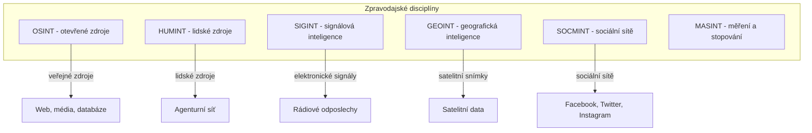
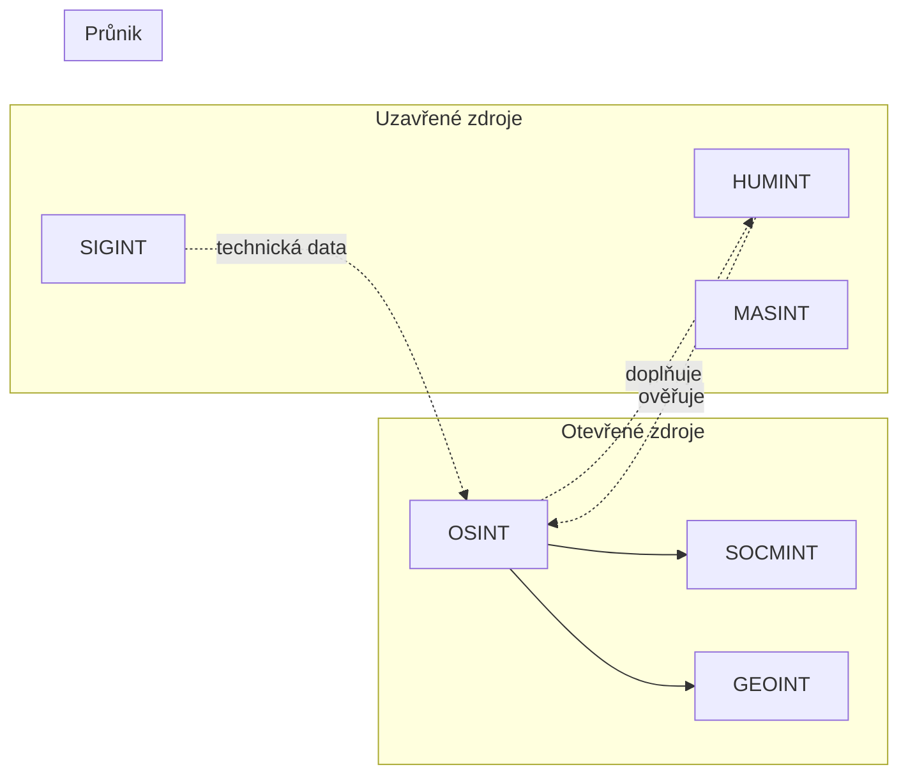
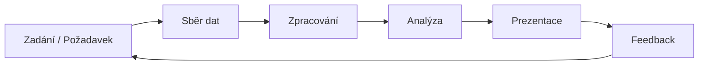

# 1.1 Co je OSINT

> **Cíle kapitoly:**
>
> - Definovat OSINT a jeho místo v rodině zpravodajských disciplín
> - Rozlišit OSINT, SOCMINT, GEOINT, SIGINT a HUMINT
> - Porozumět historickému vývoji OSINT
> - Znát analytický cyklus a jeho fáze

---

## Teorie

### Definice OSINT

**OSINT** (Open Source Intelligence) je zpravodajská disciplína zabývající se sběrem, analýzou a využitím informací z volně dostupných (otevřených) zdrojů. Na rozdíl od utajovaných zdrojů (HUMINT, SIGINT) OSINT pracuje výhradně s informacemi, které jsou legálně dostupné komukoli.

### Vztah mezi INT disciplínami

### Historie OSINT

| Období | Vývoj |
|---|---|
| 1940s | BBC Monitoring Service — monitoring rozhlasu |
| 1960s | CIA zřizuje Foreign Broadcast Information Service (FBIS) |
| 1990s | Nástup internetu — zlom v dostupnosti informací |
| 2000s | Social media boom — vznik SOCMINT |
| 2010s | Velká data, AI, automatizace OSINT |
| 2020s | OSINT jako standardní nástroj bezpečnostních týmů |

### Analytický cyklus

OSINT se řídí standardním zpravodajským cyklem:

1. **Zadání / Požadavek** — definice cíle, rozsahu a kritérií
2. **Sběr dat** — identifikace zdrojů, extrakce informací
3. **Zpracování** — filtrování, třídění, odstranění šumu
4. **Analýza** — hledání vztahů, vzorců, anomálií
5. **Prezentace** — závěrečná zpráva, dashboard, briefing
6. **Feedback** — zpětná vazba, úprava požadavků

### Druhy OSINT zdrojů

| Kategorie | Příklady |
|---|---|
| **Média** | Noviny, časopisy, televize, rozhlas |
| **Internet** | Webové stránky, blogy, fóra, sociální sítě |
| **Veřejné databáze** | Obchodní rejstříky, katastry, registrace |
| **Akademické zdroje** | Publikace, konference, výzkumné zprávy |
| **Vládní data** | Open data portály, veřejné rejstříky |
| **Technická data** | DNS, WHOIS, SSL certifikáty, IP adresy |

---

## Postup krok za krokem: První OSINT analýza

1. **Definujte cíl** — co konkrétně chcete zjistit?
2. **Identifikujte zdroje** — kde mohou být relevantní informace?
3. **Sběr dat** — systematicky procházejte zdroje, dokumentujte nálezy
4. **Analyzujte** — hledejte souvislosti, vytvářejte hypotézy
5. **Ověřte** — křížová kontrola informací z více zdrojů
6. **Zdokumentujte** — zapište postup a nálezy

---

## Reálné příklady

### Příklad 1: Investigativní žurnalistika

**Případ:** Skupina novinářů z Bellingcatu pomocí OSINT technik identifikovala ruské vojáky zapojené do sestřelení letu MH17 na Ukrajině.

**Použité techniky:**
- Analýza sociálních sítí (VKontakte)
- Geolokace fotografií
- Cross-referencing veřejných dat
- Analýza metadata fotografií

### Příklad 2: Corporate security

**Případ:** Bezpečnostní tým společnosti prověřuje potenciálního obchodního partnera.

**Použité techniky:**
- Obchodní rejstřík — vlastnická struktura
- Media monitoring — reputace
- Social media — klíčové osoby
- DNS analýza — doménová infrastruktura

---

## Tipy a časté chyby

> [!TIP]
> Vždy začínejte s jasně definovanou výzkumnou otázkou. Bez cíle budete zahlceni informacemi.

> [!WARNING]
> **Častá chyba:** Zaměňování OSINT s hackingem. OSINT pracuje VÝHRADNĚ s legálně dostupnými informacemi. Jakýkoli pokus o obcházení zabezpečení, prolomení hesel nebo neoprávněný přístup NENÍ OSINT.

> [!WARNING]
> **Častá chyba:** Slepá důvěra prvnímu zdroji. Vždy ověřujte informace minimálně ze 3 nezávislých zdrojů.

---

## Praktické cvičení

**Úkol:** Vyberte si libovolnou veřejně známou osobu (politik, sportovec, umělec) a proveďte základní OSINT profil:

1. Najděte 5 různých typů zdrojů informací o této osobě
2. Zaznamenejte, jaké informace jednotlivé zdroje poskytují
3. Ověřte alespoň 2 informace křížově z různých zdrojů
4. Zapište, které informace jsou konzistentní a které si odporují

**Pomůcky:** Google, sociální sítě, veřejné rejstříky
**Očekávaný výstup:** Stručná zpráva (1-2 strany) s profilem osoby a použitými zdroji

---

## Shrnutí

- OSINT je zpravodajská disciplína pracující výhradně s otevřenými zdroji
- Zahrnuje poddisciplíny SOCMINT, GEOINT, částečně SIGINT
- Řídí se analytickým cyklem: zadání → sběr → zpracování → analýza → prezentace
- Historicky sahá od monitoringu rozhlasu po moderní AI analýzu
- Klíčová je křížová validace informací z více nezávislých zdrojů

---

## Kontrolní otázky

1. Jaký je hlavní rozdíl mezi OSINT a HUMINT?
2. Vyjmenujte 5 kategorii OSINT zdrojů.
3. Jaké jsou fáze analytického cyklu?
4. Proč je důležitá křížová validace informací?
5. Jaký je vztah mezi OSINT a SOCMINT?

---

## Zdroje a odkazy

- [NATO OSINT Handbook](https://www.nato.int)
- [Bellingcat — Online Investigation Toolkit](https://www.bellingcat.com/resources/)
- [CIA — Intelligence Cycle](https://www.cia.gov)
- [OSINT Framework](https://osintframework.com)
