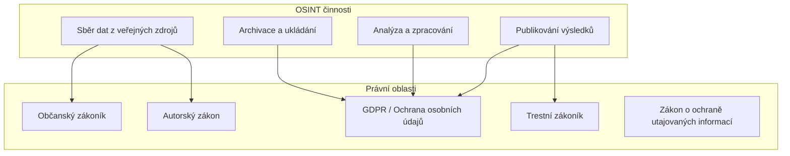
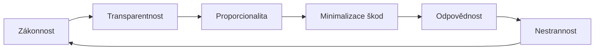

# 1.2 Právní a etické aspekty

> **Cíle kapitoly:**
>
> - Znát klíčové právní předpisy ovlivňující OSINT (GDPR, autorský zákon)
> - Rozumět etickým hranicím OSINT vyšetřování
> - Umět posoudit, kdy je OSINT legální a kdy ne
> - Znát etický kodex OSINT analytika

---

## Teorie

### Právní rámec OSINT

OSINT se pohybuje na hraně několika právních oblastí. Následující přehled pokrývá klíčové aspekty.

### GDPR a OSINT

**Nařízení GDPR (2016/679)** se vztahuje na zpracování osobních údajů občanů EU. Pro OSINT analytika to znamená:

| Pravidlo | Dopad na OSINT |
|---|---|
| **Účelové omezení** | Data lze sbírat jen pro konkrétní, legitimní účel |
| **Minimalizace dat** | Sbírat jen data nezbytná pro daný účel |
| **Přesnost** | Povinnost udržovat data aktuální a opravovat chyby |
| **Omezení uložení** | Data uchovávat jen po nezbytně nutnou dobu |
| **Bezpečnost** | Adekvátní zabezpečení shromážděných dat |

> [!WARNING]
> GDPR se vztahuje i na data, která jsou volně dostupná na internetu. Skutečnost, že jsou data veřejná, neznamená, že je můžete libovolně zpracovávat a publikovat.

### Etické principy OSINT

Etický kodex OSINT analytika by měl obsahovat:

1. **Zákonnost** — všechny činnosti musí být v souladu s platnou legislativou
2. **Transparentnost** — pokud je to možné, deklarovat účel sběru dat
3. **Proporcionalita** — rozsah sběru dat musí odpovídat cíli
4. **Minimalizace škod** — nepublikovat citlivé informace bez potřeby
5. **Odpovědnost** — analytik nese odpovědnost za své činy a jejich důsledky
6. **Nestrannost** — vyhýbat se kognitivním zkreslením a předpojatosti

### Co NENÍ OSINT

Následující činnosti **nejsou** OSINT a jsou zpravidla nelegální:

- **Phishing** — získávání přihlašovacích údajů podvodem
- **Sociální inženýrství** — manipulace osob k prozrazení informací
- **Prolomení zabezpečení** — hacking, brute force
- **Neoprávněný přístup** — vstup do systémů bez oprávnění
- **Sledování bez souhlasu** — stalking, harassment
- **Krádež identity** — vydávání se za jinou osobu

### Právní rozdíly v jednotlivých zemích

| Země | Specifika |
|---|---|
| **ČR** | GDPR + zákon o ochraně osobních údajů (110/2019 Sb.) |
| **USA** | First Amendment — široká ochrana sběru dat, ale omezení pro některé sektory |
| **UK** | Investigatory Powers Act — rozsáhlé pravomoci bezpečnostních složek |
| **Německo** | Sehr přísná ochrana osobních údajů (BDSG) |
| **Rusko** | Omezený přístup k datům, přísné zákony o ochraně dat |

---

## Postup krok za krokem: Právní audit OSINT projektu

1. **Definujte účel** — proč data sbíráte? Je účel legitimní?
2. **Identifikujte jurisdikci** — jaké zákony se vztahují na vás i na cíl?
3. **Posuďte rizika** — jaká data sbíráte? Jsou citlivá?
4. **Zdokumentujte zdůvodnění** — proč je sběr těchto dat nezbytný?
5. **Omezte sběr** — sbírejte jen to nejnutnější
6. **Zajistěte data** — šifrování, access control
7. **Naplánujte likvidaci** — kdy data smažete?

---

## Reálné příklady

### Příklad 1: Novinářské vyšetřování

**Situace:** Novinář zveřejní článek o korupci politika, který vychází z veřejných informací (obchodní rejstřík, veřejné zakázky, social media).

**Právní hodnocení:** Legální — veřejné informace, veřejný zájem, novinářská výjimka
**Etické hodnocení:** Etické — transparentní zdroje, ověřená fakta

### Příklad 2: Sledování osoby

**Situace:** Analytik sbírá všechny veřejně dostupné informace o konkrétní osobě bez jejího vědomí a vytváří detailní profil.

**Právní hodnocení:** Problematické — možné porušení GDPR (účelové omezení)
**Etické hodnocení:** Neetické — bez souhlasu, bez legitimního účelu

---

## Tipy a časté chyby

> [!TIP]
> Vždy si zdokumentujte právní základ pro váš sběr dat. V případě sporu budete mít důkaz, že jste postupovali v souladu se zákonem.

> [!WARNING]
> **Častá chyba:** "Je to veřejné, tak to můžu použít." — To není pravda. Veřejná dostupnost neznamená automatické právo na zpracování a publikování.

> [!WARNING]
> **Častá chyba:** Ignorování jurisdikce. Pokud sbíráte data o občanech EU, vztahuje se na vás GDPR bez ohledu na to, kde sídlíte.

---

## Praktické cvičení

**Úkol:** Analyzujte následující scénář z právního a etického hlediska:

> "Jste OSINT analytik a dostanete za úkol prověřit potenciálního obchodního partnera vaší firmy. Manažer po vás chce 'všechno, co se dá najít' — včetně informací o rodinných příslušnících, koníčcích a politických názorech."

1. Které informace jsou legitimní pro due diligence?
2. Kde je hranice, kterou byste neměli překročit?
3. Jak byste manažerovi vysvětlili, proč některé informace nesbíráte?

**Pomůcky:** GDPR nařízení, etický kodex
**Očekávaný výstup:** Stručný právní posudek (max 1 strana)

---

## Shrnutí

- OSINT se musí pohybovat v mezích zákona — veřejná dostupnost neznamená volné použití
- GDPR klade přísná pravidla na sběr a zpracování osobních údajů
- Etika je stejně důležitá jako legalita
- Různé jurisdikce mají různá pravidla
- Klíčové principy: zákonnost, transparentnost, proporcionalita, minimalizace škod

---

## Kontrolní otázky

1. Jaké jsou hlavní právní předpisy ovlivňující OSINT v ČR?
2. Co je to účelové omezení dle GDPR?
3. Jaký je rozdíl mezi nelegální a neetickou OSINT aktivitou?
4. Vyjmenujte 5 činností, které nejsou OSINT.
5. Proč je důležité zdokumentovat právní základ sběru dat?

---

## Zdroje a odkazy

- [GDPR nařízení (český překlad)](https://www.uoou.cz/gdpr/)
- [Zákon 110/2019 Sb. o ochraně osobních údajů](https://www.zakonyprolidi.cz/cs/2019-110)
- [Etický kodex OSINT — NATO](https://www.nato.int)
- [Electronic Frontier Foundation — Legal Guide](https://www.eff.org)
