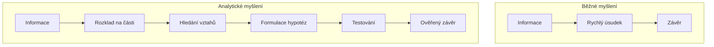
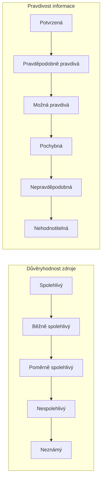
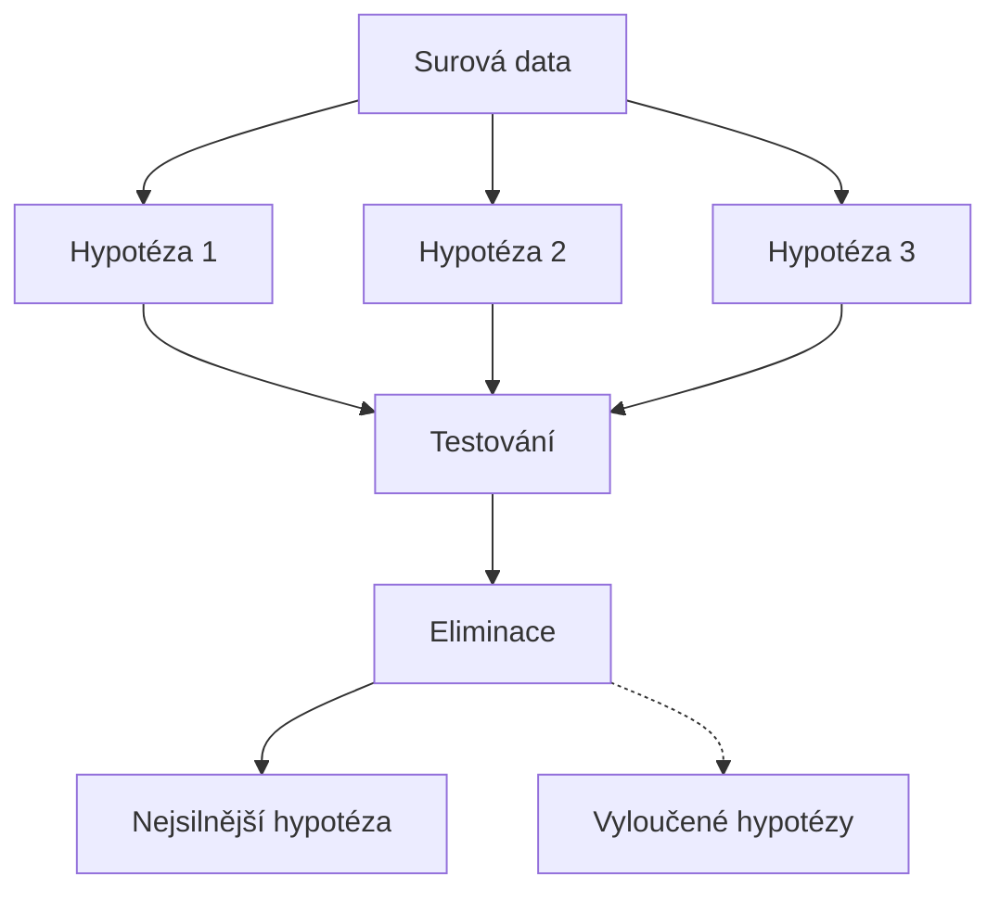

# 1.3 Jak přemýšlí analytik

> **Cíle kapitoly:**
>
> - Osvojit si strukturovaný přístup k analýze informací
> - Rozpoznat a minimalizovat kognitivní zkreslení
> - Naučit se formulovat hypotézy a testovat je
> - Umět posoudit důvěryhodnost zdroje a informace

---

## Teorie

### Analytické myšlení

Analytické myšlení je systematický přístup k řešení problémů a zpracování informací. Na rozdíl od běžného myšlení se vyznačuje:

### Kognitivní zkreslení v OSINT

Každý analytik je vystaven kognitivním zkreslením, která ovlivňují jeho úsudek. Zde jsou nejčastější:

| Zkreslení | Popis | Dopad na OSINT |
|---|---|---|
| **Confirmation bias** | Vyhledávání informací potvrzujících naše přesvědčení | Přehlížení důkazů, které vyvracejí hypotézu |
| **Anchoring** | Přílišné spoléhání na první informaci | První nález ovlivňuje celou analýzu |
| **Availability bias** | Přisuzování větší váhy snadno dostupným informacím | Opomíjení méně viditelných, ale relevantních zdrojů |
| **Overconfidence** | Přílišná důvěra ve vlastní úsudek | Nedostatečné ověřování, chybějící alternativy |
| **Groupthink** | Skupinový tlak na konsenzus | Potlačení alternativních názorů |

### Model důvěryhodnosti zdroje

Pro hodnocení důvěryhodnosti zdroje používáme **Admiralty Code** (NATO):

| Kód zdroje | Význam |
|---|---|
| A — Spolehlivý | Prověřený zdroj, historicky přesný |
| B — Běžně spolehlivý | Většinou přesný, ojedinělé chyby |
| C — Poměrně spolehlivý | Občas nepřesný, omezená historie |
| D — Nespolehlivý | Často nepřesný nebo záměrně klamavý |
| E — Neznámý | Neprověřený zdroj, nelze posoudit |

| Kód informace | Význam |
|---|---|
| 1 — Potvrzená | Potvrzeno z jiného nezávislého zdroje |
| 2 — Pravděpodobně pravdivá | Logicky konzistentní, vysoká pravděpodobnost |
| 3 — Možná pravdivá | Možné, ale nepotvrzené |
| 4 — Pochybná | Nelogické, rozporuplné |
| 5 — Nepravděpodobná | Protichůdné vůči známým faktům |
| 6 — Nehodnotitelná | Nelze posoudit |

### Formulace hypotéz

Strukturovaná technika tvorby hypotéz:

1. **Sběr informací** — bez předporozumění
2. **Generování hypotéz** — všechny možné interpretace
3. **Testování hypotéz** — hledání důkazů pro i proti
4. **Eliminace hypotéz** — vyřazení nepodložených
5. **Závěr** — nejlépe podložená hypotéza

### Techniky kritického myšlení

| Technika | Popis |
|---|---|
| **5W1H** | Who, What, When, Where, Why, How |
| **SWOT** | Strengths, Weaknesses, Opportunities, Threats |
| **Red teaming** | Záměrné hledání protiargumentů |
| **Devil's advocate** | Obhajoba opačné pozice |
| **Premortem** | Předpoklad neúspěchu a hledání příčin |
| **Intelligence gap** | Explicitní identifikace neznámých |

---

## Postup krok za krokem: Analýza informace

1. **Identifikujte zdroj** — kdo informaci poskytl, proč, kdy?
2. **Posuďte důvěryhodnost** — použijte Admiralty Code
3. **Zvažte kontext** — v jakém kontextu byla informace vytvořena?
4. **Hledejte motivaci** — proč by mohl zdroj lhát nebo zkreslovat?
5. **Ověřte fakta** — existuje nezávislé potvrzení?
6. **Formulujte závěr** — s uvedením míry nejistoty

---

## Reálné příklady

### Příklad 1: Confirmation bias v praxi

**Situace:** Analytik je přesvědčen, že cílová osoba používá pseudonym "X". Všechny nálezy interpretuje v tomto smyslu — podobná uživatelská jména, stejné zájmy. Ignoruje přitom, že profilová fotografie neodpovídá a časová osa aktivit nesouhlasí.

**Řešení:** Formulovat alternativní hypotézu (není to ta osoba) a aktivně hledat důkazy, které by ji podpořily.

### Příklad 2: Aplikace Admiralty Code

**Informace:** "Firma XYZ plánuje akvizici společnosti ABC."

- **Zdroj:** Twitter účet anonymního účtu (@leaks_xyz)
- **Zdroj hodnocení:** D (nespolehlivý)
- **Informace:** Neověřená, bez konkrétních detailů
- **Informace hodnocení:** 3 (možná pravdivá)

**Závěr:** Informaci zaznamenat, ale nezakládat na ní rozhodnutí bez potvrzení z jiného zdroje.

---

## Tipy a časté chyby

> [!TIP]
> Používejte "analytický deník" — zapisujte si své hypotézy, zdůvodnění a závěry. Pomáhá to odhalit vlastní kognitivní zkreslení.

> [!WARNING]
> **Častá chyba:** Zaměňování korelace s kauzalitou. Dvě události, které nastaly současně, nemusí být nutně propojeny.

> [!WARNING]
> **Častá chyba:** "Analýza paralýzou" — nekonečné sbírání dat bez vyvození závěrů. Stanovte si časový limit pro sběr dat.

---

## Praktické cvičení

**Úkol:** Představte si, že vyšetřujete případ kybernetického útoku na firmu. Máte následující informace:

1. Útok proběhl v pátek v 22:00
2. Útočník použil VPN z Německa
3. V den útoku propustila firma zaměstnance IT oddělení
4. V logu je IP adresa z tor exit node
5. Na fóru se objevila zpráva chlubící se útokem

Formulujte 3 alternativní hypotézy a ohodnoťte jejich pravděpodobnost.

**Pomůcky:** Technika "devil's advocate", Admiralty Code
**Očekávaný výstup:** Tabulka hypotéz s argumenty pro a proti

---

## Shrnutí

- Analytické myšlení je systematický, strukturovaný přístup k informacím
- Kognitivní zkreslení (confirmation bias, anchoring) jsou přirozená, ale musíme se jim aktivně bránit
- Admiralty Code poskytuje standardizovaný rámec pro hodnocení zdrojů a informací
- Formulace více hypotéz a jejich systematické testování je základem kvalitní analýzy
- Kritické myšlení zahrnuje zpochybňování vlastních předpokladů

---

## Kontrolní otázky

1. Vyjmenujte 5 kognitivních zkreslení a jejich dopad na OSINT analýzu.
2. Jak funguje Admiralty Code? Popište hodnocení zdroje a informace.
3. Co je to "confirmation bias" a jak se mu bránit?
4. Proč je důležité formulovat více hypotéz?
5. Jaký je rozdíl mezi korelací a kauzalitou?

---

## Zdroje a odkazy

- [CIA — Psychology of Intelligence Analysis](https://www.cia.gov)
- [NATO Intelligence Cycle](https://www.nato.int)
- [Kahneman — Thinking, Fast and Slow](https://en.wikipedia.org/wiki/Thinking,_Fast_and_Slow)
- [Heuer — Psychology of Intelligence Analysis](https://www.cia.gov/library/center-for-the-study-of-intelligence/)
