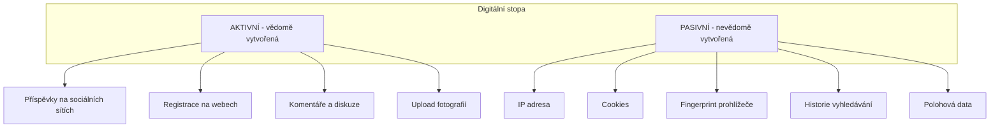
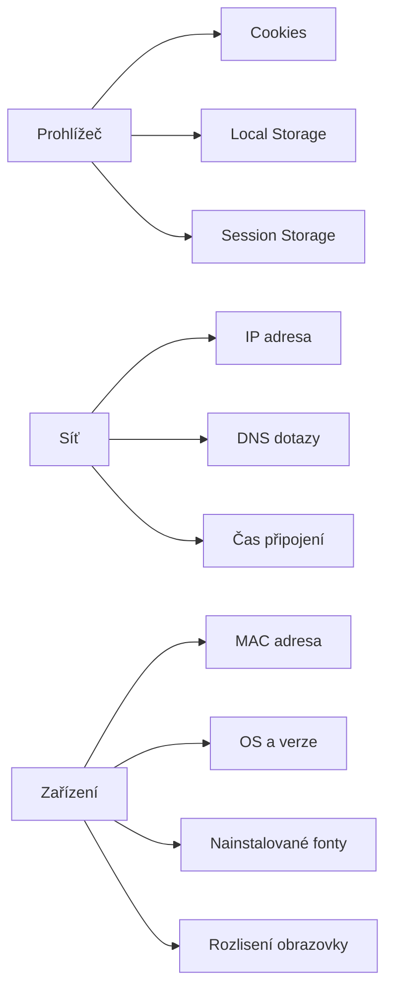
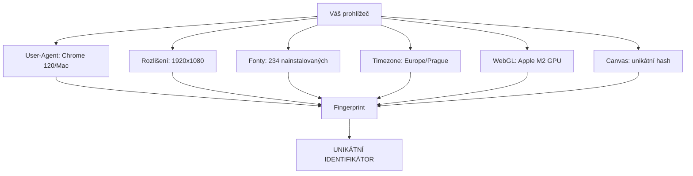

# 2.1 Digitální stopa

> **Cíle kapitoly:**
>
> - Porozumět konceptu aktivní a pasivní digitální stopy
> - Znát techniky fingerprintingu prohlížeče a zařízení
> - Umět analyzovat vlastní digitální stopu
> - Získat přehled o nástrojích pro sledování na internetu

---

## Teorie

### Co je digitální stopa

Digitální stopa (digital footprint) jsou veškeré stopy, které zanecháváme při používání internetu a digitálních technologií. Dělí se na:

### Aktivní digitální stopa

Zahrnuje data, která vědomě publikujete:

- **Sociální sítě** — profily, příspěvky, fotografie, komentáře
- **Diskuzní fóra** — příspěvky, registrace
- **Blogy a webové stránky** — vlastní obsah
- **Online nákupy** — recenze, hodnocení
- **Profesní sítě** — LinkedIn, pracovní portály

### Pasivní digitální stopa

Data sbíraná bez vašeho vědomí:

### Fingerprinting prohlížeče

Browser fingerprinting je technika identifikace zařízení na základě unikátní kombinace vlastností prohlížeče:

| Vlastnost | Variabilita | Identifikační hodnota |
|---|---|---|
| User-Agent | Nízká | Střední |
| Rozlišení obrazovky | Nízká | Nízká |
| Nainstalované fonty | Vysoká | Vysoká |
| Pluginy | Střední | Střední |
| Timezone | Nízká | Nízká |
| WebGL renderer | Vysoká | Velmi vysoká |
| Canvas fingerprint | Vysoká | Velmi vysoká |
| AudioContext | Střední | Střední |
| Jazyk prohlížeče | Nízká | Nízká |
| Platforma | Nízká | Střední |

### Doba uchování digitální stopy

| Typ stopy | Typická doba uchování |
|---|---|
| IP adresa (ISP) | 3-12 měsíců |
| Cookies třetích stran | Až 2 roky |
| Google historie | Neomezeně (do smazání) |
| Sociální sítě | Neomezeně |
| Veřejné rejstříky | Neomezeně |
| Wayback Machine | Neomezeně |
| Bezpečnostní kamery | 7-90 dní |

---

## Postup krok za krokem: Analýza vlastní digitální stopy

### 1. Zjistěte svůj browser fingerprint

1. Otevřete stránku [amiunique.org](https://amiunique.org) nebo [coveryour.tracks](https://coveryourtracks.eff.org)
2. Prohlédněte si, jaké informace váš prohlížeč poskytuje
3. Zapište si, kolik informací je unikátních

### 2. Audit sociálních sítí

1. Projděte všechny své veřejné profily
2. Zkontrolujte, jaké informace jsou veřejně viditelné
3. Odstraňte nepotřebné osobní údaje

### 3. Kontrola úniků dat

1. Zkontrolujte [haveibeenpwned.com](https://haveibeenpwned.com) — zda váš e-mail nebyl v úniku
2. Zkontrolujte [dehashed.com](https://dehashed.com) — detailnější analýza

---

## Reálné příklady

### Příklad 1: Geolokace z fotografie

**Případ:** Uživatel na Instagramu zveřejnil fotografii jídla v restauraci. Exif data obsahovala GPS souřadnice.

**Následek:** Během 24 hodin někdo zjistil, kde bydlí (pravidelný pattern příspěvků z domova), kde pracuje (check-iny ve všední dny) a kam chodí na večeře.

### Příklad 2: Browser fingerprinting

**Případ:** Webová stránka pomocí canvas fingerprinting vytvořila unikátní hash prohlížeče. I po smazání cookies a změně IP byl uživatel rozpoznán při opětovné návštěvě.

---

## Tipy a časté chyby

> [!TIP]
> Pravidelně kontrolujte svůj browser fingerprint na amiunique.org. Čím je unikátnější, tím snadněji jste identifikovatelní.

> [!WARNING]
> **Častá chyba:** "Mám vypnuté cookies, tak jsem anonymní." — Cookies jsou jen jedna část digitální stopy. Fingerprinting, IP adresa a další techniky fungují i bez cookies.

> [!WARNING]
> **Častá chyba:** Používání stejného uživatelského jména napříč službami. Usnadňuje to propojení všech vašich aktivit.

---

## Praktické cvičení

**Úkol:** Proveďte audit své vlastní digitální stopy:

1. Zjistěte svůj browser fingerprint na coveryour.tracks
2. Vyhledejte své e-maily na haveibeenpwned.com
3. Najděte 5 veřejně dostupných informací o sobě (zkuste googlit své jméno)
4. Zkontrolujte, jaké informace o vás poskytují sociální sítě (použijte anonymní okno)
5. Napište krátkou zprávu o tom, co jste našli

**Pomůcky:** amiunique.org, haveibeenpwned.com, Google
**Očekávaný výstup:** Zpráva o digitální stopě (max 2 strany)

---

## Shrnutí

- Digitální stopa se dělí na aktivní (vědomou) a pasivní (nevědomou)
- Browser fingerprinting dokáže identifikovat zařízení s vysokou přesností
- Kombinace různých typů dat vytváří unikátní profil
- Digitální stopa je prakticky nesmazatelná — lze ji pouze minimalizovat
- Pravidelný audit vlastní digitální stopy je základem OPSEC

---

## Kontrolní otázky

1. Jaký je rozdíl mezi aktivní a pasivní digitální stopou?
2. Vyjmenujte 5 vlastností používaných pro browser fingerprinting.
3. Proč je nebezpečné používat stejné uživatelské jméno napříč službami?
4. Jak dlouho se typicky uchovává IP adresa u ISP?
5. Co je to canvas fingerprinting?

---

## Zdroje a odkazy

- [amiunique.org](https://amiunique.org) — kontrola fingerprintu
- [Cover Your Tracks](https://coveryourtracks.eff.org) — EFF test
- [haveibeenpwned.com](https://haveibeenpwned.com) — kontrola úniků
- [Panopticlick](https://panopticlick.eff.org) — test anonymity prohlížeče
