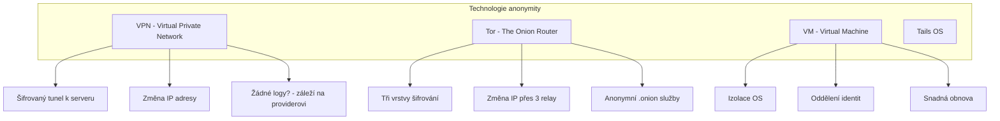
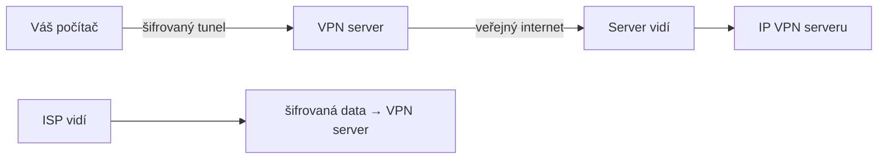
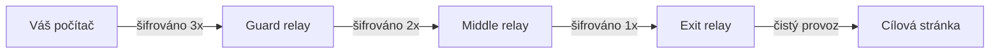
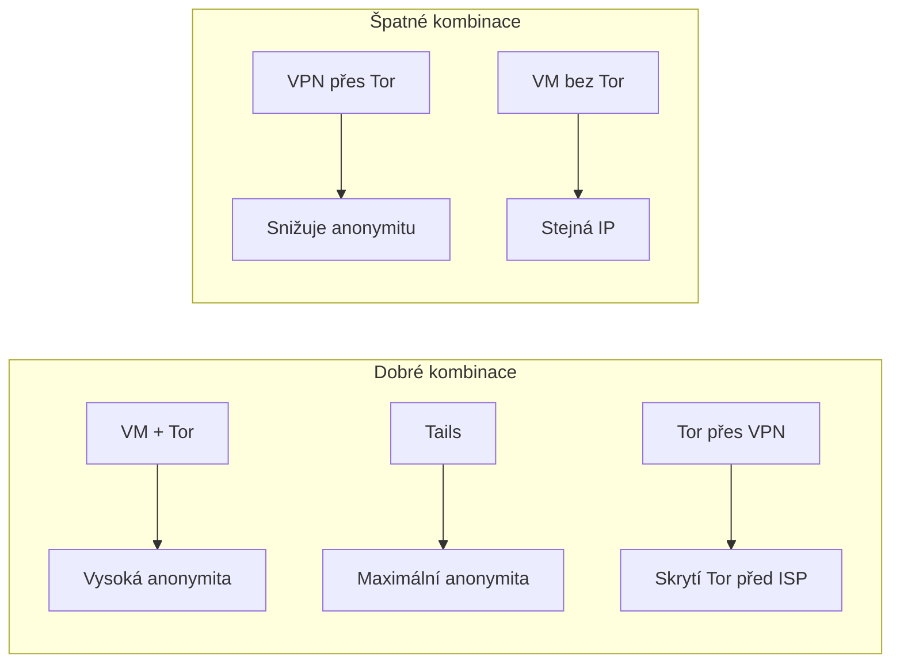

# 2.2 VPN, Tor a virtuální stroje

> **Cíle kapitoly:**
>
> - Porozumět principům VPN, Tor a virtuálních strojů
> - Znát silné a slabé stránky jednotlivých technologií
> - Umět vybrat vhodný nástroj pro daný scénář
> - Vědomě kombinovat technologie pro dosažení anonymity

---

## Teorie

### Srovnání technologií

### VPN — Virtual Private Network

**Princip:** Vytvoří šifrovaný tunel mezi vaším zařízením a VPN serverem. Veškerý provoz vypadá, jako by vycházel z IP adresy VPN serveru.

**Výhody:**
- Jednoduché použití
- Zvyšuje soukromí před ISP
- Obchází geografická omezení

**Nevýhody:**
- VPN provider vidí váš provoz
- Kvalita závisí na providerovi (logy?)
- Některé VPN prodávají data

### Tor — The Onion Router

**Princip:** Provoz prochází přes tři náhodně vybrané relay servery. Každý relay zná jen předchozí a následující hop.

**Tor vs VPN — detailní srovnání:**

| Aspekt | VPN | Tor |
|---|---|---|
| **Rychlost** | Vysoká | Nízká |
| **Anonymita** | Střední (závisí na providerovi) | Vysoká |
| **Jednoduchost** | Vysoká | Střední |
| **Logování** | Závisí na providerovi | Žádné (designem) |
| **Blokování** | Snadno blokovatelné | Obtížně blokovatelné |
| **HTTPS** | Není vyžadováno | Doporučeno |
| **Síťová vrstva** | Transportní | Aplikační |
| **Cena** | Placené | Zdarma |

### Virtuální stroje

**Princip:** Izolované prostředí, které emuluje samostatný počítač. Umožňuje provozovat OS v OS.

**Typy virtualizace:**

| Typ | Popis | Příklad |
|---|---|---|
| **Hypervisor (typ 2)** | Virtualizace nad host OS | VirtualBox, VMware |
| **Hypervisor (typ 1)** | Native virtualization (bez host OS) | Proxmox, ESXi |
| **Kontejnery** | Sdílené jádro s host OS | Docker, LXC |
| **Live OS** | Boot z USB bez instalace | Tails, Kali Live |

### Tails

Tails (The Amnesic Incognito Live System) je live OS navržený pro anonymitu:

- Veškerý provoz jde přes Tor
- Po vypnutí nezanechává stopy
- Šifrované úložiště pro trvalá data
- Předkonfigurované nástroje pro bezpečnou komunikaci

### Kombinace technologií

---

## Postup krok za krokem: Bezpečné nastavení

### 1. Nastavení Tor Browser

1. Stáhněte Tor Browser z [torproject.org](https://www.torproject.org)
2. Při prvním spuštění zvolte "Connect"
3. Nastavte bezpečnostní úroveň na "Safest"
4. Zakažte JavaScript (ručně nebo přes NoScript)
5. Nepřidávejte žádné další addony

### 2. Výběr VPN providera

Při výběru VPN zvažte:
- **Bez logování** — audituje nezávislá třetí strana?
- **Jurisdikce** — v jaké zemi sídlí?
- **Open source** — je klient open source?
- **Kill switch** — vypne připojení při pádu VPN?
- **Protokol** — WireGuard, OpenVPN?

### 3. Nastavení virtuálního stroje

1. Nainstalujte VirtualBox nebo VMware
2. Vytvořte VM s OS (např. Ubuntu, Tails)
3. Nastavte síť na NAT
4. V rámci VM používejte Tor Browser

---

## Reálné příklady

### Příklad 1: Investigativní novinář

**Scénář:** Novinář vyšetřující korupci potřebuje komunikovat se zdrojem a hledat informace, aniž by prozradil svou identitu.

**Řešení:** Tails OS bootovaný z USB + veřejná WiFi. Všechna komunikace přes Tor.

### Příklad 2: Security researcher

**Scénář:** Researcher potřebuje analyzovat podezřelou stránku, aniž by prozradil svou IP.

**Řešení:** VM s VPN + Tor Browser. Po analýze VM zničen.

---

## Tipy a časté chyby

> [!TIP]
> Pro nejvyšší anonymitu používejte Tails nebo podobný live OS. Kombinace VM + Tor je druhý nejlepší scénář.

> [!WARNING]
> **Častá chyba:** "VPN mě dělá zcela anonymním." — VPN pouze mění IP adresu, nechrání před fingerprintingem, cookies nebo sledováním na úrovni účtů.

> [!WARNING]
> **Častá chyba:** Používání free VPN. Pokud neplatíte za produkt, jste vy tím produktem. Free VPN často prodávají data nebo obsahují malware.

> [!WARNING]
> **Častá chyba:** Tor Browser s maximálním oknem. Maximalizované okno usnadňuje fingerprinting. Používejte výchozí velikost.

---

## Praktické cvičení

**Úkol:** Nastavte si bezpečné prostředí pro OSINT:

1. Stáhněte a nainstalujte Tor Browser
2. Ověřte funkčnost na check.torproject.org
3. Vytvořte virtuální stroj (např. Ubuntu) ve VirtualBoxu
4. Uvnitř VM nainstalujte Tor Browser
5. Porovnejte fingerprint před a po použití Tor: amiunique.org

**Pomůcky:** VirtualBox, Tor Browser, Ubuntu ISO
**Očekávaný výstup:** Funkční VM s Tor Browserem a dokumentace rozdílů ve fingerprintu

---

## Shrnutí

- VPN poskytuje šifrovaný tunel a změnu IP, ale provider vidí provoz
- Tor poskytuje vyšší anonymitu díky třívrstvému šifrování a relay
- VM umožňuje izolaci a oddělení identit
- Tails je nejbezpečnější volbou pro maximální anonymitu
- Kombinace technologií je vhodná, ale musí být správně nakonfigurována
- Žádná technologie neposkytuje 100% anonymitu

---

## Kontrolní otázky

1. Jaký je princip onion routingu?
2. Jaké jsou výhody a nevýhody Tor vs VPN?
3. Proč není free VPN bezpečná?
4. Co je Tails a k čemu se používá?
5. Proč byste neměli maximalizovat okno Tor Browseru?

---

## Zdroje a odkazy

- [Tor Project](https://www.torproject.org)
- [Tails OS](https://tails.net)
- [VPN Comparison — That One Privacy Site](https://thatoneprivacysite.net)
- [EFF — HTTPS Everywhere](https://www.eff.org/https-everywhere)
- [DigitalOcean - What is a VPN?](https://www.digitalocean.com/community/tutorials/what-is-a-vpn)
