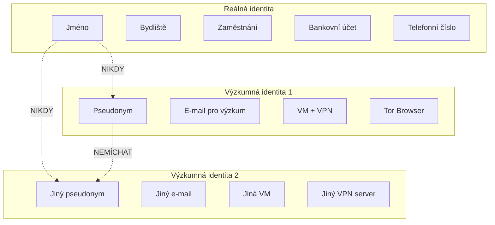

# 2.3 Oddělení identit

> **Cíle kapitoly:**
>
> - Porozumět konceptu identity management v OSINT
> - Umět vytvořit a udržovat oddělené identity
> - Znát rizika prolomení oddělení identit
> - Ovládat techniky operační bezpečnosti

---

## Teorie

### Koncept oddělení identit

Při OSINT vyšetřování je klíčové oddělit vaši reálnou identitu od identit používaných pro výzkum.

### Úrovně oddělení

| Úroveň | Popis | Příklad použití |
|---|---|---|
| **L1 — Základní** | Jeden prohlížeč v anonymním režimu | Rychlé vyhledávání, veřejné informace |
| **L2 — Střední** | Samostatný profil prohlížeče + VPN | Analýza sociálních sítí |
| **L3 — Pokročilá** | VM + Tor/VPN | Vyšetřování citlivých témat |
| **L4 — Maximální** | Tails + veřejná WiFi | Dark web, vysoce citlivá témata |

### Pravidla pro oddělení identit

1. **Nikdy nemíchejte identity** — každá identita má vlastní:
   - E-mailovou adresu
   - Uživatelské jméno
   - Prohlížeč/profil
   - IP adresu (VPN/relay)
   - Platební metodu

2. **Izolujte prostředí** — každá identita používá:
   - Vlastní VM nebo profil prohlížeče
   - Vlastní síťové nastavení
   - Vlastní úložiště (cookie, cache)

3. **Dodržujte operační bezpečnost**:
   - Nepřihlašujte se k osobním účtům z výzkumného prostředí
   - Nepoužívejte stejné platební metody
   - Nepřecházejte mezi identitami bez vyčištění prostředí

### Nástroje pro správu identit

| Nástroj | Účel | Poznámka |
|---|---|---|
| **Firefox Multi-Account Containers** | Izolace cookies/profilů | Pouze Firefox |
| **Chrome Profiles** | Oddělené profily | Vestavěné v Chrome |
| **VirtualBox / VMware** | Plná izolace | Vlastní OS na identitu |
| **Docker** | Izolace aplikací | Lehčí než VM |
| **KeePassXC** | Správa hesel identit | Database na identitu |
| **Tails** | Live OS bez stopy | Maximální izolace |

---

## Postup krok za krokem: Vytvoření výzkumné identity

### 1. Výběr pseudonymu

- Použijte generátor jmen (např. [fakenamegenerator.com](https://www.fakenamegenerator.com))
- NEPOUŽÍVEJTE jména skutečných lidí
- Nepoužívejte jméno podobné vašemu reálnému
- Vyhněte se nápadným nebo provokativním jménům

### 2. Vytvoření e-mailu

- Použijte anonymní e-mail službu: ProtonMail, Tutanota
- Nepoužívejte běžné služby (Gmail, Outlook) pro citlivou identitu
- E-mail vytvářejte přes Tor nebo VPN
- Nepoužívejte své reálné telefonní číslo pro ověření

### 3. Nastavení prostředí

1. Vytvořte VM pro danou identitu
2. Nainstalujte základní nástroje
3. Nastavte VPN/Tor pro výchozí síťový provoz
4. Vytvořte profily na sociálních sítích (je-li potřeba)
5. Zdokumentujte všechny účty v password manageru

### 4. Udržování čistoty

- Před přepnutím na jinou identitu: clear + restart VM
- Nepoužívejte stejné platební metody
- Nepřihlašujte se k osobním službám z výzkumné identity
- Pravidelně kontrolujte, zda identity nejsou propojitelné

---

## Reálné příklady

### Příklad 1: Operační bezpečnost

**Scénář:** Vyšetřovatel vytvořil identitu "Jan Novák" pro výzkum extremistických fór. Po roce omylem poslal e-mail z osobního účtu na fórum pod touto identitou.

**Následek:** Administrátor fóra propojil obě identity a doxoval vyšetřovatele.

### Příklad 2: Chyba v oddělení

**Scénář:** Analytik používal stejný prohlížeč pro osobní účely i výzkum. Cookies z Facebooku (osobní) unikly do výzkumné identity.

**Následek:** Facebook doporučil výzkumný profil analytikovi v sekci "Lidé, které možná znáte" — propojení identit.

---

## Tipy a časté chyby

> [!TIP]
> Vytvořte si "identity matrix" — tabulku všech identit s jejich atributy (e-mail, pseudonym, VM, IP, účty). Udržujte ji v šifrovaném souboru.

> [!WARNING]
> **Častá chyba:** Používání stejného telefonu pro osobní i výzkumnou komunikaci. Telefon je jednoznačně přiřaditelný k osobě.

> [!WARNING]
> **Častá chyba:** Přihlášení k osobnímu Google účtu na stejném zařízení jako výzkumná identita. Google dokáže propojit i oddělené profily.

---

## Praktické cvičení

**Úkol:** Vytvořte výzkumnou identitu podle následujícího postupu:

1. Vygenerujte si pseudonym na fakenamegenerator.com
2. Vytvořte e-mail na ProtonMail (přes Tor)
3. Nastavte VM pro tuto identitu
4. Vytvořte účet na dvou sociálních sítích (např. Twitter a Reddit)
5. Napište "identity matrix" — tabulku všech atributů

**Pomůcky:** ProtonMail, Tor Browser, VirtualBox, fakenamegenerator.com
**Očekávaný výstup:** Funkční výzkumná identita s dokumentací

---

## Shrnutí

- Oddělení identit je základním kamenem OPSEC
- Každá identita vyžaduje vlastní e-mail, pseudonym, prostředí a IP adresu
- Identity se nikdy nesmí prolínat
- Pro maximální izolaci používejte VM nebo Tails
- Dokumentace identit je důležitá, ale musí být bezpečně uložena

---

## Kontrolní otázky

1. Proč je důležité oddělovat identity při OSINT?
2. Jaké jsou 4 úrovně oddělení identit?
3. Proč byste neměli používat stejný telefon pro osobní a výzkumné aktivity?
4. Co je to "identity matrix"?
5. Jaké nástroje můžete použít pro správu identit?

---

## Zdroje a odkazy

- [ProtonMail](https://protonmail.com)
- [Fake Name Generator](https://www.fakenamegenerator.com)
- [Firefox Multi-Account Containers](https://addons.mozilla.org/firefox/addon/multi-account-containers/)
- [KeePassXC](https://keepassxc.org)
