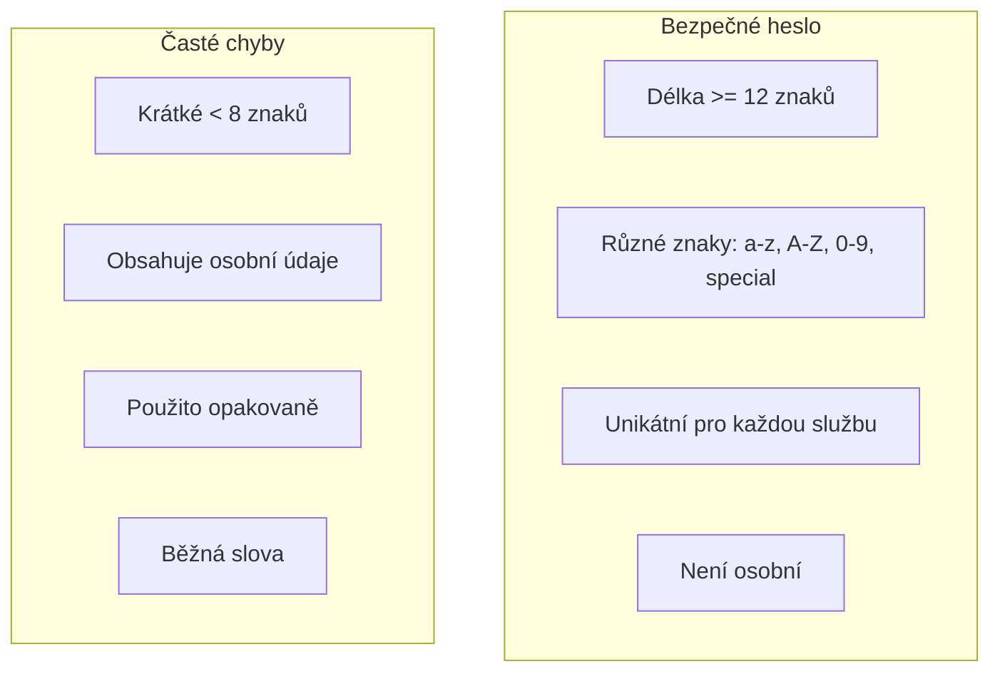
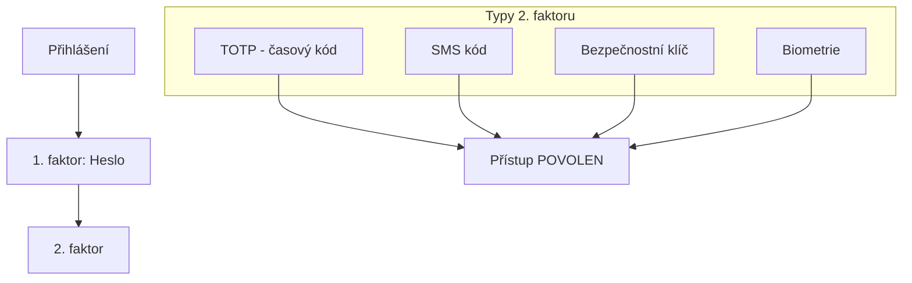

# 2.4 Bezpečnost účtů

> **Cíle kapitoly:**
>
> - Umět vytvářet a spravovat bezpečná hesla
> - Ovládat vícefaktorovou autentizaci (2FA/MFA)
> - Znát správce hesel a jejich správné použití
> - Osvojit si bezpečnostní návyky pro OSINT práci

---

## Teorie

### Základy bezpečnosti hesel

### Správci hesel

Správce hesel (password manager) je nezbytný nástroj pro každého OSINT analytika:

| Vlastnost | Význam |
|---|---|
| **Generátor hesel** | Vytváří náhodná, silná hesla |
| **Šifrované úložiště** | Hesla uložena v šifrované databázi |
| **Autofill** | Automatické vyplňování |
| **Synchronizace** | Napříč zařízeními |
| **Audit hesel** | Kontrola slabých/použitých hesel |

**Doporučení správci hesel:**

| Nástroj | Platforma | Otevřený zdroj | Cena |
|---|---|---|---|
| **KeePassXC** | Win/Mac/Linux | Ano | Zdarma |
| **Bitwarden** | Vše | Ano | Zdarma / Premium |
| **1Password** | Vše | Ne | Placený |
| **ProtonPass** | Vše | Ano | Zdarma / Premium |

### Vícefaktorová autentizace (MFA)

| Typ 2FA | Bezpečnost | Pohodlí |
|---|---|---|
| **TOTP** (Google Authenticator, Authy) | Vysoká | Střední |
| **SMS kód** | Nízká (SIM swap) | Vysoká |
| **Bezpečnostní klíč** (YubiKey) | Velmi vysoká | Nízká |
| **Hardwarový token** | Velmi vysoká | Nízká |
| **Biometrie** (otisk, obličej) | Střední | Vysoká |

> [!WARNING]
> **SMS 2FA je lepší než žádná 2FA, ale není bezpečná.** SIM swap útoky jsou běžné. Používejte TOTP nebo hardwarový klíč.

### Bezpečnostní návyky pro OSINT

| Návyk | Frekvence | Popis |
|---|---|---|
| **Rotace hesel** | Při podezření na kompromitaci | Měnit pouze v případě potřeby |
| **Audit účtů** | Měsíčně | Kontrola přihlášení, zařízení, oprávnění |
| **Kontrola úniků** | Měsíčně | haveibeenpwned.com, firefox monitor |
| **Aktualizace** | Průběžně | OS, prohlížeč, pluginy, nástroje |
| **Zálohování** | Týdně | Šifrované zálohy důležitých dat |

---

## Postup krok za krokem: Zabezpečení účtů

### 1. Audit stávajících účtů

1. Zkontrolujte [haveibeenpwned.com](https://haveibeenpwned.com) — všechny své e-maily
2. Projděte si všechna místa, kde máte účty
3. Zkontrolujte nastavení zabezpečení u každého účtu
4. Odstraňte nepotřebné účty

### 2. Nastavení správce hesel

1. Nainstalujte Bitwarden nebo KeePassXC
2. Vytvořte hlavní heslo (min. 16 znaků, žádné osobní údaje)
3. Zapište hlavní heslo offline (papír do trezoru)
4. Nastavte generování hesel na min. 16 znaků

### 3. Aktivace 2FA

1. Nainstalujte TOTP aplikaci (Authy, Google Authenticator, Aegis)
2. Postupně aktivujte 2FA u všech důležitých účtů
3. Uložte backup kódy offline

### 4. Pravidelná údržba

- Měsíční kontrola haveibeenpwned
- Kvartální audit přihlášení k účtům
- Pravidelné zálohování databáze hesel

---

## Reálné příklady

### Příklad 1: Únik dat

**Případ:** Služba LinkedIn unikla v roce 2021 data 700 miliónů uživatelů. Pokud měl analytik stejné heslo na LinkedIn a na svém OSINT e-mailu, útočník se mohl dostat ke všem datům.

**Poučení:** Každý účet musí mít unikátní heslo.

### Příklad 2: SIM swap

**Případ:** Útočník zavolal na operátora, vydával se za oběť a nechal si převést číslo na novou SIM. Pak resetoval hesla přes SMS 2FA.

**Poučení:** Nepoužívat SMS jako primární 2FA u důležitých účtů.

---

## Tipy a časté chyby

> [!TIP]
> Hlavní heslo k password manageru si zapište na papír a uložte do fyzického trezoru. Je to jediné heslo, které si musíte pamatovat.

> [!WARNING]
> **Častá chyba:** "Mám silné heslo, tak jsem v bezpečí." — Silné heslo nestačí. Bez 2FA může být účet kompromitován phishingem nebo únikem databáze.

> [!WARNING]
> **Častá chyba:** Používání stejného hesla pro OSINT účty a osobní účty. Pokud jeden unikne, jsou propojeny všechny.

---

## Praktické cvičení

**Úkol:** Zabezpečte svůj OSINT pracovní postup:

1. Nainstalujte Bitwarden nebo KeePassXC
2. Vygenerujte nová hesla pro všechny OSINT účty (min. 20 znaků)
3. Aktivujte TOTP 2FA u všech účtů, které to podporují
4. Zkontrolujte všechny své e-maily na haveibeenpwned.com
5. Vytvořte plán pravidelného auditu

**Pomůcky:** Bitwarden/KeePassXC, Authy, haveibeenpwned.com
**Očekávaný výstup:** Zabezpečené účty, dokumentace hesel v password manageru

---

## Shrnutí

- Každý účet vyžaduje unikátní, silné heslo (min. 16 znaků)
- Správce hesel je nezbytný nástroj pro správu mnoha účtů
- 2FA je povinná — preferujte TOTP před SMS
- Pravidelně kontrolujte úniky dat a audit účtů
- Bezpečnost je proces, ne jednorázová akce

---

## Kontrolní otázky

1. Jaké vlastnosti má bezpečné heslo?
2. Proč je SMS 2FA méně bezpečná než TOTP?
3. Jaký je rozdíl mezi Bitwarden a KeePassXC?
4. Proč byste měli mít unikátní heslo pro každý účet?
5. Jak často byste měli kontrolovat úniky dat?

---

## Zdroje a odkazy

- [Have I Been Pwned](https://haveibeenpwned.com)
- [Bitwarden](https://bitwarden.com)
- [KeePassXC](https://keepassxc.org)
- [Authy](https://authy.com)
- [Yubico - YubiKey](https://www.yubico.com)
