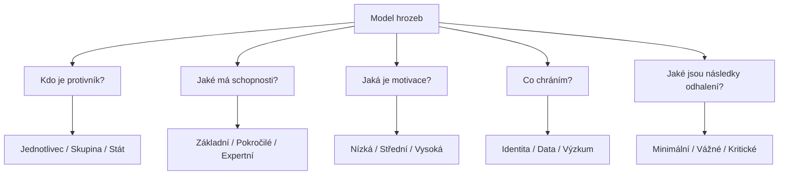
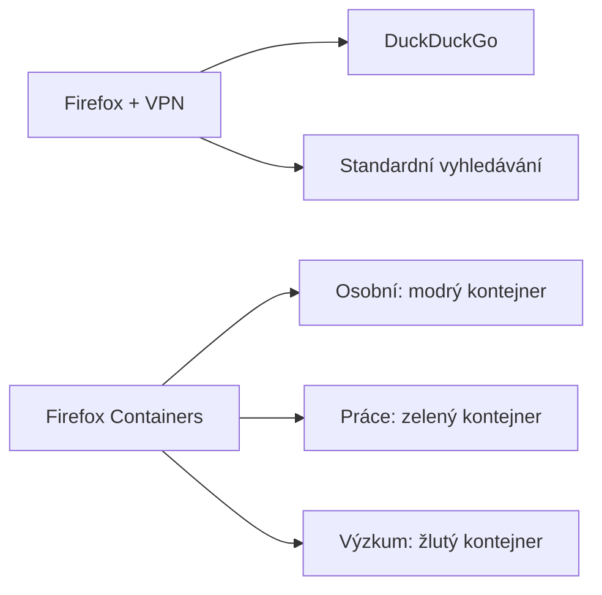
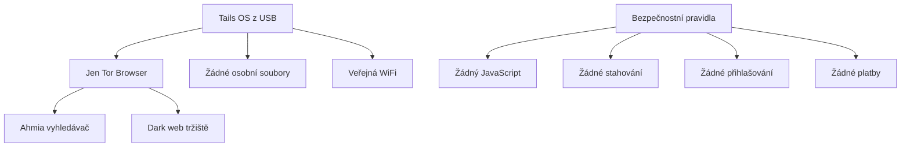

# 2.5 Praktické scénáře

> **Cíle kapitoly:**
>
> - Aplikovat OPSEC principy na reálné situace
> - Umět posoudit rizika a zvolit vhodnou úroveň zabezpečení
> - Zvládnout krizovou reakci při kompromitaci identity

---

## Teorie

### Model hrozeb

Před výběrem OPSEC opatření je nutné definovat **model hrozeb**:

### Scénáře podle úrovně rizika

| Úroveň | Protivník | Opatření | Příklad |
|---|---|---|---|
| **Nízká** | Běžný uživatel | VPN, cookie management | Vyhledávání veřejných informací |
| **Střední** | Konkurence, novináři | VM + Tor, oddělené identity | Vyšetřování firmy |
| **Vysoká** | Organizované skupiny | Tails, veřejná WiFi, žádné osobní účty | Dark web výzkum |
| **Kritická** | Státní aktéři | Maximální OPSEC, komplexní opatření | Investigace citlivých témat |

---

## Scénář 1: Denní OSINT vyhledávání

**Situace:** Potřebujete denně vyhledávat informace o běžných tématech (firmy, osoby, domény).

**Model hrozeb:** Nízký — nikdo vás aktivně nesleduje.

**Doporučené nastavení:**

1. Firefox s Multi-Account Containers
2. VPN (vždy zapnutá pro výzkumné kontejnery)
3. DuckDuckGo jako výchozí vyhledávač
4. Pravidelné mazání cookies
5. Základní password manager

---

## Scénář 2: Vyšetřování osoby

**Situace:** Prověřujete konkrétní osobu — možná trestná činnost.

**Model hrozeb:** Střední — cíl může mít zájem zjistit, kdo ho prověřuje.

**Doporučené nastavení:**

1. **Dedikovaná VM** pro toto vyšetřování
2. **Tor Browser** uvnitř VM
3. **Výzkumná identita** — vlastní e-mail, pseudonym
4. **Žádné osobní účty** v této VM
5. **Šifrované poznámky** — KeepassXC nebo Cryptomator
6. **Pravidelné snapshoty** VM pro případ nouze

**Postup:**
1. Vytvořte VM pro toto vyšetřování
2. Nastavte výchozí prohlížeč na Tor Browser
3. Vytvořte novou identitu (pseudonym + ProtonMail)
4. Veškerou komunikaci veďte jen přes tuto identitu
5. Po dokončení VM zničte

---

## Scénář 3: Dark web výzkum

**Situace:** Potřebujete prozkoumat tržiště na dark webu.

**Model hrozeb:** Vysoký — tržiště mohou být monitorována policejními složkami, hrozí malware.

**Doporučené nastavení:**

1. **Tails OS** — boot z USB, žádné stopy
2. **Veřejná WiFi** — kavárna, knihovna (daleko od domova)
3. **Žádný JavaScript** — vypnutý v Tor Browser
4. **Žádné stahování** — neotvírejte neznámé soubory
5. **Žádné přihlašování** — nezakládejte účty na dark webu
6. **Screen recording** — pokud potřebujete důkazy, foťte mobilem

---

## Scénář 4: Kompromitace identity

**Situace:** Zjistili jste, že vaše výzkumná identita byla propojena s vaší reálnou osobou.

**Krizový postup:**

1. **Nepanikařte** — zhodnoťte situaci
2. **Identifikujte únik** — jak k propojení došlo?
3. **Izolujte** — okamžitě přestaňte používat kompromitovanou identitu
4. **Dokumentujte** — zapište vše, co víte
5. **Zabezpečte ostatní identity** — změňte hesla, zkontrolujte 2FA
6. **Zvažte právní kroky** — kontaktujte právníka (je-li relevantní)

**Prevence:**
- Pravidelná kontrola, zda identity nejsou propojitelné
- Googlit své pseudonymy
- Sledovat, zda se neobjevují na nečekaných místech

---

## Reálné příklady

### Příklad 1: Chyba v OPSEC novináře

**Případ:** Britský novinář používal pro komunikaci se zdrojem WhatsApp na stejném telefonu jako pro osobní hovory. Policie při zabavení telefonu propojila všechny kontakty.

**Poučení:** Fyzické oddělení zařízení pro citlivou komunikaci.

### Příklad 2: Úspěšný OPSEC

**Případ:** Skupina Bellingcat vyšetřovala sestřelení MH17. Používali přísné OPSEC — VM, VPN, pseudonymy, nikdy nemíchali identity.

**Výsledek:** Úspěšná identifikace pachatelů bez kompromitace výzkumníků.

---

## Tipy a časté chyby

> [!TIP]
> Vytvořte si check-list pro každé vyšetřování: model hrozeb → úroveň OPSEC → nastavení prostředí → dokumentace. Držte se ho systematicky.

> [!WARNING]
> **Častá chyba:** Podcenění modelu hrozeb. "Nikdo mě nebude sledovat" je nejčastější důvod selhání OPSEC.

> [!WARNING]
> **Častá chyba:** Používání osobního zařízení pro OSINT. Telefon, který nosíte denně s sebou, je plný osobních dat a identifikátorů.

---

## Praktické cvičení

**Úkol:** Navrhněte OPSEC plán pro následující scénář:

>"Jste bezpečnostní analytik a máte prověřit podezřelou firmu, která se pravděpodobně zabývá kyberšpionáží. Firma má IT oddělení a aktivně monitoruje, kdo si o nich zjišťuje informace."

1. Definujte model hrozeb
2. Zvolte úroveň OPSEC
3. Navrhněte konkrétní nastavení prostředí
4. Popište, jak budete dokumentovat nálezy
5. Navrhněte plán pro případ kompromitace

**Pomůcky:** Model hrozeb tabulka, úrovně OPSEC
**Očekávaný výstup:** OPSEC plán (1-2 strany)

---

## Shrnutí

- Model hrozeb je první krok — definujte protivníka a jeho schopnosti
- Různé scénáře vyžadují různou úroveň OPSEC
- Denní vyhledávání: VPN + containers
- Vyšetřování: VM + Tor
- Dark web: Tails + veřejná WiFi
- Při kompromitaci: izolovat, dokumentovat, zabezpečit

---

## Kontrolní otázky

1. Co je model hrozeb a jak ho definujete?
2. Jaké OPSEC opatření byste zvolili pro dark web výzkum?
3. Jaký je postup při kompromitaci identity?
4. Proč nestačí VPN pro vyšetřování s vysokým rizikem?
5. Jaký je rozdíl v OPSEC mezi denním vyhledáváním a vyšetřováním osoby?

---

## Zdroje a odkazy

- [EFF - Surveillance Self-Defense](https://ssd.eff.org)
- [Bellingcat - OPSEC Guide](https://www.bellingcat.com/resources/)
- [Threat Modeling - OWASP](https://owasp.org/www-project-threat-modeling/)
- [Privacy Guides](https://www.privacyguides.org)
