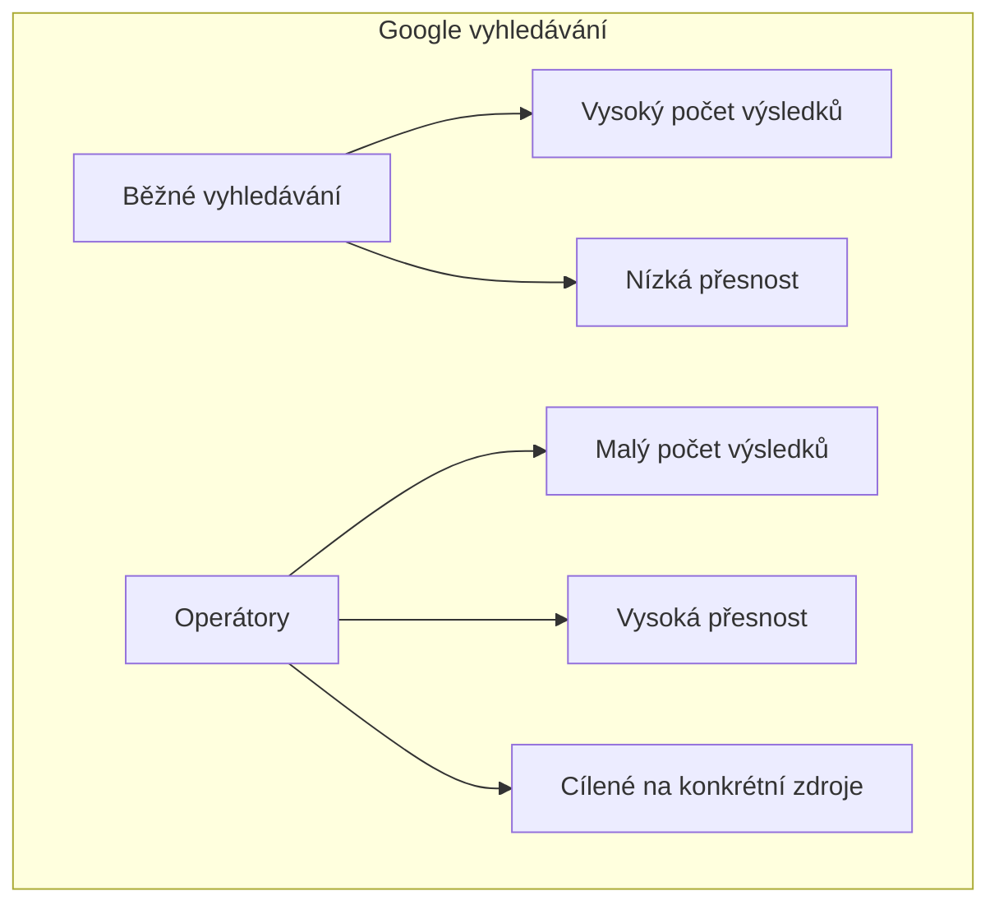
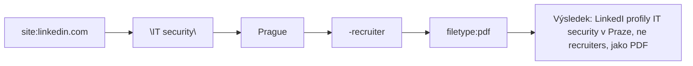

# 3.1 Pokročilé operátory Google

> **Cíle kapitoly:**
>
> - Ovládat všechny důležité Google operátory na expertní úrovni
> - Umět kombinovat operátory pro přesné vyhledávání
> - Znát techniky Google dorking pro OSINT
> - Umět automatizovat vyhledávání

---

## Teorie

### Co jsou Google operátory

Google operátory jsou speciální příkazy, které omezují nebo specifikují vyhledávání. V OSINT jsou klíčové pro cílený sběr dat.



### Přehled operátorů

| Operátor | Syntax | Příklad | Výsledek |
|---|---|---|---|
| **site:** | site:domena.cz | site:vlada.cz "utajovaná" | Pouze z dané domény |
| **filetype:** | filetype:typ | filetype:pdf "osint" | Pouze daný typ souborů |
| **intitle:** | intitle:slovo | intitle:"zpráva" | Slovo v titulku |
| **inurl:** | inurl:slovo | inurl:admin | Slovo v URL |
| **intext:** | intext:slovo | intext:"heslo" | Slovo v textu |
| **cache:** | cache:url | cache:example.com | Archivovaná verze |
| **link:** | link:url | link:example.com | Stránky odkazující na URL |
| **related:** | related:url | related:example.com | Podobné stránky |
| **"text"** | "přesná fráze" | "tajný projekt" | Přesná shoda |
| **OR** | X OR Y | "firma" OR "společnost" | Logické NEBO |
| **-** | -slovo | -wikipedia | Vyloučení slova |
| *** | * | "nejlepší * na světě" | Wildcard |
| **..** | číslo..číslo | 2020..2024 | Rozsah čísel |
| **define:** | define:slovo | define:osint | Definice slova |
| **weather:** | weather:město | weather:Praha | Počasí |
| **maps:** | maps:místo | maps:Karlův most | Mapy |

### Kombinace operátorů

Skutečná síla operátorů se projeví při jejich kombinaci:



**Příklady kombinací:**

| Cíl | Dotaz |
|---|---|
| PDF dokumenty o AI na českých webech | site:cz filetype:pdf "umělá inteligence" |
| Veřejné rejstříky firem | site:or.justice.cz inurl:"company" |
| Exponované kamery | inurl:"view/view.shtml" OR inurl:"ViewerFrame" |
| Administrátorské panely | intitle:"login" AND inurl:/admin/ OR inurl:/administrator/ |

### Google Dorking

Google Dorking je technika použití pokročilých operátorů k nalezení citlivých informací:

**Kategorie dorků:**

| Kategorie | Příklad dorku |
|---|---|
| **Konfigurační soubory** | filetype:env "DB_PASSWORD" |
| **Log soubory** | filetype:log "password" OR "passwd" |
| **Zálohy** | filetype:bak inurl:"backup" |
| **Seznamy hesel** | filetype:xls "username" "password" |
| **Web kamery** | inurl:/view/index.shtml |
| **Citlivé adresáře** | intitle:"index of" "backup" |
| **API klíče** | "api_key" filetype:env |
| **Databáze** | inurl:"phpmyadmin" OR inurl:"adminer" |

> [!WARNING]
> Google dorking je mocný nástroj, ale některé dorky mohou odhalit neveřejné informace. Používejte je eticky a v souladu se zákonem.

---

## Postup krok za krokem: Cílené vyhledávání

### 1. Definujte cíl

Co hledáte?
- Osoba → jméno, přezdívka, e-mail
- Dokument → název, typ, obsah
- Web → specifická stránka, zranitelnost

### 2. Sestavte dotaz

1. Začněte základním dotazem
2. Přidávejte operátory pro zúžení
3. Testujte varianty

### 3. Analyzujte výsledky

1. Prohlédněte stránky s výsledky
2. Identifikujte relevantní zdroje
3. Dokumentujte nálezy

### 4. Opakujte s modifikacemi

1. Změňte klíčová slova
2. Vyzkoušejte jiné operátory
3. Použijte jiné vyhledávače

---

## Reálné příklady

### Příklad 1: Nalezení životopisu

**Cíl:** Najít životopis konkrétní osoby

**Dotaz:**
```
site:linkedin.com "Jan Novák" "IT security" Prague OR "Česká republika"
site:cz filetype:pdf "životopis" "Jan Novák" CV
```

**Výsledek:** LinkedIn profil + PDF životopis na personální agentuře

### Příklad 2: Firemní dokumenty

**Cíl:** Najít smlouvy a dokumenty firmy ABC s.r.o.

**Dotaz:**
```
site:cz filetype:pdf OR filetype:docx "ABC s.r.o." smlouva
site:or.justice.cz "ABC s.r.o." inurl: dokument
```

---

## Tipy a časté chyby

> [!TIP]
> Používejte uvozovky pro přesné fráze. Bez nich Google hledá jednotlivá slova, ne frázi.

> [!WARNING]
> **Častá chyba:** Příliš úzký dotaz → málo výsledků. Začněte široce a postupně zužujte.

> [!WARNING]
> **Častá chyba:** Ignorování vyhledávání v jiných jazycích. Pokud cíl používá angličtinu, hledejte anglicky.

> [!TIP]
> Použijte **verbatim mode** (Google > Nástroje > Všechny výsledky > Doslovně) pro přesné vyhledávání bez automatických korekcí.

---

## Praktické cvičení

**Úkol 1:** Najděte pomocí Google operátorů:

1. PDF dokument o OSINT na českých webech
2. LinkedIn profily lidí s pozicí "Security Analyst" v Praze
3. Všechny stránky na doméně example.cz
4. Stránky obsahující slovo "heslo" v titulku
5. Dokumenty typu .xlsx obsahující "účetní"

**Úkol 2:** Sestavte dork dotazy pro:
- Nalezení phpMyAdmin panelů
- Nalezení otevřených webkamer
- Nalezení záloh databází (SQL)

**Pomůcky:** Google, seznam operátorů
**Očekávaný výstup:** Funkční dotazy + screenshoty výsledků

---

## Shrnutí

- Google operátory umožňují přesné cílené vyhledávání
- Kombinace operátorů výrazně zvyšuje přesnost
- Google dorking odhaluje citlivé informace
- Vždy začínejte široce a postupně zužujte
- Dokumentujte úspěšné dotazy pro opakované použití

---

## Kontrolní otázky

1. Jaký operátor použijete pro vyhledávání na konkrétní doméně?
2. Jak byste našli všechny PDF na doméně školy?
3. Co znamená operátor `inurl:admin`?
4. Jak byste vyloučili wikipedii z výsledků?
5. K čemu slouží Google dorking?

---

## Zdroje a odkazy

- [Google Search Operators - Google Guide](https://support.google.com/websearch/answer/2466433)
- [GHDB - Google Hacking Database](https://www.exploit-db.com/google-hacking-database)
- [Google Dorks Cheat Sheet](https://github.com/ayoubfathi/OSINT-Toolkit)
- [Google Verbatim Search](https://support.google.com/websearch/answer/173746)
