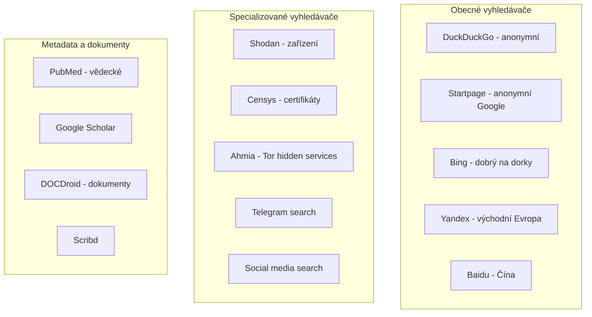

# 3.2 Alternativní vyhledávače

> **Cíle kapitoly:**
>
> - Znát alternativní vyhledávače a jejich specializaci
> - Umět používat specializované vyhledávače (Shodan, Censys)
> - Vědět, který vyhledávač použít pro který typ informace
> - Znát omezení a silné stránky každého vyhledávače

---

## Teorie

### Proč nepoužívat jen Google

Google není vždy nejlepší volbou pro OSINT:

| Omezení Googlu | Alternativa |
|---|---|
| Blokování některých dork dotazů | Bing, Yandex |
| Neindexuje deep web | Archive services |
| Omezené vyhledávání zařízení | Shodan, Censys |
| Nízká podpora neanglických zdrojů | Yandex, Baidu |
| Sledování a personalizace | DuckDuckGo, Startpage |

### Klasifikace vyhledávačů



### Přehled alternativních vyhledávačů

| Vyhledávač | URL | Specializace | Poznámka |
|---|---|---|---|
| **DuckDuckGo** | duckduckgo.com | Anonymní vyhledávání | Neprofiluje uživatele |
| **Startpage** | startpage.com | Anonymní Google | Google výsledky bez sledování |
| **Bing** | bing.com | Obecný | Méně blokuje dorky než Google |
| **Yandex** | yandex.com | Východní Evropa | Dobrý na ruské zdroje |
| **Baidu** | baidu.com | Čína | Čínské weby |
| **Shodan** | shodan.io | Zařízení / IoT | Vyhledávání připojených zařízení |
| **Censys** | censys.io | Certifikáty / IP | Veřejné certifikáty a služby |
| **Ahmia** | ahmia.fi | Tor / I2P | Onion služby |
| **Google Scholar** | scholar.google.com | Vědecké publikace | Akademické zdroje |

### Shodan — Vyhledávač zařízení

Shodan indexuje zařízení připojená k internetu:

```mermaid
graph TD
    A[Shodan crawlers] --> B[Skenují IP rozsahy]
    B --> C[Porty: 80, 443, 22, 21, ...]
    C --> D[Banner grabbing]
    D --> E[Indexace]
    
    E --> F[Vyhledávání]
    F --> G[""apache" country:CZ"]
    F --> H[""webcam" port:8080"]
    F --> I[""default password""]
```

**Shodan filtry:**

| Filtr | Příklad | Popis |
|---|---|---|
| **country:** | country:CZ | Podle země |
| **city:** | city:Prague | Podle města |
| **port:** | port:22 | Podle portu |
| **org:** | org:Google | Podle organizace |
| **hostname:** | hostname:example.com | Podle hostname |
| **os:** | os:Linux | Podle OS |
| **before/after:** | before:2024 | Podle data |
| **product:** | product:Apache | Podle produktu |

### Censys — Vyhledávač certifikátů a služeb

Censys se specializuje na SSL/TLS certifikáty a služby:

| Funkce | Popis |
|---|---|
| **Certificate search** | Vyhledávání certifikátů podle domény, hashe, issuer |
| **Host search** | Informace o IP adresách a službách |
| **Certificate Transparency** | CT log search |
| **API** | Programový přístup k datům |

---

## Postup krok za krokem: Vyhledávání na Shodan

### 1. Základní vyhledávání

1. Otevřete [shodan.io](https://www.shodan.io)
2. Zadejte dotaz: `country:CZ`
3. Filtrujte podle portů, služeb, města

### 2. Pokročilé vyhledávání

1. Najděte webkamery: `"webcam" country:CZ`
2. Najděte otevřené databáze: `"MongoDB" "SetParameter" port:27017`
3. Najděte průmyslové systémy: `"Siemens" "S7"`

### 3. Export výsledků

1. Použijte API pro export (vyžaduje účet)
2. Stáhněte JSON pro další analýzu

---

## Reálné příklady

### Příklad 1: Otevřené kamery

**Cíl:** Najít veřejně dostupné kamery v Praze

**Dotaz (Shodan):**
```
webcam country:CZ city:Prague port:8080 OR port:554
```

**Výsledek:** Několik otevřených kamer bez hesla

### Příklad 2: Firemní infrastruktura

**Cíl:** Zmapovat zařízení firmy ABC

**Dotaz (Shodan):**
```
org:"ABC Corp" OR hostname:"abc.com"
```

**Výsledek:** Seznam všech zařízení firmy viditelných z internetu

---

## Tipy a časté chyby

> [!TIP]
> Shodan je nejlepší přítel OSINT analytika při mapování infrastruktury. Základní účet je zdarma, pro větší projekty použijte API.

> [!WARNING]
> **Častá chyba:** Domnívat se, že Shodan najde vše. Shodan crawls pouze známé porty a ne všechna zařízení.

> [!WARNING]
> **Častá chyba:** Nepoužívat DuckDuckGo pro citlivá vyhledávání. Ačkoli neprofiluje, stále odhaluje IP adresu — používejte s Tor nebo VPN.

---

## Praktické cvičení

**Úkol 1:** Vyzkoušejte vyhledávače:

1. Porovnejte výsledky stejného dotazu na Google vs DuckDuckGo vs Bing
2. Najděte na Shodan zařízení ve svém městě
3. Najděte na Censys certifikáty pro doménu svého výběru

**Úkol 2:** Shodan výzkum:
1. Najděte 5 otevřených databází (MongoDB, Elastic)
2. Najděte zařízení s výchozím heslem
3. Zjistěte, jaké služby běží na IP 1.1.1.1

**Pomůcky:** Shodan, Censys, DuckDuckGo, Bing, Yandex
**Očekávaný výstup:** Srovnávací tabulka vyhledávačů + screenshoty z Shodan

---

## Shrnutí

- Různé vyhledávače mají různé silné stránky
- DuckDuckGo/Startpage pro anonymní vyhledávání
- Shodan/Censys pro technickou infrastrukturu
- Yandex/Baidu pro regionální zdroje
- Specializované vyhledávače poskytují data, které Google nemá

---

## Kontrolní otázky

1. Jaký je rozdíl mezi DuckDuckGo a Startpage?
2. K čemu slouží Shodan?
3. Jaký filtr byste použili na Shodan pro nalezení zařízení v ČR?
4. Co indexuje Censys?
5. Proč může být Yandex užitečný pro OSINT?

---

## Zdroje a odkazy

- [Shodan](https://www.shodan.io)
- [Censys](https://censys.io)
- [DuckDuckGo](https://duckduckgo.com)
- [Startpage](https://www.startpage.com)
- [Ahmia — Tor Search](https://ahmia.fi)
- [Yandex](https://yandex.com)
