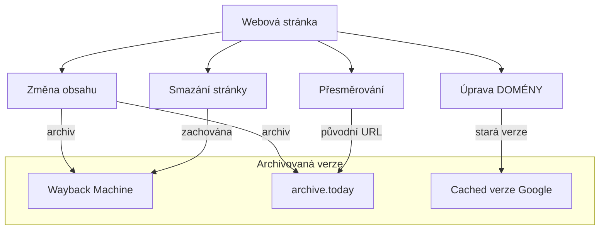

# 3.3 Archivované stránky

> **Cíle kapitoly:**
>
> - Umět používat Wayback Machine a archive.today
> - Znát techniky pro získání starších verzí webových stránek
> - Umět analyzovat změny na stránkách v čase
> - Využívat cached verze stránek

---

## Teorie

### Proč jsou archivované stránky důležité

Webový obsah není trvalý. Stránky se mění, mažou, upravují:



### Kdy používat archivy

| Situace | Nástroj |
|---|---|
| Stránka byla smazána | Wayback Machine, archive.today |
| Potřebuji starší verzi obsahu | Wayback Machine |
| Chci porovnat změny v čase | Wayback Machine + diff |
| Stránka je blokovaná v ČR | Cached verze, archive.today |
| Potřebuji důkaz o existenci stránky v minulosti | Wayback Machine |
| Aktuální stránka je upravena | Wayback Machine, Google Cache |

### Wayback Machine (Internet Archive)

Největší webový archiv na světě s více než 800 miliardami stránek.

| Funkce | Popis |
|---|---|
| **Wayback Machine** | Hlavní rozhraní — web.archive.org |
| **Save Page Now** | Ruční archivace stránky |
| **CDX API** | Programový přístup k datům |
| **Changes** | Sledování změn na stránce |
| **Collections** | Tématické kolekce |

### archive.today

Alternativní archiv s důrazem na screenshoty:

| Funkce | Popis |
|---|---|
| **Screenshot** | Ukládá vizuální podobu stránky |
| **Text** | Zároveň ukládá textový obsah |
| **Rychlost** | Rychlejší než Wayback Machine |
| **Tor** | Přístupný přes Tor |
| **Ochrana** | Obtížněji odstranitelný |

### Google Cache

Google ukládá kopie indexovaných stránek:

- Prefix: `cache:URL`
- Nebo: vyhledat a kliknout na šipku u výsledku → "Cached"

> [!WARNING]
> Google Cache je dočasný — stránka zůstává v cache jen několik dní až týdnů.

---

## Postup krok za krokem: Práce s Wayback Machine

### 1. Vyhledání archivované stránky

1. Otevřete [web.archive.org](https://web.archive.org)
2. Zadejte URL stránky
3. Prohlédněte si časovou osu snapshotů

### 2. Analýza změn v čase

1. Na časové ose vyberte dva snapshoty
2. Klikněte na "Compare" (pokud je k dispozici)
3. Analyzujte rozdíly

### 3. Ruční archivace

1. Otevřete [web.archive.org/save](https://web.archive.org/save)
2. Zadejte URL
3. Počkejte na archivaci

### 4. Programový přístup (API)

```python
import requests

# Získání seznamu snapshotů
url = "https://web.archive.org/cdx/search/cdx"
params = {
    "url": "example.com",
    "output": "json",
    "limit": 100
}
response = requests.get(url, params=params)
```

---

## Reálné příklady

### Příklad 1: Smazaná stránka

**Případ:** Firma smazala ze svého webu stránku s tiskovou zprávou, která obsahovala nepravdivé informace. Novinář chce dokázat, že stránka existovala.

**Řešení:** Wayback Machine — stránka byla archivována před smazáním.

**Postup:**
1. `web.archive.org/web/20230101000000/https://firma.cz/tiskova-zprava`
2. Screenshot původní stránky
3. Porovnání s aktuální verzí (404)

### Příklad 2: Sledování změn

**Případ:** Analytik sleduje změny na stránce politické strany během volební kampaně.

**Postup:**
1. Pravidelná archivace stránky na Wayback Machine
2. Porovnání snapshotů před a po klíčových událostech
3. Identifikace změn v programu a slibech

---

## Tipy a časté chyby

> [!TIP]
> Archivujte důležité stránky IHNED, jakmile je najdete. Nikdy nevíte, kdy budou smazány.

> [!WARNING]
> **Častá chyba:** Wayback Machine nearchivuje vše. Některé stránky jsou blokovány robots.txt nebo nebyly nikdy archivovány.

> [!WARNING]
> **Častá chyba:** Spoléhání na jeden archiv. Pokud je stránka kritická, archivujte ji na Wayback Machine I na archive.today.

---

## Praktické cvičení

**Úkol 1:** Historický výzkum:

1. Najděte na Wayback Machine stránku svého oblíbeného webu z roku 2010
2. Porovnejte ji s aktuální verzí
3. Zapište 5 největších změn

**Úkol 2:** Cílené vyhledávání:

1. Zkuste najít smazaný článek nebo stránku
2. Použijte Wayback Machine i archive.today
3. Zdokumentujte postup

**Úkol 3:** Archivace:
1. Archivujte aktuální článek na Wayback Machine
2. Archivujte stejný článek na archive.today
3. Porovnejte obě archivace

**Pomůcky:** web.archive.org, archive.today
**Očekávaný výstup:** Sada screenshotů archivovaných stránek + dokumentace změn

---

## Shrnutí

- Wayback Machine je největší webový archiv s miliardami stránek
- archive.today je alternativa s důrazem na screenshoty
- Google Cache je dočasná, ale rychlá
- Vždy archivujte důležité stránky hned při objevení
- Pro kritické informace používejte více archivů současně

---

## Kontrolní otázky

1. Jak funguje Wayback Machine?
2. Jaký je rozdíl mezi Wayback Machine a archive.today?
3. Jak zobrazíte Google Cache stránky?
4. Proč je důležité archivovat stránky při objevení?
5. Co je omezením Wayback Machine?

---

## Zdroje a odkazy

- [Wayback Machine](https://web.archive.org)
- [archive.today](https://archive.ph)
- [Google Cache](https://webcache.googleusercontent.com)
- [Wayback Machine API](https://archive.org/help/wayback_api.php)
- [CachedView](https://cachedview.com)
