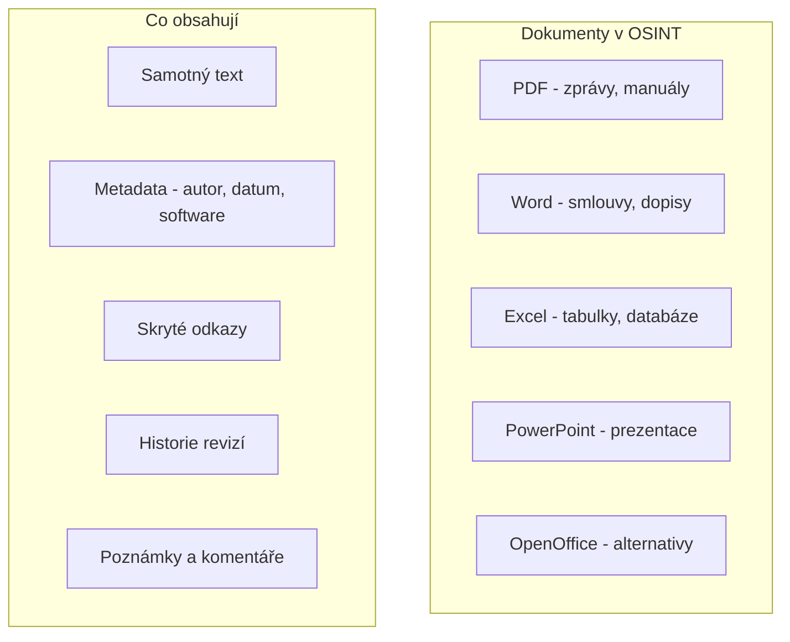

# 3.4 Vyhledávání dokumentů

> **Cíle kapitoly:**
>
> - Umět cíleně vyhledávat dokumenty podle typu a obsahu
> - Znát techniky pro nalezení PDF, DOCX, XLSX a dalších formátů
> - Umět extrahovat metadata z dokumentů
> - Ovládat specializované vyhledávače dokumentů

---

## Teorie

### Proč vyhledávat dokumenty

Dokumenty často obsahují informace, které nejsou na webových stránkách:



### Základní techniky

| Technika | Popis | Příklad |
|---|---|---|
| **filetype:** | Vyhledání podle typu souboru | filetype:pdf "osint" |
| **ext:** | Alternativa k filetype | ext:pdf ext:docx |
| **intext:** | Hledání v textu dokumentu | intext:"důvěrné" |
| **Kombinace** | Více podmínek najednou | filetype:xls "heslo" site:cz |

### Formáty dokumentů

| Formát | MIME type | Co hledat |
|---|---|---|
| **PDF** | application/pdf | Zprávy, manuály, formuláře |
| **DOCX** | application/vnd.openxmlformats-officedocument.wordprocessingml | Smlouvy, dopisy, šablony |
| **XLSX** | application/vnd.openxmlformats-officedocument.spreadsheetml | Tabulky, databáze, účetnictví |
| **PPTX** | application/vnd.openxmlformats-officedocument.presentationml | Prezentace, plány |
| **ODT** | application/vnd.oasis.opendocument.text | Alternativní texty |
| **TXT** | text/plain | Poznámky, logy |
| **CSV** | text/csv | Data, exporty |
| **JSON** | application/json | API data |

### Specializované vyhledávače dokumentů

| Služba | URL | Specializace |
|---|---|---|
| **Scribd** | scribd.com | Dokumenty všeho druhu |
| **SlideShare** | slideshare.net | Prezentace |
| **DocDroid** | docdroid.net | PDF dokumenty |
| **Academia** | academia.edu | Akademické dokumenty |
| **ResearchGate** | researchgate.net | Výzkumné publikace |
| **Issuu** | issuu.com | Publikace, magazíny |
| **Yumpu** | yumpu.com | Digitální publikace |
| **Google Books** | books.google.com | Knihy |

---

## Postup krok za krokem: Vyhledávání dokumentů

### 1. Definujte typ dokumentu

Co hledáte?
- Výroční zpráva → PDF
- Finanční data → XLSX
- Smlouva → PDF nebo DOCX
- Prezentace → PPTX nebo PDF

### 2. Sestavte dotaz

**Příklady cílených dotazů:**

```bash
# Hledání zpráv českých firem
filetype:pdf "výroční zpráva" site:cz

# Hledání smluv
filetype:pdf OR filetype:docx "smlouva" "dodavatel"

# Hledání tabulek s hesly (pozor, eticky!)
filetype:xls "username" "password"

# Hledání prezentací o bezpečnosti
filetype:ppt OR filetype:pptx "bezpečnost" "IT"

# Hledání dokumentů na konkrétním serveru
site:example.cz filetype:pdf intitle:"důvěrné"
```

### 3. Prohledejte specializované servery

1. Projděte Scribd, DocDroid, SlideShare pro cílové téma
2. Použijte Google operátory pro hledání na těchto serverech
3. Stáhněte relevantní dokumenty

### 4. Analyzujte metadata

Po stažení dokumentu analyzujte jeho metadata:

```bash
# Linux: pdfinfo
pdfinfo dokument.pdf

# Linux: exiftool (funguje na PDF, Office)
exiftool dokument.docx

# Windows: pravým kliknout > Vlastnosti
# Mac: Get Info
```

---

## Reálné příklady

### Příklad 1: Firemní smlouva

**Cíl:** Najít smlouvu mezi firmou A a firmou B

**Postup:**
1. `site:cz filetype:pdf "smlouva" "Firma A" "Firma B"`
2. `site:or.justice.cz "Firma A" filetype:pdf`
3. Prohledat i archivované verze na Wayback Machine

**Výsledek:** PDF smlouva na veřejné zakázce

### Příklad 2: Uniklá databáze

**Cíl:** Najít uniklou databázi uživatelů

**Postup:**
1. `filetype:sql "INSERT INTO" "users" "password"`
2. `filetype:csv "email" "password" "username"`
3. `filetype:json "users" "credentials"`

> [!WARNING]
> S uniklými databázemi nakládejte opatrně. Nepoužívejte je k nelegálním účelům.

---

## Tipy a časté chyby

> [!TIP]
> Dokumenty často obsahují více informací, než je na první pohled vidět. Vždy kontrolujte metadata, komentáře a historii revizí.

> [!WARNING]
> **Častá chyba:** Zapomínání na neanglické ekvivalenty. Pokud hledáte v ČR, používejte česká klíčová slova: "smlouva", "faktura", "zpráva".

> [!WARNING]
> **Častá chyba:** Stahování podezřelých dokumentů bez kontroly. Dokument může obsahovat malware nebo sledovací prvky.

---

## Praktické cvičení

**Úkol 1:** Vyhledejte dokumenty:

1. Najděte výroční zprávu české firmy ve formátu PDF
2. Najděte prezentaci o kybernetické bezpečnosti (PPT/PPTX)
3. Najděte tabulku s finančními daty (XLS/XLSX)
4. Najděte dokument na Scribd nebo DocDroid

**Úkol 2:** Metadata:
1. Stáhněte libovolný PDF
2. Pomocí exiftool nebo vestavěných vlastností zjistěte:
   - Autora
   - Software, ve kterém byl vytvořen
   - Datum vytvoření a modifikace
   - Počet revizí

**Pomůcky:** Google, Scribd, DocDroid, exiftool/pdfinfo
**Očekávaný výstup:** Sada nalezených dokumentů + metadatová analýza

---

## Shrnutí

- Používejte `filetype:` a `ext:` pro cílené vyhledávání dokumentů
- Specializované servery (Scribd, SlideShare) mají obsah neindexovaný Googlem
- Metadata dokumentů často prozradí více než samotný obsah
- Vždy kontrolujte autora, datum a software z metadat
- Buďte opatrní při stahování neznámých dokumentů

---

## Kontrolní otázky

1. Jaký Google operátor použijete pro hledání PDF?
2. Kde hledat prezentace?
3. Jaká metadata můžete získat z PDF?
4. Proč je důležité kontrolovat metadata dokumentů?
5. Jaká rizika hrozí při stahování dokumentů?

---

## Zdroje a odkazy

- [Scribd](https://www.scribd.com)
- [SlideShare](https://www.slideshare.net)
- [DocDroid](https://www.docdroid.net)
- [Academia](https://www.academia.edu)
- [ResearchGate](https://www.researchgate.net)
- [ExifTool](https://exiftool.org)
- [PDF Tools - pdfinfo](https://www.xpdfreader.com)
