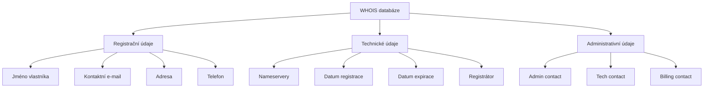
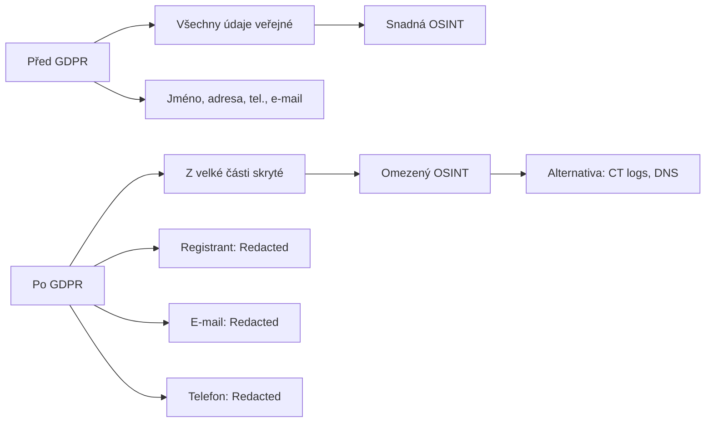

# 4.1 WHOIS

> **Cíle kapitoly:**
>
> - Porozumět struktuře WHOIS databází
> - Umět provést WHOIS lookup a interpretovat výsledky
> - Znát limity a ochranu WHOIS dat
> - Umět využít RDAP jako moderní alternativu

---

## Teorie

### Co je WHOIS

WHOIS je protokol a databáze obsahující informace o registraci doménových jmen a IP adres.



### Struktura WHOIS záznamu

| Pole | Popis | Příklad |
|---|---|---|
| **Domain Name** | Doménové jméno | example.com |
| **Registrar** | Registrátor domény | NameCheap, GoDaddy |
| **WHOIS Server** | Server s WHOIS daty | whois.namecheap.com |
| **Creation Date** | Datum registrace | 2020-01-01 |
| **Registry Expiry Date** | Datum expirace | 2025-01-01 |
| **Name Server** | DNS servery | ns1.example.com |
| **Registrant** | Vlastník domény | John Doe |
| **Admin** | Administrativní kontakt | admin@example.com |
| **Tech** | Technický kontakt | tech@example.com |
| **DNSSEC** | DNSSEC podpis | unsigned |

### Typy WHOIS dotazů

```bash
# Základní WHOIS
whois example.com

# WHOIS na konkrétním serveru
whois -h whois.nic.cz example.cz

# WHOIS IP adresy
whois 1.1.1.1

# WHOIS ASN
whois AS13335
```

### RDAP — Moderní náhrada WHOIS

RDAP (Registration Data Access Protocol) je modernější standard:

| Vlastnost | WHOIS | RDAP |
|---|---|---|
| **Formát** | Text (nestrukturovaný) | JSON (strukturovaný) |
| **Standard** | Žádný jednotný | RFC 7480-7484 |
| **Internacionalizace** | Omezená | Podpora UTF-8 |
| **Autentizace** | Žádná | Podpora |
| **Rate limiting** | Implementačně závislé | Standardizované |

### Ochrana WHOIS (WHOIS Privacy / GDPR)

Od účinnosti GDPR (2018) došlo k zásadním změnám:



---

## Postup krok za krokem: WHOIS analýza

### 1. Základní WHOIS

```bash
# Příkazový řádek (Linux/Mac)
whois example.com

# Online nástroje
# - whois.domaintools.com
# - whois.icann.org
# - lookup.icann.org
```

### 2. Interpretace výsledků

Klíčové informace k analýze:

1. **Datum registrace** — jak dlouho doména existuje?
2. **Datum expirace** — hrozí ztráta domény?
3. **Registrátor** — kde je doména registrována?
4. **Nameservery** — kde je hostována?
5. **Kontaktní údaje** — i přes privacy někdy prosvítají
6. **DNSSEC** — je zabezpečena?

### 3. Pokročilá analýza

```bash
# Zjištění změn v čase
whois example.com | grep "Creation Date"
whois example.com | grep "Updated Date"

# Porovnání s historickými WHOIS
# whois.domaintools.com má historické WHOIS
```

---

## Reálné příklady

### Příklad 1: Detekce podezřelé domény

**Cíl:** Ověřit důvěryhodnost nově registrované domény

```bash
$ whois suspicious-site.com
Creation Date: 2024-08-01  # Registrováno před 3 dny
Registrant: WhoIs Privacy Service
Registrar: GoDaddy
```

**Analýza:**
- Nově registrovaná (3 dny) — častý znak phishingových stránek
- WHOIS privacy — může být legitimní, ale ztěžuje identifikaci
- Známý registrátor — neutrální

### Příklad 2: Historie domény

**Cíl:** Zjistit změny vlastnictví domény

```bash
$ whois example.cz
# Aktuální: Firma ABC s.r.o.
# Historicky (podle whois.domaintools.com):
# 2020: původní majitel
# 2022: změna na Firmu ABC
# 2024: aktuální stav
```

---

## Tipy a časté chyby

> [!TIP]
> WHOIS je jen začátek. Kombinujte ho s DNS analýzou, Certificate Transparency a dalšími technikami pro kompletní obraz.

> [!WARNING]
> **Častá chyba:** GDPR ochrana = doména je bezpečná. GDPR ochrana pouze skrývá osobní údaje, neznamená to, že doména je legitimní.

> [!WARNING]
> **Častá chyba:** Ignorování historických WHOIS. Současné WHOIS může být zavádějící — historická data často odhalí skutečného vlastníka.

---

## Praktické cvičení

**Úkol 1:** Proveďte WHOIS analýzu:

1. `whois seznam.cz` — co zjistíte o Seznam.cz?
2. `whois google.com` — porovnejte strukturu
3. `whois example.com` — všimněte si rozdílu

**Úkol 2:** Ověřte podezřelou doménu:

1. Najděte doménu registrovanou v posledních 30 dnech
2. Zkontrolujte WHOIS záznam
3. Zjistěte, zda používá WHOIS privacy
4. Zkontrolujte historii domény na whois.domaintools.com

**Úkol 3:** RDAP:
1. Použijte RDAP místo WHOIS: `curl https://rdap.org/domain/example.com`
2. Porovnejte strukturovaný JSON s textovým WHOIS
3. Který formát je pro automatizaci vhodnější?

**Pomůcky:** whois příkaz, whois.domaintools.com, rdap.org
**Očekávaný výstup:** WHOIS analýza 3 domén + RDAP JSON

---

## Shrnutí

- WHOIS poskytuje registrační údaje domén a IP adres
- GDPR výrazně omezilo dostupnost osobních údajů v WHOIS
- RDAP je moderní strukturovaná alternativa k WHOIS
- Historické WHOIS je cenný zdroj informací
- WHOIS je první, ale ne jediný krok v analýze domény

---

## Kontrolní otázky

1. Jaké informace obsahuje WHOIS záznam?
2. Jak GDPR ovlivnilo WHOIS?
3. Co je RDAP a jak se liší od WHOIS?
4. Jak zjistíte historii WHOIS záznamů?
5. Proč je WHOIS ochrana problém pro OSINT?

---

## Zdroje a odkazy

- [ICANN WHOIS](https://whois.icann.org)
- [DomainTools WHOIS](https://whois.domaintools.com)
- [RDAP](https://rdap.org)
- [CZ.NIC WHOIS](https://whois.nic.cz)
