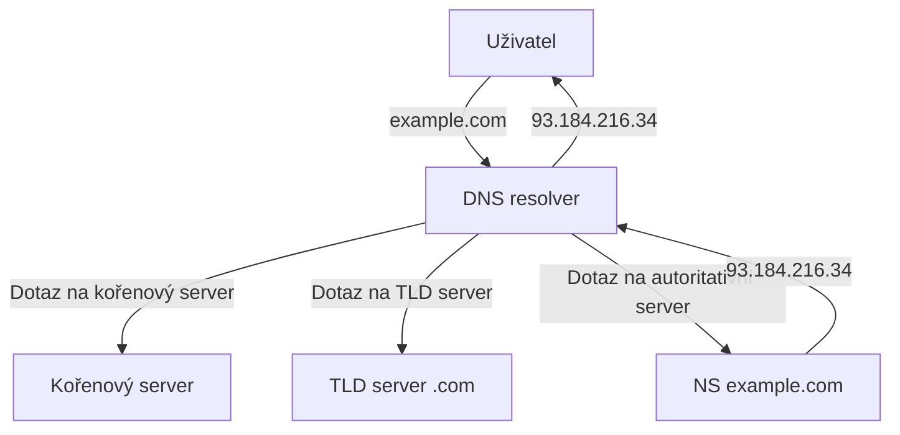
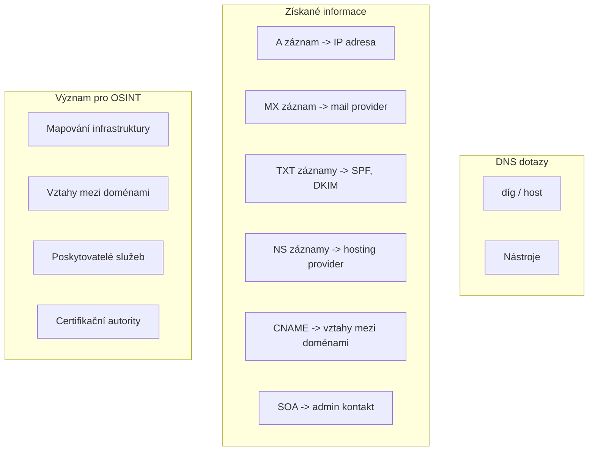

# 4.2 DNS záznamy

> **Cíle kapitoly:**
>
> - Porozumět DNS systému a typům záznamů
> - Umět provádět DNS dotazy a interpretovat výsledky
> - Znát význam jednotlivých typů záznamů pro OSINT
> - Umět využít DNS pro mapování infrastruktury

---

## Teorie

### Co je DNS

DNS (Domain Name System) je systém překladu doménových jmen na IP adresy a naopak.



### Typy DNS záznamů

| Záznam | Účel | Příklad |
|---|---|---|
| **A** | IPv4 adresa domény | 93.184.216.34 |
| **AAAA** | IPv6 adresa domény | 2606:2800:220:1:248:1893:25c8:1946 |
| **CNAME** | Kanonické jméno (alias) | www → example.com |
| **MX** | Mail server pro doménu | mail.example.com (priority 10) |
| **NS** | Nameservery domény | ns1.example.com |
| **TXT** | Textové záznamy | SPF, DKIM, DMARC, verifikace |
| **SOA** | Start of Authority | Primární NS, admin e-mail, refresh |
| **PTR** | Reverzní DNS (IP → jméno) | 34.216.184.93 → example.com |
| **SRV** | Služby (SIP, LDAP) | _sip._tcp.example.com |
| **CAA** | Oprávněné CA pro SSL | Lets Encrypt, DigiCert |

### DNS lookup nástroje

```bash
# Základní dotazy
dig example.com
dig example.com A
dig example.com MX
dig example.com TXT

# Zkrácený výstup
dig example.com +short

# Specifický DNS server
dig @8.8.8.8 example.com

# Reverzní DNS
dig -x 93.184.216.34

# Hostitelský příkaz
host example.com
host -t mx example.com
host -t txt example.com

# Nslookup (Windows)
nslookup example.com
nslookup -type=mx example.com
```

### DNS v OSINT



---

## Postup krok za krokem: DNS analýza

### 1. Základní dotaz

```bash
# Získání IP adresy
dig example.com +short

# Všechny záznamy
dig example.com ANY +noall +answer
```

### 2. Mail server

```bash
# MX záznam - poštovní server
dig example.com MX +short

# Zjištění priority mail serverů
dig example.com MX +noall +answer
```

### 3. TXT záznamy (SPF, DKIM, DMARC)

```bash
# TXT záznamy
dig example.com TXT +short

# Konkrétně SPF
dig example.com TXT | grep "v=spf1"

# DMARC
dig _dmarc.example.com TXT +short

# DKIM (typicky)
dig default._domainkey.example.com TXT +short
```

### 4. Nameservery

```bash
# NS záznamy
dig example.com NS +short

# SOA záznam
dig example.com SOA +short
```

### 5. Hromadné dotazy (script)

```bash
#!/bin/bash
# DNS skenování subdomén
for sub in www mail admin blog shop; do
    ip=$(dig +short $sub.example.com)
    if [ -n "$ip" ]; then
        echo "$sub.example.com -> $ip"
    fi
done
```

---

## Reálné příklady

### Příklad 1: Identifikace hosting providera

```bash
$ dig seznam.cz NS +short
ns.seznam.cz.
ns2.seznam.cz.

$ dig seznam.cz A +short
77.75.75.75
77.75.77.77

# IP rozsah patří Seznamu
# -> vlastní infrastruktura
```

### Příklad 2: Mail security analýza

```bash
$ dig seznam.cz TXT | grep spf
"v=spf1 include:spf.seznam.cz ~all"

$ dig _dmarc.seznam.cz TXT
"v=DMARC1; p=reject; sp=reject; ..."
```

**Interpretace:**
- SPF: definuje, které servery smí odesílat e-maily
- DMARC: reject = odmítnout e-maily, které neprojdou SPF/DKIM
- p=reject signalizuje aktivní ochranu proti phishingu

---

## Tipy a časté chyby

> [!TIP]
> Používejte `+short` pro rychlé výsledky a `+noall +answer` pro kompletní výpis bez hlaviček.

> [!WARNING]
> **Častá chyba:** Zapomínání na `ANY` dotaz. `dig example.com` vrací jen A záznam — použijte `ANY` nebo specifikujte typ.

> [!WARNING]
> **Častá chyba:** Neověřování CNAME řetězců. Doména může být alias na jinou doménu → jinou IP → jiného vlastníka.

---

## Praktické cvičení

**Úkol 1:** Základní DNS analýza:

1. Zjistěte IP adresu domén: google.com, seznam.cz, github.com
2. Zjistěte MX záznamy pro každou doménu
3. Zjistěte NS záznamy

**Úkol 2:** Pokročilá analýza:

1. Najděte DMARC záznam pro google.com
2. Najděte SPF záznam pro seznam.cz
3. Zjistěte CNAME pro www.github.com
4. Najděte subdomény pomocí DNS enumeration

**Úkol 3:** Napište skript:

Napište jednoduchý bash skript, který provede DNS analýzu domény a zobrazí:
- IP adresu
- MX servery
- NS servery
- TXT záznamy

**Pomůcky:** dig, host, bash
**Očekávaný výstup:** DNS analýza 3 domén + funkční skript

---

## Shrnutí

- DNS je základní infrastrukturní služba internetu
- Různé typy DNS záznamů poskytují různé informace
- A/AAAA → IP adresy, MX → mail, TXT → SPF/DKIM/DMARC
- OSINT využívá DNS pro mapování infrastruktury
- dig je nejmocnější nástroj pro DNS dotazy

---

## Kontrolní otázky

1. Jaký DNS záznam použijete pro zjištění poštovního serveru?
2. Co je CNAME a k čemu slouží?
3. Jak zjistíte SPF záznam domény?
4. Co je DMARC a jak ho zjistíte?
5. Jaký je rozdíl mezi A a AAAA záznamem?

---

## Zdroje a odkazy

- [DNS Guide - Cloudflare](https://www.cloudflare.com/dns/)
- [dig man page](https://manpages.ubuntu.com/manpages/focal/man1/dig.1.html)
- [DNSDumpster](https://dnsdumpster.com)
- [MXToolbox DNS lookup](https://mxtoolbox.com)
