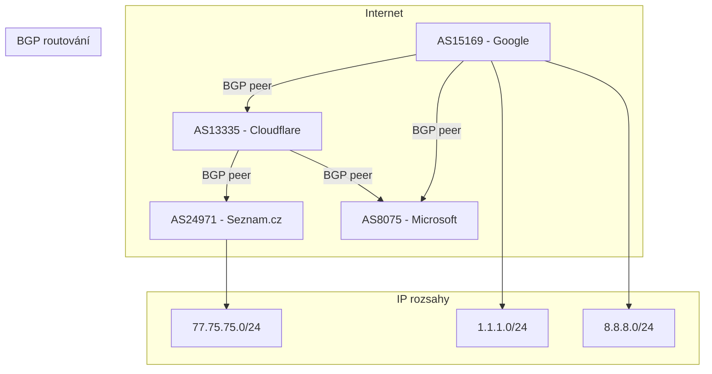
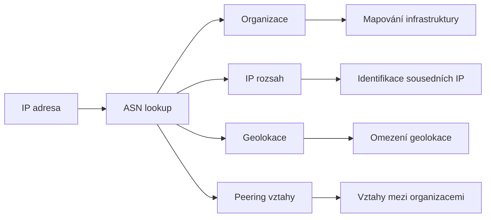

# 4.3 ASN

> **Cíle kapitoly:**
>
> - Porozumět konceptu autonomních systémů (AS)
> - Umět zjistit ASN pro IP adresu nebo doménu
> - Znát vztah mezi ASN, IP rozsahy a organizacemi
> - Umět využít ASN data pro mapování infrastruktury

---

## Teorie

### Co je ASN

Autonomní systém (AS) je kolekce IP sítí pod jednotnou správou, které sdílejí společnou routovací politiku. Každý AS má unikátní číslo — ASN (Autonomous System Number).



### Typy ASN

| Typ | Rozsah | Popis |
|---|---|---|
| **Public ASN** | 1-64511 | Veřejné, použitelné na internetu |
| **Private ASN** | 64512-65534 | Interní, pro privátní sítě |
| **32-bit ASN** | 65536-4294967295 | Rozšířený 32-bitový formát |

### Proč je ASN důležité pro OSINT



### Zjištění ASN

```bash
# Z IP adresy
whois 77.75.75.75
# Výsledek: origin: AS24971

# Pomocí dig
dig +short 77.75.75.75 AS24971.asn.cymru.com TXT
# Výsledek: "24971 | 77.75.75.0/24 | CZ | seznam"

# Online nástroj
# https://ipinfo.io
# https://bgp.he.net
```

### BGP a peering

| Pojem | Popis |
|---|---|
| **BGP** | Border Gateway Protocol — routovací protokol |
| **Peering** | Přímé propojení dvou AS |
| **Transit** | AS poskytuje konektivitu k internetu |
| **IXP** | Internet Exchange Point — místo peeringu |
| **BGP path** | Cesta přes AS k cíli |

---

## Postup krok za krokem: ASN analýza

### 1. Zjištění ASN z IP

```bash
# Metoda 1: whois
whois 77.75.75.75 | grep -i origin

# Metoda 2: Team Cymru
dig +short 77.75.75.75.asn.cymru.com TXT

# Metoda 3: BGP.he.net
# Web: https://bgp.he.net/ip/77.75.75.75
```

### 2. Získání IP rozsahů AS

```bash
# Metoda 1: whois
whois -h whois.radb.net !gAS24971

# Metoda 2: Team Cymru
whois -h whois.cymru.com " -c -v AS24971"

# Metoda 3: bgp.he.net
# https://bgp.he.net/AS24971#_prefixes
```

### 3. Analýza sousedních AS (peering)

```bash
# BGP.he.net zobrazí peering vztahy
# https://bgp.he.net/AS24971#_graph

# Kdo je upstream provider?
# Kdo je downstream?
# Kde má AS peering?
```

### 4. Vizualizace

```bash
# Grafické znázornění vztahů
# https://bgp.he.net/AS24971#_graph
# Zobrazí interaktivní graf sousedních AS
```

---

## Reálné příklady

### Příklad 1: Identifikace organizace

```bash
$ whois 185.43.4.1 | grep -i origin
origin: AS43541

$ whois -h whois.rada.net AS43541
České Radiokomunikace
```

**Analýza:** IP patří Českým Radiokomunikacím → můžeme očekávat hostingové služby

### Příklad 2: Mapování přes IP rozsah

```bash
$ whois -h whois.radb.net !gAS24971
77.75.75.0/24
77.75.76.0/24
77.75.77.0/24
77.75.78.0/24

# Nyní můžeme skenovat celý rozsah
# Známé služby Seznamu na 77.75.75.0/24
```

---

## Tipy a časté chyby

> [!TIP]
> ASN je klíč k pochopení, kdo skutečně vlastní IP infrastrukturu. I když je WHOIS domény skrytý, ASN často odhalí poskytovatele.

> [!WARNING]
> **Častá chyba:** Jeden ASN = jedna organizace. Velké společnosti (Google, Cloudflare) mají více ASN. Malé firmy mohou sdílet ASN s hosting providerem.

> [!WARNING]
> **Častá chyba:** ASN není vždy přesný indikátor vlastnictví. IP může být pronajatá od providera.

---

## Praktické cvičení

**Úkol 1:** ASN lookup:

1. Zjistěte ASN pro IP 8.8.8.8 (Google DNS)
2. Zjistěte ASN pro IP 1.1.1.1 (Cloudflare)
3. Zjistěte ASN pro IP svého oblíbeného webu
4. Zjistěte ASN pro seznam.cz

**Úkol 2:** IP rozsah:

1. Získejte všechny IP rozsahy AS24971
2. Zkontrolujte, zda některá IP v tomto rozsahu není známá služba
3. Zmapujte peering vztahy tohoto AS

**Úkol 3:** Vizualizace:

1. Otevřete bgp.he.net pro AS13335 (Cloudflare)
2. Prohlédněte si graf peering vztahů
3. Kdo jsou největší partneři Cloudflare?

**Pomůcky:** dig, whois, bgp.he.net, ipinfo.io
**Očekávaný výstup:** ASN analýza 4 IP adres, IP rozsahy, graf peeringu

---

## Shrnutí

- ASN identifikuje organizaci spravující IP rozsah
- Každý AS má unikátní číslo a přiřazené IP rozsahy
- BGP peering odhaluje vztahy mezi organizacemi
- ASN umožňuje mapovat celou IP infrastrukturu organizace
- Kombinace ASN + WHOIS + DNS poskytuje komplexní obraz

---

## Kontrolní otázky

1. Co je ASN a k čemu slouží?
2. Jak zjistíte ASN z IP adresy?
3. Jak získáte všechny IP rozsahy patřící AS?
4. Co je BGP peering?
5. Proč je ASN užitečné pro OSINT?

---

## Zdroje a odkazy

- [BGP.he.net](https://bgp.he.net)
- [Team Cymru](https://www.team-cymru.com)
- [IPinfo](https://ipinfo.io)
- [RADB - Routing Assets DB](https://www.radb.net)
- [Cloudflare - What is BGP?](https://www.cloudflare.com/learning/security/glossary/what-is-bgp/)
