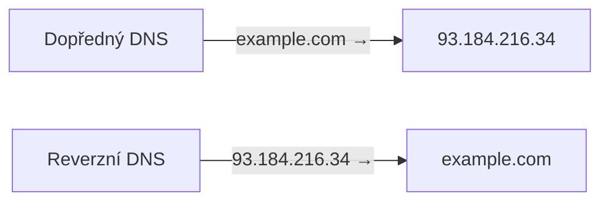
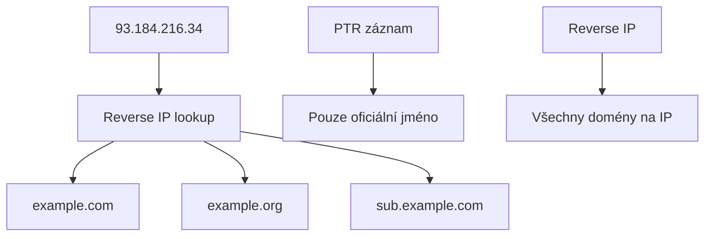

# 4.4 Reverzní DNS

> **Cíle kapitoly:**
>
> - Porozumět reverznímu DNS a PTR záznamům
> - Umět provést reverzní DNS lookup
> - Znát reverse IP lookup a jeho využití
> - Umět identifikovat servery podle PTR záznamů

---

## Teorie

### Co je reverzní DNS

Zatímco běžný DNS překládá doménové jméno na IP adresu, reverzní DNS překládá IP adresu na doménové jméno.



### PTR záznam

PTR (Pointer Record) je DNS záznam, který mapuje IP adresu na doménové jméno:

```bash
# Formát reverzního DNS
# IP: 93.184.216.34
# Reverzní doména: 34.216.184.93.in-addr.arpa
# PTR záznam: 34.216.184.93.in-addr.arpa → example.com
```

### Jak provést reverzní DNS

```bash
# Pomocí dig
dig -x 77.75.75.75 +short
# Výsledek: mail.seznam.cz

# Pomocí host
host 77.75.75.75
# 77.75.75.75.in-addr.arpa domain name pointer mail.seznam.cz.

# Pomocí nslookup
nslookup 77.75.75.75
```

### Reverse IP lookup

Na rozdíl od reverzního DNS (jedna IP → jedno jméno) reverse IP lookup hledá všechny domény na stejné IP:

```bash
# Online nástroje
# - https://yougetsignal.com/tools/web-sites-on-web-server/
# - https://viewdns.info/reverseip/
# - https://securitytrails.com
```



### Využití v OSINT

| Technika | Význam |
|---|---|
| **PTR analýza** | Identifikace typu serveru (mail, www, dns) |
| **Reverse IP** | Nalezení dalších domén na stejném hostingu |
| **Porovnání PTR** | Ověření, zda IP patří k doméně |
| **Historický PTR** | Změny v čase (pokud je k dispozici) |

---

## Postup krok za krokem: Reverzní DNS analýza

### 1. Základní reverzní DNS

```bash
# Zjištění PTR záznamu
dig -x 1.1.1.1 +short
# one.one.one.one

dig -x 8.8.8.8 +short
# dns.google
```

### 2. Interpretace PTR jmen

PTR jména často prozrazují typ serveru:

```bash
mail.example.com → Poštovní server
www.example.com → Webový server
dns.example.com → DNS server
ns1.example.com → Nameserver
smtp.example.com → SMTP server
pop.example.com → POP3 server
```

### 3. Reverse IP lookup

```bash
# Použití API (securitytrails.com)
curl -H "APIKEY: key" https://api.securitytrails.com/v1/ip/1.1.1.1
```

### 4. Identifikace sdíleného hostingu

```bash
# Mnoho domén na stejné IP = sdílený hosting
# Méně domén = dedikovaný server
# Vlastní PTR = vlastní infrastruktura
```

---

## Reálné příklady

### Příklad 1: Ověření identity serveru

```bash
$ dig -x 77.75.75.75 +short
mail.seznam.cz

# PTR potvrzuje, že jde o mail server Seznamu
```

### Příklad 2: Nalezení dalších domén

```bash
$ # Reverse IP na 77.75.75.75
$ # Výsledek (yougetsignal.com):
# seznam.cz
# seznam.net
# email.seznam.cz
# spoluzaci.cz
```

---

## Tipy a časté chyby

> [!TIP]
> PTR záznamy jsou často zanedbávané a obsahují cenné informace o infrastruktuře. Vždy je kontrolujte.

> [!WARNING]
> **Častá chyba:** Ne každá IP má PTR záznam. Malé firmy a domácí IP často PTR nemají.

> [!WARNING]
> **Častá chyba:** PTR nemusí odpovídat obsahu serveru. Server může mít PTR `mail.example.com`, ale běží na něm web — jde o špatnou konfiguraci.

---

## Praktické cvičení

**Úkol 1:** Reverzní DNS:

1. `dig -x 77.75.75.75` — co je to za server?
2. `dig -x 1.1.1.1` — jaký PTR má Cloudflare DNS?
3. `dig -x 8.8.8.8` — jaký PTR má Google DNS?
4. Zkuste reverzní DNS na IP své školy nebo zaměstnavatele

**Úkol 2:** Reverse IP lookup:

1. Použijte yougetsignal.com pro IP 77.75.75.75
2. Kolik domén je na stejné IP?
3. Zkuste reverse IP na IP svého webu
4. Porovnejte výsledky pro sdílený hosting vs dedikovaný server

**Pomůcky:** dig, yougetsignal.com, securitytrails.com
**Očekávaný výstup:** Reverzní DNS + reverse IP analýza pro 5 IP adres

---

## Shrnutí

- Reverzní DNS překládá IP → doménové jméno přes PTR záznamy
- PTR prozrazuje typ serveru (mail, web, DNS)
- Reverse IP lookup najde všechny domény na stejné IP
- Užitečné pro mapování infrastruktury a identifikaci sdíleného hostingu
- Ne všechny IP mají PTR — absence je také informace

---

## Kontrolní otázky

1. Jaký je rozdíl mezi reverzním DNS a reverse IP lookup?
2. Jak provedete reverzní DNS lookup pomocí dig?
3. Co prozrazuje PTR záznam?
4. Kdy není PTR záznam k dispozici?
5. K čemu slouží reverse IP lookup v OSINT?

---

## Zdroje a odkazy

- [YouGetSignal - Reverse IP](https://www.yougetsignal.com/tools/web-sites-on-web-server/)
- [ViewDNS - Reverse IP](https://viewdns.info/reverseip/)
- [SecurityTrails](https://securitytrails.com)
- [MXToolbox Reverse DNS](https://mxtoolbox.com/ReverseLookup.aspx)
