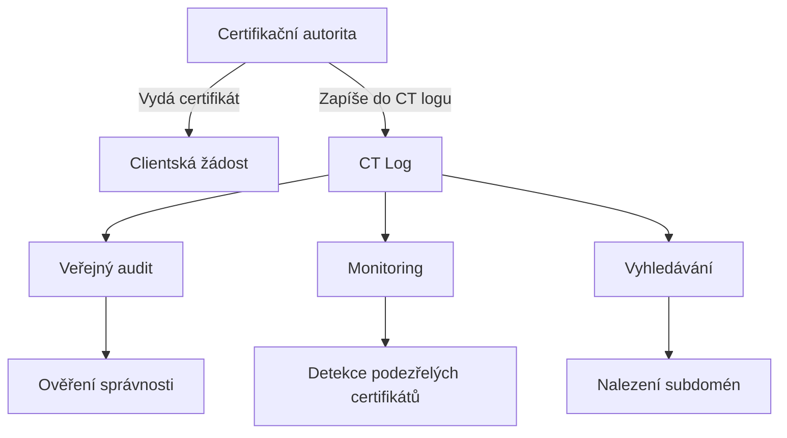
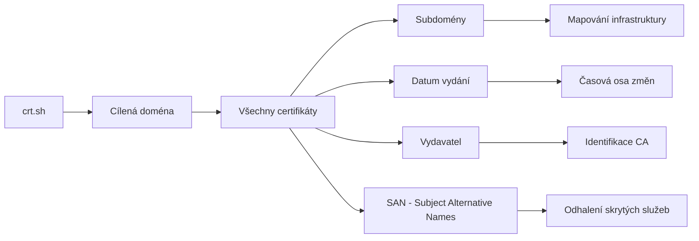

# 4.5 Certificate Transparency

> **Cíle kapitoly:**
>
> - Porozumět Certificate Transparency a CT logům
> - Umět vyhledávat certifikáty domény v CT logu
> - Znát crt.sh a další nástroje pro CT
> - Umět využít CT pro nalezení subdomén a infrastruktury

---

## Teorie

### Co je Certificate Transparency

Certificate Transparency (CT) je systém veřejných logů SSL/TLS certifikátů. Každý certifikát vydaný důvěryhodnou certifikační autoritou (CA) musí být zapsán do CT logu.



### Proč je CT důležité pro OSINT



### crt.sh

[crt.sh](https://crt.sh) je nejznámější CT vyhledávač provozovaný Comodo (Sectigo):

```bash
# Základní vyhledání certifikátů
https://crt.sh/?q=example.com

# JSON výstup
https://crt.sh/?q=example.com&output=json

# Identifikace (ID)
https://crt.sh/?id=12345678
```

### Další CT nástroje

| Nástroj | URL | Specifika |
|---|---|---|
| **crt.sh** | crt.sh | Nejznámější, JSON API |
| **Google CT** | search.certificate-transparency.appspot.com | Googlův CT |
| **CertSpotter** | certspotter.com | SSLMate monitoring |
| **Facebook CT** | facebook.com/ct/ | Facebook CT monitor |
| **Censys** | censys.io | CT + host data |

---

## Postup krok za krokem: CT analýza

### 1. Základní vyhledání

```bash
# Otevřít v prohlížeči
https://crt.sh/?q=example.com

# JSON formát (pro programové zpracování)
https://crt.sh/?q=example.com&output=json
```

### 2. Filtrování výsledků

```bash
# Identifikace (ID) — detail certifikátu
https://crt.sh/?id=12345678

# Pouze nespárované (issued, not matched)
https://crt.sh/?q=example.com&matched=no

# Pouze wildcard certifikáty
# obsahují *.example.com v CN nebo SAN
```

### 3. Extrakce subdomén

```bash
# Získání seznamu subdomén z CT logu
curl -s "https://crt.sh/?q=example.com&output=json" | \
  jq -r '.[].name_value' | \
  sort -u
```

### 4. Analýza časové osy

```bash
# Certifikáty podle data
curl -s "https://crt.sh/?q=example.com&output=json" | \
  jq -r '.[] | "\(.not_before) \(.name_value) \(.issuer_name)"'
```

---

## Reálné příklady

### Příklad 1: Nalezení skrytých subdomén

**Cíl:** Najít všechny subdomény example.com

```bash
$ curl -s "https://crt.sh/?q=example.com&output=json" | jq -r '.[].name_value' | sort -u
example.com
www.example.com
mail.example.com
admin.example.com
dev.example.com
staging.example.com
api.example.com
vpn.example.com
```

**Analýza:** CT log odhalil i neveřejné subdomény (staging, dev, admin), které nejsou indexované vyhledávači.

### Příklad 2: Sledování změn infrastruktury

**Cíl:** Sledovat, kdy firma přidala nové služby

```bash
# Všechny certifikáty seřazené podle data
$ curl -s "https://crt.sh/?q=example.com&output=json" | \
  jq -r '.[] | "\(.not_before[0:10]) \(.name_value)"' | \
  sort

2023-01-01 example.com
2023-06-01 www.example.com
2024-01-15 mail.example.com
2024-03-01 shop.example.com  # Nová služba!
```

---

## Tipy a časté chyby

> [!TIP]
> CT logy jsou zlatý důl pro OSINT. Pravidelně monitorujte domény zájmu — nový certifikát signalizuje novou službu nebo infrastrukturu.

> [!WARNING]
> **Častá chyba:** CT log zobrazí jen certifikované subdomény. Ne všechny subdomény mají vlastní certifikát — některé používají wildcard `*.example.com`.

> [!WARNING]
> **Častá chyba:** Starší certifikáty v CT logu mohou ukazovat na již neexistující subdomény. Vždy ověřte, zda subdoména stále existuje (DNS dotaz).

---

## Praktické cvičení

**Úkol 1:** CT analýza domény:

1. Otevřete crt.sh pro seznam.cz
2. Kolik certifikátů je vydáno?
3. Najděte všechny subdomény seznam.cz
4. Která CA vydala nejvíce certifikátů?

**Úkol 2:** JSON API:

1. Stáhněte JSON seznam certifikátů pro example.com
2. Pomocí jq extrahujte:
   - Všechny unikátní subdomény
   - Nejstarší certifikát
   - Nejnovější certifikát

**Úkol 3:** Sledování změn:

1. Vyberte si doménu a zaznamenejte aktuální certifikáty
2. Za týden zkontrolujte, zda přibyly nové
3. Jaké změny nastaly?

**Pomůcky:** crt.sh, curl, jq
**Očekávaný výstup:** Seznam subdomén z CT logu + analýza certifikátů

---

## Shrnutí

- CT logy obsahují všechny veřejně vydané SSL/TLS certifikáty
- crt.sh je hlavní nástroj pro vyhledávání v CT logu
- CT logy odhalují subdomény, i ty skryté před vyhledávači
- Časová osa certifikátů ukazuje vývoj infrastruktury
- Wildcard certifikáty (*.doména) omezují viditelnost subdomén

---

## Kontrolní otázky

1. Co je Certificate Transparency a k čemu slouží?
2. Jak najdete všechny certifikáty domény na crt.sh?
3. Co jsou Subject Alternative Names (SAN)?
4. Jaký je limit CT logů pro OSINT?
5. Jak můžete automaticky stáhnout certifikáty z crt.sh?

---

## Zdroje a odkazy

- [crt.sh](https://crt.sh)
- [Certificate Transparency - Google](https://certificate-transparency.org)
- [CertSpotter](https://certspotter.com)
- [Censys Certificate Search](https://censys.io)
- [SSLMate CT Search](https://sslmate.com)
