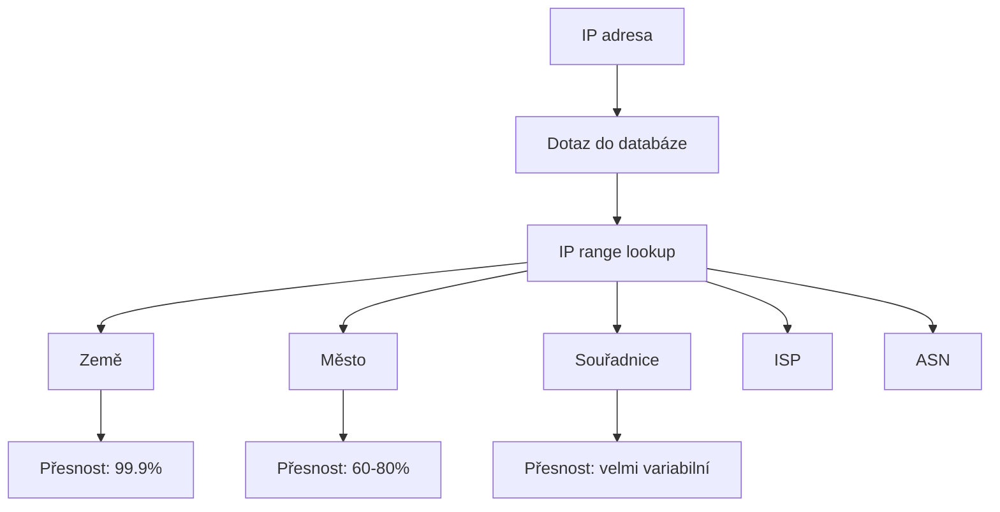
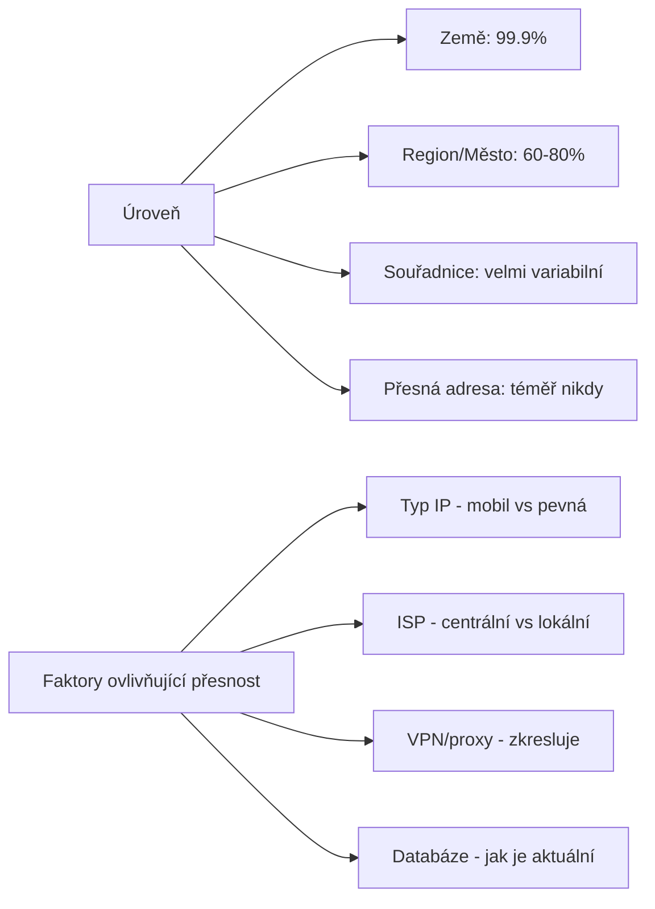

# 5.1 Geolokace IP adres

> **Cíle kapitoly:**
>
> - Porozumět principům geolokace IP adres
> - Znát databáze a jejich přesnost
> - Umět interpretovat výsledky geolokace
> - Znát limity a ošidnosti IP geolokace

---

## Teorie

### Jak funguje geolokace IP

Geolokace IP adres není založena na fyzickém umístění zařízení, ale na databázích, které mapují IP rozsahy na geografické lokace.



### Zdroje geolokačních dat

| Databáze | Typ | Přesnost | Cena |
|---|---|---|---|
| **MaxMind GeoIP** | Komerční | Vysoká | Zdarma/Placená |
| **IP2Location** | Komerční | Vysoká | Placená |
| **ipinfo.io** | API | Střední | Omezeně zdarma |
| **GeoLite2** | MaxMind free | Střední | Zdarma |
| **IP-api.com** | API | Střední | Omezeně zdarma |
| **RDAP/WHOIS** | Registrační | Nízká (podle registrace) | Zdarma |

### Přesnost geolokace



### Nástroje pro geolokaci

```bash
# ipinfo.io (CLI)
curl ipinfo.io/8.8.8.8

# ip-api.com
curl ip-api.com/8.8.8.8

# Výstup JSON
{
  "ip": "8.8.8.8",
  "city": "Mountain View",
  "region": "California",
  "country": "US",
  "loc": "37.4056,-122.0775",
  "org": "AS15169 Google LLC",
  "postal": "94043",
  "timezone": "America/Los_Angeles"
}
```

---

## Reálné příklady

### Příklad 1: Mobilní IP

**IP:** 10.0.0.1 (ilustrativní)
**Geolokace:** Praha
**Skutečnost:** Uživatel v Brně — mobilní operátor má IP rozsah centrálně v Praze, i když je uživatel fyzicky v Brně.

### Příklad 2: VPN zkreslení

**IP:** 193.123.45.67
**Geolokace:** Amsterdam
**Skutečnost:** Uživatel může být kdekoli — IP patří VPN providerovi.

---

## Praktické cvičení

**Úkol 1:** Ověřte geolokaci:
1. Zjistěte svou vlastní IP (ifconfig.me)
2. Geolokujte ji na ipinfo.io a ip-api.com
3. Porovnejte výsledky — shodují se?
4. Zapněte VPN a opakujte

**Úkol 2:** Přesnost:
1. Geolokujte 8.8.8.8 (Google DNS)
2. Geolokujte 1.1.1.1 (Cloudflare DNS)
3. Geolokujte IP svého ISP (zjistěte z WHOIS)
4. Která geolokace je nejpřesnější a proč?

**Pomůcky:** ipinfo.io, ip-api.com, ifconfig.me
**Očekávaný výstup:** Srovnání geolokace na různých službách

---

## Shrnutí

- Geolokace IP není GPS — je založena na databázích
- Přesnost klesá: země → město → souřadnice
- VPN/proxy/mobil zkreslují geolokaci
- Vždy používejte více zdrojů pro ověření
- Nikdy nepovažujte geolokaci IP za 100% přesnou

---

## Zdroje a odkazy

- [ipinfo.io](https://ipinfo.io)
- [ip-api.com](http://ip-api.com)
- [MaxMind GeoIP](https://www.maxmind.com)
- [IP2Location](https://www.ip2location.com)
