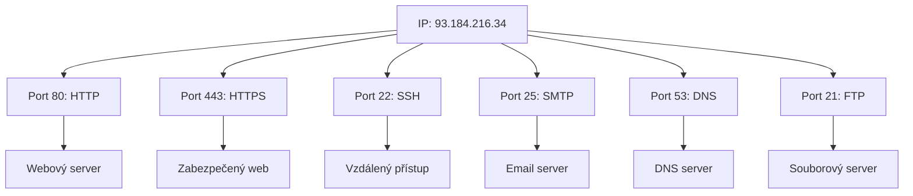

# 5.2 Porty a služby

> **Cíle kapitoly:**
>
> - Porozumět portům a službám v TCP/IP
> - Znát běžné porty a jejich služby
> - Umět provést port scan a interpretovat výsledky
> - Znát bezpečnostní aspekty port scanování

---

## Teorie

### Co jsou porty

Porty jsou virtuální komunikační kanály, které umožňují běh více služeb na jedné IP adrese.



### Běžné porty a služby

| Port | Protokol | Služba | OSINT význam |
|---|---|---|---|
| **21** | TCP | FTP | Souborový server, možnost anonymního přístupu |
| **22** | TCP | SSH | Vzdálený přístup, možná verze serveru |
| **23** | TCP | Telnet | Nešifrovaný přístup (zastaralý) |
| **25** | TCP | SMTP | Mail server |
| **53** | TCP/UDP | DNS | DNS server |
| **80** | TCP | HTTP | Web server |
| **110** | TCP | POP3 | Mail server (příjem) |
| **143** | TCP | IMAP | Mail server (příjem) |
| **443** | TCP | HTTPS | Zabezpečený web server |
| **3306** | TCP | MySQL | Databázový server |
| **3389** | TCP | RDP | Vzdálená plocha Windows |
| **5432** | TCP | PostgreSQL | Databázový server |
| **6379** | TCP | Redis | Cache/databáze |
| **8080** | TCP | HTTP-alt | Alternativní web |
| **8443** | TCP | HTTPS-alt | Alternativní HTTPS |
| **27017** | TCP | MongoDB | Databáze |

### Port scanning

Port scanning je technika pro identifikaci otevřených portů na cílovém zařízení.

```bash
# Nmap — základní scan
nmap -sS 77.75.75.75

# Scan běžných portů
nmap -sS --top-ports 100 77.75.75.75

# Scan všech portů
nmap -p- 77.75.75.75

# Detekce služeb a verzí
nmap -sV 77.75.75.75

# OS detekce
nmap -O 77.75.75.75
```

### Interpretace port scanu

```bash
PORT     STATE    SERVICE    VERSION
22/tcp   filtered ssh        # Filtrováno (firewall)
80/tcp   open     http       Apache 2.4.41
443/tcp  open     https      nginx 1.24.0
3306/tcp closed   mysql      # Zavřeno (nebo blokováno)
```

| Stav | Význam |
|---|---|
| **open** | Port je otevřený a služba naslouchá |
| **closed** | Port není otevřený, ale je dosažitelný |
| **filtered** | Firewall nebo pravidla blokují přístup |
| **unfiltered** | Port je dosažitelný, ale stav není znám |
| **open\|filtered** | Nelze rozlišit (časté u UDP) |

---

## Reálné příklady

### Příklad 1: Webový server

```bash
$ nmap -sV 77.75.75.75
PORT    STATE SERVICE  VERSION
80/tcp  open  http     Apache
443/tcp open  https    Apache
```

**Interpretace:** Standardní webový server, žádné neočekávané služby.

### Příklad 2: Podezřelý server

```bash
$ nmap -sV 203.0.113.1
PORT     STATE SERVICE     VERSION
21/tcp   open  ftp         vsftpd 2.3.4
22/tcp   open  ssh         OpenSSH 7.2
3389/tcp open  ms-wbt-server Microsoft RDP
3306/tcp open  mysql       MySQL 5.5
```

**Interpretace:** Server provozuje více služeb, včetně FTP a MySQL — potenciálně špatně zabezpečený.

---

## Tipy a časté chyby

> [!TIP]
> Při skenování používejte `-sV` pro detekci verzí — ty prozradí, zda je software aktuální nebo zastaralý.

> [!WARNING]
> **Častá chyba:** Skenování bez povolení je nelegální. Vždy skenujte jen vlastní zařízení nebo zařízení s výslovným povolením.

> [!WARNING]
> **Častá chyba:** Skenování všech 65535 portů je pomalé a nápadné. Začněte s top 100 nebo 1000 porty.

---

## Praktické cvičení

**Úkol 1:** Bezpečný scan:
1. Skenujte scanme.nmap.org (povolený testovací cíl)
2. Zjistěte otevřené porty
3. Identifikujte služby a verze

**Úkol 2:** Analýza:
1. Jaké služby běží na portech 80 a 443 scanme.nmap.org?
2. Je nějaký port překvapivý?
3. Která verze softwaru je zastaralá?

**Pomůcky:** nmap, scanme.nmap.org
**Očekávaný výstup:** Port scan + analýza služeb

---

## Shrnutí

- Porty identifikují služby běžící na zařízení
- Běžné porty (80, 443, 22, 25) prozrazují typ služby
- Nmap je standardní nástroj pro port scanning
- Verze služeb prozrazují aktuálnost softwaru
- Skenování bez povolení je nelegální

---

## Kontrolní otázky

1. Jaký port používá HTTPS?
2. Jaký nástroj se používá pro port scanning?
3. Co znamená stav "filtered" u portu?
4. Proč je důležité zjistit verzi služby?
5. Je port scanning legální?

---

## Zdroje a odkazy

- [Nmap Reference Guide](https://nmap.org/docs.html)
- [Port Numbers - IANA](https://www.iana.org/assignments/service-names-port-numbers)
- [Nmap Cheat Sheet](https://www.stationx.net/nmap-cheat-sheet/)
