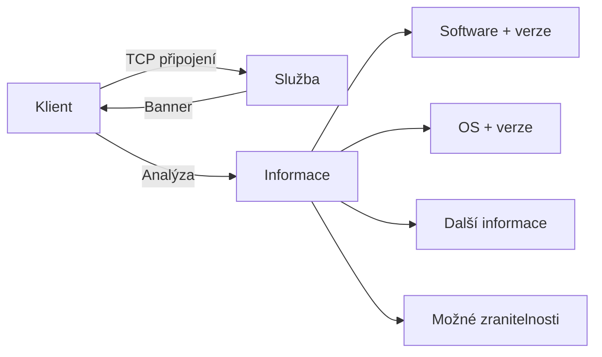

# 5.3 Banner grabbing

> **Cíle kapitoly:**
>
> - Porozumět technice banner grabbing
> - Umět získat bannery z různých služeb
> - Znát nástroje pro banner grabbing
> - Umět interpretovat informace z bannerů

---

## Teorie

### Co je banner grabbing

Banner grabbing je technika získávání informací o službě na základě jejího "banneru" — uvítací zprávy, kterou služba odesílá při připojení.



### Typy bannerů

| Služba | Typický banner |
|---|---|
| **Apache** | `Apache/2.4.41 (Ubuntu)` |
| **nginx** | `nginx/1.24.0` |
| **OpenSSH** | `SSH-2.0-OpenSSH_8.9p1 Ubuntu-3` |
| **vsFTPd** | `220 (vsFTPd 3.0.3)` |
| **IIS** | `Microsoft-IIS/10.0` |
| **MySQL** | `5.7.33-0ubuntu0.18.04.1` |
| **Postfix** | `220 mail.example.com ESMTP Postfix` |

### Banner grabbing techniky

```bash
# 1. Netcat (nc) — manuální
nc -v 77.75.75.75 80
GET / HTTP/1.1
Host: seznam.cz

# 2. Netcat — rychlý
echo "" | nc -w 3 77.75.75.75 22

# 3. OpenSSL — HTTPS
openssl s_client -connect seznam.cz:443 -servername seznam.cz

# 4. Nmap — automatický
nmap -sV --script=banner 77.75.75.75

# 5. curl — HTTP hlavičky
curl -I https://seznam.cz
```

### Co z bannerů zjistíme

```bash
$ curl -I https://www.seznam.cz
HTTP/2 200
server: Apache/2.4.41 (Ubuntu)   # Apache na Ubuntu
```

```bash
$ nmap -sV -p 22 77.75.75.75
PORT   STATE SERVICE VERSION
22/tcp open  ssh     OpenSSH 7.6p1 Ubuntu 4ubuntu0.7
```

**OSINT hodnota:**
- Verze softwaru → možné zranitelnosti (CVE)
- OS → cílené exploitaci
- Další hlavičky → X-Powered-By, technologie

---

## Reálné příklady

### Příklad 1: Identifikace technologie

```bash
$ curl -I https://example.com
HTTP/2 200
server: nginx/1.24.0
x-powered-by: PHP/8.2.0
x-generator: Drupal 10
```

**Analýza:** nginx + PHP 8.2 + Drupal 10 — kompletní technologický stack.

### Příklad 2: Zastaralý software

```bash
$ nc -v scanme.nmap.org 22
SSH-2.0-OpenSSH_5.3p1 Debian 3ubuntu7

# OpenSSH 5.3p1 je z roku 2010!
# Mnoho známých zranitelností
```

---

## Tipy a časté chyby

> [!TIP]
> Vždy kontrolujte HTTP hlavičky `Server`, `X-Powered-By` a `X-Generator` — prozradí technologický stack.

> [!WARNING]
> **Častá chyba:** Některé servery mají falešné bannery (security by obscurity). Apache může vypadat jako IIS a naopak.

> [!WARNING]
> **Častá chyba:** Banner grabbing na portu 443 vyžaduje SSL/TLS. Použijte `openssl s_client` nebo `nmap -sV`.

---

## Praktické cvičení

**Úkol 1:** Získejte bannery z:
1. `curl -I https://seznam.cz` — HTTP server
2. `curl -I https://github.com` — HTTP server
3. `nc -v scanme.nmap.org 22` — SSH
4. `openssl s_client -connect scanme.nmap.org:443`

**Úkol 2:** Analyzujte:
1. Jaký software a verze běží na každém serveru?
2. Který software je nejnovější / nejstarší?
3. Jaké další hlavičky prozrazují technologie?

**Pomůcky:** curl, nc, openssl, nmap
**Očekávaný výstup:** Bannery + identifikace verzí a technologií

---

## Shrnutí

- Banner grabbing odhaluje software, verze a OS
- Využívá netcat, curl, openssl, nmap
- HTTP hlavičky prozrazují technologický stack
- Informace o verzích vedou k identifikaci zranitelností
- Některé servery používají falešné bannery

---

## Kontrolní otázky

1. Co je banner grabbing?
2. Jak zjistíte HTTP server a jeho verzi?
3. Proč je verze softwaru důležitá pro OSINT?
4. Jak získáte banner z SSH služby?
5. Jaké jsou limity banner grabbing?

---

## Zdroje a odkazy

- [Nmap - banner script](https://nmap.org/nsedoc/scripts/banner.html)
- [Netcat manual](https://linux.die.net/man/1/nc)
- [OpenSSL s_client](https://www.openssl.org/docs/manmaster/man1/openssl-s_client.html)
