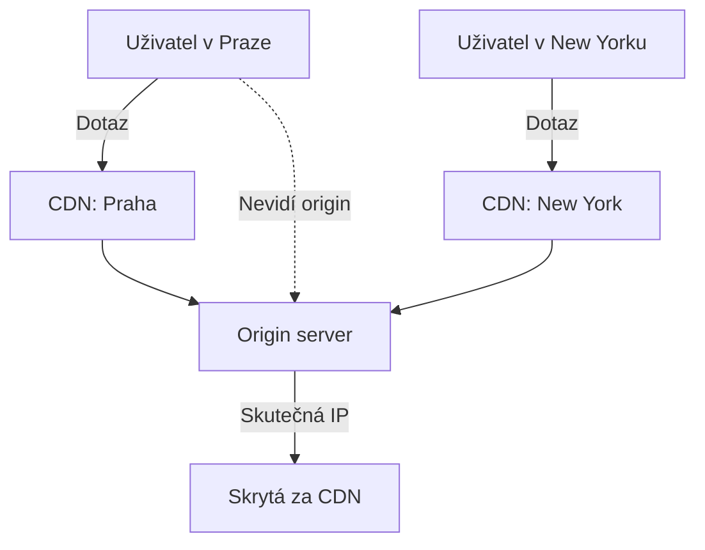
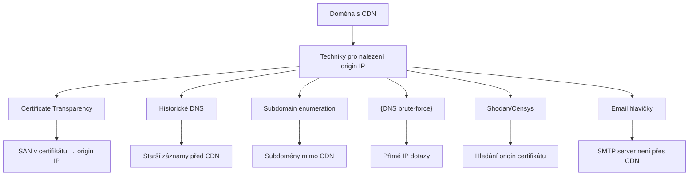

# 5.4 CDN a Cloudflare

> **Cíle kapitoly:**
>
> - Porozumět CDN a jeho vlivu na OSINT
> - Umět identifikovat, jestli doména používá Cloudflare
> - Znát techniky pro zjištění skutečné IP za CDN
> - Znát limity obcházení CDN

---

## Teorie

### Co je CDN

CDN (Content Delivery Network) je síť serverů po celém světě, která doručuje obsah uživatelům z nejbližšího serveru.



### Identifikace CDN

```bash
# 1. Podle IP adresy
dig cloudflare.com +short
# 104.16.124.96 - IP v rozsahu Cloudflare

# 2. Podle HTTP hlaviček
curl -I https://example.com | grep -i "cf-ray"
# cf-ray: 7a2b3c4d5e6f-PRG  ← Cloudflare

# 3. Podle HTTP hlaviček
curl -I https://example.com | grep -i "server"
# server: cloudflare
```

### Běžné CDN/IP rozsahy

| CDN | IP rozsah (příklad) | Detekce |
|---|---|---|
| **Cloudflare** | 104.16.0.0/12, 172.64.0.0/13 | cf-ray hlavička, server: cloudflare |
| **Akamai** | 23.0.0.0/12 | aklang, server: AkamaiNetStorage |
| **Fastly** | 151.101.0.0/16 | X-Served-By, X-Cache |
| **CloudFront** | 13.32.0.0/15 | x-amz-cf-id, server: CloudFront |
| **Google Cloud CDN** | Via hlavička | via: 1.1 google |

### Obcházení CDN — Techniky



### Konkrétní techniky

```bash
# 1. CT logs - hledání origin IP
curl -s "https://crt.sh/?q=example.com&output=json" | \
  jq -r '.[].name_value' | grep -v "cdn\|cloudflare"

# 2. Historické DNS (securitytrails)
# Najde starší A záznamy před použitím CDN

# 3. Subdomain enumeration - hledání subdomén bez CDN
# mail.example.com, vpn.example.com, ...
dig mail.example.com +short
# 203.0.113.5 → origin IP!

# 4. Shodan - hledání certifikátu domény
# Hledá IP s certifikátem pro example.com
```

---

## Reálné příklady

### Příklad 1: Identifikace CDN

```bash
$ curl -I https://example.com
HTTP/2 200
server: cloudflare
cf-ray: 7a2b3c4d5e6f-PRG
```

**Závěr:** Doména je za Cloudflare.

### Příklad 2: Nalezení origin IP

```bash
# Hledání subdomény bez CDN
$ dig direct.example.com +short
203.0.113.5

# Ověření
$ curl -I http://203.0.113.5
HTTP/1.1 200 OK
server: nginx/1.24.0
# Není cloudflare → origin IP!
```

---

## Tipy a časté chyby

> [!TIP]
> Ne všechny subdomény jsou za CDN. Mail servery (MX), DNS, VPN, API endpointy jsou často na origin IP.

> [!WARNING]
> **Častá chyba:** Pokus o obcházení CDN je proti podmínkám služby a může být nelegální. Pokud Cloudflare aktivně chrání stránku, respektujte to.

> [!WARNING]
> **Častá chyba:** CDN ne vždy blokuje přímý přístup na IP. Někdy origin server stále odpovídá na HTTP dotazy.

---

## Praktické cvičení

**Úkol 1:** Identifikace CDN:
1. Ověřte, zda doména používá CDN: seznam.cz, github.com, cloudflare.com
2. Použijte `curl -I` a zkontrolujte hlavičky
3. Zkontrolujte IP rozsah

**Úkol 2:** Hledání origin IP (legitimní):
1. Vyberte si doménu s Cloudflare
2. Zkontrolujte CT logy na crt.sh
3. Hledejte subdomény mimo CDN
4. Zkontrolujte MX záznam (mail není přes CDN)

**Pomůcky:** curl, dig, crt.sh, shodan.io
**Očekávaný výstup:** Identifikace CDN a pokus o nalezení origin IP

---

## Shrnutí

- CDN (Cloudflare) skrývá origin IP za distribuovanou síť
- Identifikace: HTTP hlavičky, IP rozsahy
- Techniky k nalezení origin IP: CT, historické DNS, subdomény, mail
- Obcházení CDN není vždy legální — respektujte pravidla
- Některé služby (mail) jsou často mimo CDN

---

## Kontrolní otázky

1. Jak poznáte, že doména používá Cloudflare?
2. Proč subdomény jako "mail" bývají mimo CDN?
3. Jak mohou certifikáty v CT logu pomoci najít origin IP?
4. Je vždy možné obejít CDN?
5. Jaké jsou etické limity obcházení CDN?

---

## Zdroje a odkazy

- [Cloudflare IP Ranges](https://www.cloudflare.com/ips/)
- [CloudFlair - tool for finding origin IP](https://github.com/christophetd/CloudFlair)
- [Shodan](https://shodan.io)
- [crt.sh](https://crt.sh)
