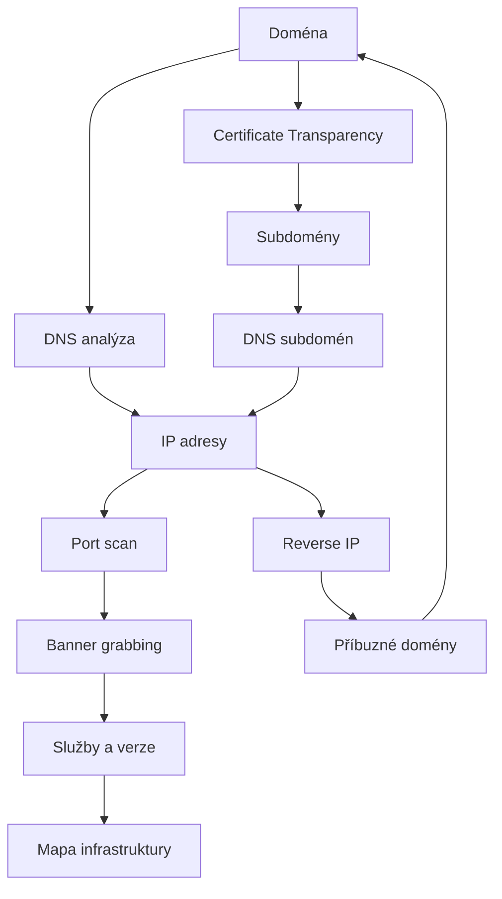
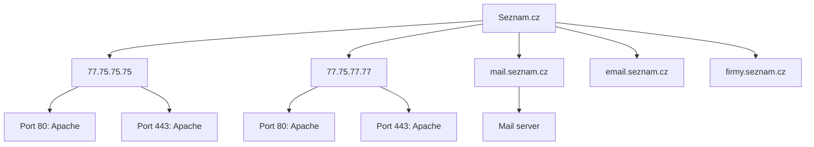

# 5.5 Mapování infrastruktury

> **Cíle kapitoly:**
>
> - Umět sestavit mapu síťové infrastruktury cíle
> - Ovládat nástroje pro mapování (Nmap, Shodan, vizualizace)
> - Znát techniky pro objevování skrytých služeb
> - Umět dokumentovat a prezentovat infrastrukturu

---

## Teorie

### Proces mapování infrastruktury



### Nástroje pro mapování

| Nástroj | Účel | Příklad použití |
|---|---|---|
| **Nmap** | Port scan, OS detekce | `nmap -sV -O target.com` |
| **Shodan** | Internetový skener | `hostname:target.com` |
| **Censys** | Certifikáty a služby | `target.com` |
| **dnsrecon** | DNS enumeration | `dnsrecon -d target.com` |
| **Masscan** | Rychlý scan rozsahů | `masscan 10.0.0.0/8 -p80` |
| **Amass** | Subdomain enumeration | `amass enum -d target.com` |
| **Gephi** | Vizualizace sítí | Import grafů vztahů |

### Nmap — pokročilé techniky

```bash
# Kompletní scan
nmap -sS -sV -O -A -T4 target.com

# Detekce OS
nmap -O --osscan-guess target.com

# Script scanning (vulnerability)
nmap --script vuln target.com

# UDP scan (pomalý)
nmap -sU --top-ports 50 target.com

# Export do XML
nmap -oX scan.xml target.com
```

### Masscan — ultra rychlý scan

```bash
# Rychlý scan celého /24
masscan 77.75.75.0/24 -p80,443,22,21 --rate=1000
```

---

## Postup krok za krokem: Kompletní mapování

### Fáze 1: DNS a subdomény

```bash
# DNS enum
dnsrecon -d example.com
amass enum -d example.com

# CT logy
curl -s "https://crt.sh/?q=example.com&output=json" | \
  jq -r '.[].name_value' | sort -u
```

### Fáze 2: Port skenování

```bash
# Top 100 portů
nmap -sS -sV --top-ports 100 -oN scan.txt example.com

# Všechny porty (pomalé)
nmap -p- -sV example.com
```

### Fáze 3: Banner grabbing a detekce služeb

```bash
# HTTP hlavičky
curl -I https://example.com

# Všechny služby
nmap -sV --script=banner,http-headers example.com
```

### Fáze 4: Shodan / Censys

```bash
# Shodan (API)
curl -H "Authorization: KEY" \
  "https://api.shodan.io/shodan/host/77.75.75.75?key=KEY"

# Censys (web)
# https://censys.io/ipv4/77.75.75.75
```

### Fáze 5: Vizualizace

```bash
# Nmap → XML → Gephi
nmap -oX scan.xml -sV -O example.com
# Import XML do Gephi pro grafické zobrazení
```

---

## Reálné příklady

### Příklad 1: Kompletní mapa

```bash
# Cíl: seznam.cz
# DNS: 77.75.75.75, 77.75.77.77
# Subdomény: www, mail, email, firmy, ...
# Služby: Apache na 80/443
# AS: AS24971
# IP rozsah: 77.75.75.0/24
```



---

## Tipy a časté chyby

> [!TIP]
> Dokumentujte každý krok. Používejte `-oA` v Nmap pro export do všech formátů (normal, XML, grepable).

> [!WARNING]
> **Častá chyba:** Skenování celého IP rozsahu bez omezení rychlosti. Může vyvolat alarmy nebo DoS.

> [!WARNING]
> **Častá chyba:** Zapomínání na IPv6. Mnoho serverů má AAAA záznam, který může odhalit jinou infrastrukturu.

---

## Praktické cvičení

**Úkol:** Kompletní mapování domény (vlastní nebo scanme.nmap.org):

1. DNS analýza (A, MX, NS, TXT)
2. Subdomain enumeration (crt.sh + dnsrecon)
3. Port scan (top 100 portů + detekce verzí)
4. Banner grabbing (curl, netcat)
5. ASN a IP rozsah
6. Shodan/Censys doplnění
7. Vytvořte diagram infrastruktury

**Pomůcky:** nmap, dig, curl, dnsrecon, crt.sh, shodan
**Očekávaný výstup:** Dokument mapující infrastrukturu + diagram

---

## Shrnutí

- Mapování infrastruktury je iterativní proces
- Kombinuje DNS, port scan, banner grabbing, CT a ASN
- Různé nástroje poskytují různé informace
- Dokumentace je klíčová
- Respektujte legální a etické hranice

---

## Kontrolní otázky

1. Jaké jsou fáze mapování infrastruktury?
2. K čemu slouží Masscan oproti Nmap?
3. Jaký exportní formát Nmap použijete pro vizualizaci?
4. Jak zahrnete IPv6 do mapování?
5. Proč je důležité dokumentovat nálezy?

---

## Zdroje a odkazy

- [Nmap Documentation](https://nmap.org/docs.html)
- [Masscan](https://github.com/robertdavidgraham/masscan)
- [Amass](https://github.com/owasp-amass/amass)
- [Gephi](https://gephi.org)
- [Shodan API](https://developer.shodan.io)
