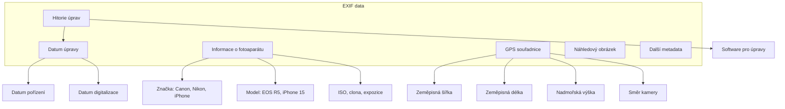

# 6.1 EXIF fotografie

> **Cíle kapitoly:**
>
> - Porozumět EXIF metadatům a jejich struktuře
> - Umět extrahovat EXIF data z fotografií
> - Znát GPS data a jejich rizika
> - Umět analyzovat EXIF pro OSINT účely

---

## Teorie

### Co je EXIF

EXIF (Exchangeable Image File Format) je standard pro ukládání metadat v obrazových souborech (JPEG, TIFF, PNG).



### EXIF tagy relevantní pro OSINT

| Tag | Popis | OSINT hodnota |
|---|---|---|
| **GPSLatitude** | Zeměpisná šířka | Přesná poloha |
| **GPSLongitude** | Zeměpisná délka | Přesná poloha |
| **GPSAltitude** | Nadmořská výška | Upřesnění polohy |
| **GPSImgDirection** | Směr kamery | Kam bylo foceno |
| **DateTimeOriginal** | Datum a čas pořízení | Časová osa |
| **Make / Model** | Značka a model zařízení | Identifikace zařízení |
| **Software** | Software pro úpravy | Pracovní postup |
| **ImageUniqueID** | Unikátní ID snímku | Propojení snímků |
| **Artist** | Autor fotografie | Identifikace fotografa |
| **Copyright** | Copyright | Vlastnická práva |
| **UserComment** | Uživatelský komentář | Popis, místo |

### Nástroje pro extrakci EXIF

```bash
# exiftool — nejmocnější nástroj
exiftool photo.jpg

# Zobrazení pouze GPS
exiftool -gps:all photo.jpg

# Zobrazení všech metadat
exiftool -a -u -G1 photo.jpg

# Linux: identify (ImageMagick)
identify -verbose photo.jpg

# Online:
# - exifdata.com
# - exif.regex.info
# - fotoforensics.com
```

---

## Postup krok za krokem: EXIF analýza

### 1. Základní extrakce

```bash
$ exiftool photo.jpg
GPS Latitude                    : 50 deg 5' 15.12" N
GPS Longitude                   : 14 deg 25' 17.94" E
GPS Position                    : 50 deg 5' 15.12" N, 14 deg 25' 17.94" E
Date/Time Original              : 2024:06:15 14:30:00
Make                            : Apple
Camera Model Name               : iPhone 15 Pro Max
Software                        : 17.3.1
```

### 2. GPS konverze

```bash
# ExifTool umí převést GPS do desetinných stupňů
exiftool -n -gpslatitude -gpslongitude photo.jpg
# 50.0875333, 14.4216500
```

### 3. Google Maps

```bash
# Otevřít v Google Maps
# https://maps.google.com/maps?q=50.0875333,14.4216500

# Nebo zobrazit v Mapy.cz
# https://mapy.cz/zakladni?x=14.4216500&y=50.0875333
```

### 4. Kontrola integrity

```bash
# Kontrola, zda EXIF nebylo upraveno
exiftool -a -u -G1 photo.jpg | grep -i "modif\|original\|history"
```

---

## Reálné příklady

### Příklad 1: Geolokace z fotografie

**Situace:** Na Twitteru je fotografie z protestu. Analytici chtějí zjistit, kde byla pořízena.

```bash
$ exiftool protest.jpg
GPS Latitude                    : 50 deg 5' 15.12" N
GPS Longitude                   : 14 deg 25' 17.94" E
```

**Výsledek:** GPS souřadnice ukazují na Václavské náměstí v Praze.

### Příklad 2: Identifikace zařízení

```bash
$ exiftool crime-scene.jpg
Make                            : Samsung
Camera Model Name               : Galaxy S24 Ultra
Software                        : G925FXXU1CYEC
```

**Výsledek:** Fotografie byla pořízena Samsung Galaxy S24 Ultra — možná identifikace pachatele podle telefonu.

---

## Tipy a časté chyby

> [!TIP]
> Sociální sítě (Facebook, Instagram, Twitter) odstraňují EXIF data. Pokud máte originální soubor, EXIF je stále přítomen.

> [!WARNING]
> **Častá chyba:** EXIF GPS není vždy přesný. Uvnitř budov, v údolích nebo při špatném signálu může být GPS nepřesná o desítky metrů.

> [!WARNING]
> **Častá chyba:** Zapomínání na thumbnail. EXIF obsahuje malý náhledový obrázek, který může ukazovat jinou scénu nebo úpravy.

---

## Praktické cvičení

**Úkol 1:** Analyzujte fotografii:
1. Najděte si libovolnou fotografii s EXIF (např. z vlastního telefonu)
2. Pomocí exiftool zjistěte:
   - GPS souřadnice
   - Datum a čas
   - Model fotoaparátu/telefonu
   - Software
3. Zobrazte GPS v Google Maps

**Úkol 2:** Online nástroje:
1. Použijte exifdata.com nebo fotoforensics.com
2. Nahrajte stejnou fotografii
3. Porovnejte výsledky s exiftool

**Úkol 3:** Detektivní práce:
1. Stáhněte fotografii z veřejného zdroje (flickr, stock photo)
2. Zkontrolujte, zda obsahuje EXIF
3. Pokud ano, co zjistíte?

**Pomůcky:** exiftool, fotoforensics.com, Google Maps
**Očekávaný výstup:** EXIF analýza fotografie + GPS lokace

---

## Shrnutí

- EXIF obsahuje GPS polohu, čas, zařízení a další metadata
- exiftool je nejmocnější nástroj pro extrakci
- GPS data přesně určují místo pořízení
- Sociální sítě EXIF odstraňují, originální soubory ho mají
- Thumbnail v EXIF může prozradit víc než samotná fotka

---

## Kontrolní otázky

1. Co je EXIF a co obsahuje?
2. Jaký nástroj použijete pro extrakci EXIF?
3. Jak převedete EXIF GPS do formátu pro Google Maps?
4. Mazou sociální sítě EXIF data?
5. Co je thumbnail v EXIF a k čemu je užitečný?

---

## Zdroje a odkazy

- [exiftool](https://exiftool.org)
- [FotoForensics](https://fotoforensics.com)
- [ExifData](https://exifdata.com)
- [EXIF Standard](https://www.cipa.jp/std/documents/e/DC-008-Translation-2024-E.pdf)
