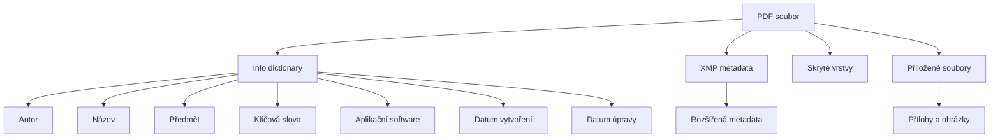

# 6.2 Metadata PDF

> **Cíle kapitoly:**
>
> - Porozumět metadatům v PDF dokumentech
> - Umět extrahovat metadata z PDF
> - Znát skrytá data v PDF
> - Umět využít PDF metadata v OSINT

---

## Teorie

### Struktura PDF metadat

PDF soubory obsahují metadata v několika vrstvách:



### PDF metadata relevantní pro OSINT

| Pole | Popis | OSINT hodnota |
|---|---|---|
| **Author** | Autor dokumentu | Identifikace autora |
| **Creator** | Software, který vytvořil PDF | Pracovní postup |
| **Producer** | Software, který vyexportoval PDF | Verze software |
| **CreationDate** | Datum vytvoření | Časová osa |
| **ModDate** | Datum poslední úpravy | Historie revizí |
| **Subject** | Předmět dokumentu | Téma |
| **Keywords** | Klíčová slova | Kategorizace |
| **Trapped** | Stav přetisku | Profesionální software |

### Nástroje pro extrakci PDF metadat

```bash
# pdfinfo (poppler)
pdfinfo document.pdf

# exiftool
exiftool document.pdf

# Python (PyPDF2)
python3 -c "
from PyPDF2 import PdfReader
reader = PdfReader('document.pdf')
metadata = reader.metadata
print(metadata)
"
```

---

## Postup krok za krokem: PDF analýza

### 1. Základní metadata

```bash
$ pdfinfo document.pdf
Title:          Výroční zpráva 2023
Subject:        Finanční výsledky
Author:         Jan Novák
Creator:        LibreOffice 7.5
Producer:       LibreOffice 7.5
CreationDate:   Wed Jan 15 10:30:00 2023
ModDate:        Wed Jan 15 14:45:00 2023
Tagged:         yes
Pages:          42
```

### 2. Skryté informace

```bash
# Zobrazení všech metadat včetně skrytých
exiftool -a -u -G1 document.pdf

# Kontrola fontů použitých v PDF
pdffonts document.pdf

# Extrakce textu
pdftotext document.pdf output.txt
```

### 3. Historie revizí

```bash
# Kontrola více revizí v PDF
exiftool -a -G1 document.pdf | grep -i "modif\|revision\|version"
```

---

## Reálné příklady

### Příklad 1: Identifikace autora

**Dokument:** Výroční zpráva uniklá na veřejnost

```bash
$ pdfinfo leaked-report.pdf
Author:     pavel.svoboda@firma.cz
Creator:    Microsoft Word
Producer:   Microsoft Word
```

**Analýza:** Autor je identifikován e-mailem. Word metadata prozrazují použití Microsoft Office.

### Příklad 2: Ověření pravosti

**Dokument:** Podezřelá smlouva

```bash
$ pdfinfo contract.pdf
CreationDate:   2024-01-01
ModDate:        2024-03-15
Author:         Firma ABC
```

**Analýza:** Dokument byl upraven 3 měsíce po "vytvoření" — možná manipulace.

---

## Tipy a časté chyby

> [!TIP]
> Vždy kontrolujte "Producer" a "Creator" — prozradí, jaký software byl použit. LibreOffice vs Microsoft Word vs LaTeX.

> [!WARNING]
> **Častá chyba:** Metadata mohou být falešná. Autor může uvést cizí jméno.

> [!WARNING]
> **Častá chyba:** PDF může obsahovat skrytý text, obrázky nebo vrstvy, které nejsou vidět. Použijte `pdftotext` pro extrakci všeho textu.

---

## Praktické cvičení

**Úkol 1:** Analyzujte PDF:
1. Stáhněte libovolné PDF (např. výroční zprávu firmy)
2. Pomocí pdfinfo zjistěte:
   - Autora
   - Software
   - Datum vytvoření a úprav
3. Pomocí exiftool zjistěte další skrytá metadata

**Úkol 2:** Ověřte historii:
1. Stáhněte PDF, které bylo několikrát upraveno
2. Zkontrolujte CreationDate vs ModDate
3. Pokud se liší, jaký je rozdíl?

**Pomůcky:** pdfinfo, exiftool, pdftotext
**Očekávaný výstup:** PDF metadatová analýza + historie úprav

---

## Shrnutí

- PDF metadata obsahují autora, datum, software
- pdfinfo a exiftool jsou hlavní nástroje
- Rozdíl mezi CreationDate a ModDate signalizuje úpravy
- Skryté vrstvy a text mohou obsahovat citlivé informace
- Metadata mohou být zfalšována

---

## Kontrolní otázky

1. Jaké informace obsahují PDF metadata?
2. Jaký nástroj použijete pro extrakci PDF metadat?
3. Co signalizuje rozdíl mezi CreationDate a ModDate?
4. Jak z PDF extrahujete čistý text?
5. Lze PDF metadata zfalšovat?

---

## Zdroje a odkazy

- [pdfinfo](https://www.xpdfreader.com)
- [exiftool](https://exiftool.org)
- [PyPDF2](https://pypdf2.readthedocs.io)
- [PDF Specification](https://opensource.adobe.com/dc-acrobat-sdk-docs/standards/)
