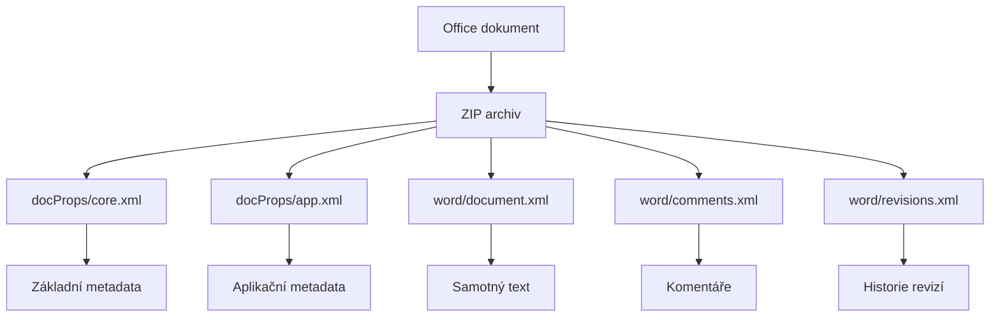

# 6.3 Office dokumenty

> **Cíle kapitoly:**
>
> - Porozumět metadatům Office dokumentů
> - Umět extrahovat metadata z DOCX, XLSX, PPTX
> - Znát skrytá data v Office souborech
> - Umět využít Office metadata v OSINT

---

## Teorie

### Struktura Office metadat

Moderní Office dokumenty (DOCX, XLSX, PPTX) jsou ZIP archivy obsahující XML soubory:



### Metadata v Office dokumentech

| Pole | Kam patří | OSINT hodnota |
|---|---|---|
| **dc:creator** | core.xml | Autor dokumentu |
| **dc:title** | core.xml | Název |
| **dc:subject** | core.xml | Předmět |
| **dc:description** | core.xml | Popis |
| **meta:last-author** | core.xml | Poslední autor |
| **dcterms:created** | core.xml | Vytvořeno |
| **dcterms:modified** | core.xml | Naposledy upraveno |
| **AppVersion** | app.xml | Verze Office |
| **Company** | app.xml | Firma |
| **Manager** | app.xml | Manažer |
| **TotalTime** | app.xml | Celkový čas úprav |
| **RevisionNumber** | app.xml | Číslo revize |
| **LastSaveBy** | app.xml | Poslední uložil |

### Nástroje pro Extrakt metadat

```bash
# 1. exiftool (funguje na všechny Office formáty)
exiftool document.docx

# 2. Manuální — rozbalení ZIP
unzip document.docx -d doc_unpacked
cat doc_unpacked/docProps/core.xml
cat doc_unpacked/docProps/app.xml

# 3. Python — python-docx
python3 -c "
from docx import Document
doc = Document('document.docx')
props = doc.core_properties
print(f'Autor: {props.author}')
print(f'Vytvořeno: {props.created}')
"
```

---

## Postup krok za krokem: Office analýza

### 1. Základní metadata

```bash
$ exiftool report.docx
Author                   : Jan Novák
Last Author              : Petr Svoboda
Create Date              : 2024:01:15 10:00:00
Modify Date              : 2024:03:20 14:30:00
Company                  : ABC s.r.o.
Manager                  : Karel Novotný
Total Edit Time          : 4 hours 30 minutes
Revision Number          : 12
```

### 2. Komentáře a revize

```bash
# Extrakce komentářů
unzip document.docx -d tmp
cat tmp/word/comments.xml | grep -oP '<w:comment.*?</w:comment>'

# Historie revizí
cat tmp/word/document.xml | grep -oP '<w:ins.*?</w:ins>'
```

### 3. Skryté listy (Excel)

```bash
# Seznam všech listů
exiftool spreadsheet.xlsx | grep -i "sheet\|list\|tab"

# Velmi skryté listy (xlVeryHidden)
python3 -c "
from openpyxl import load_workbook
wb = load_workbook('spreadsheet.xlsx')
for sheet in wb.sheetnames:
    ws = wb[sheet]
    print(f'{sheet}: {ws.sheet_state}')
"
```

---

## Reálné příklady

### Příklad 1: Firemní dokument

**Dokument:** Smlouva.docx

```bash
$ exiftool smlouva.docx
Author:         právník@akfirma.cz
Last Author:    klient@firma.cz
Company:        AK Firma s.r.o.
Revision:       15
Total Time:     8h 30m
```

**Analýza:** Autor je z advokátní kanceláře. Poslední úprava od klienta. 15 revizí, 8,5h práce — intenzivní vyjednávání.

### Příklad 2: Uniklý dokument

**Dokument:** unikly_report.xlsx

```bash
$ exiftool unikly_report.xlsx
Last Author:    whistleblower@anon.com
Company:        [REDACTED]
Manager:        CEO
```

---

## Tipy a časté chyby

> [!TIP]
> Excel soubory mohou mít "velmi skryté" listy (xlVeryHidden), které nejde zobrazit přes UI — pouze programově.

> [!WARNING]
> **Častá chyba:** Pouhé smazání textu v dokumentu neodstraní metadata. Komentáře, revize a skryté texty zůstávají.

> [!WARNING]
> **Častá chyba:** PDF export z Office zachová autora a datum. Vždy očistěte metadata před publikací.

---

## Praktické cvičení

**Úkol 1:** Analyzujte Office dokument:
1. Vytvořte jednoduchý Word dokument
2. Vyplňte autora, firmu, manažera
3. Uložte a analyzujte exiftool
4. Rozbalte ZIP a prohlédněte XML

**Úkol 2:** Komentáře a revize:
1. Vytvořte dokument s komentáři a revizemi
2. Extrahujte komentáře
3. Zkontrolujte historii revizí

**Úkol 3:** Excel:
1. Vytvořte Excel s více listy
2. Nastavte jeden list jako "very hidden"
3. Zjistěte stav listů pomocí openpyxl

**Pomůcky:** exiftool, unzip, python3, openpyxl
**Očekávaný výstup:** Kompletní analýza Office dokumentu

---

## Shrnutí

- Office dokumenty jsou ZIP archivy s XML metadaty
- exiftool extrahuje metadata ze všech Office formátů
- Komentáře a revize jsou skryté, ale extrahovatelné
- Excel umí "velmi skryté" listy
- Vždy čistěte metadata před publikací dokumentů

---

## Kontrolní otázky

1. Jakou strukturu mají moderní Office dokumenty?
2. Jak extrahujete metadata z DOCX?
3. Co jsou "very hidden" listy v Excelu?
4. Kde jsou uloženy komentáře v DOCX?
5. Proč nestačí smazat text před publikací?

---

## Zdroje a odkazy

- [exiftool](https://exiftool.org)
- [python-docx](https://python-docx.readthedocs.io)
- [openpyxl](https://openpyxl.readthedocs.io)
- [Office XML Standard](https://en.wikipedia.org/wiki/Office_Open_XML)
