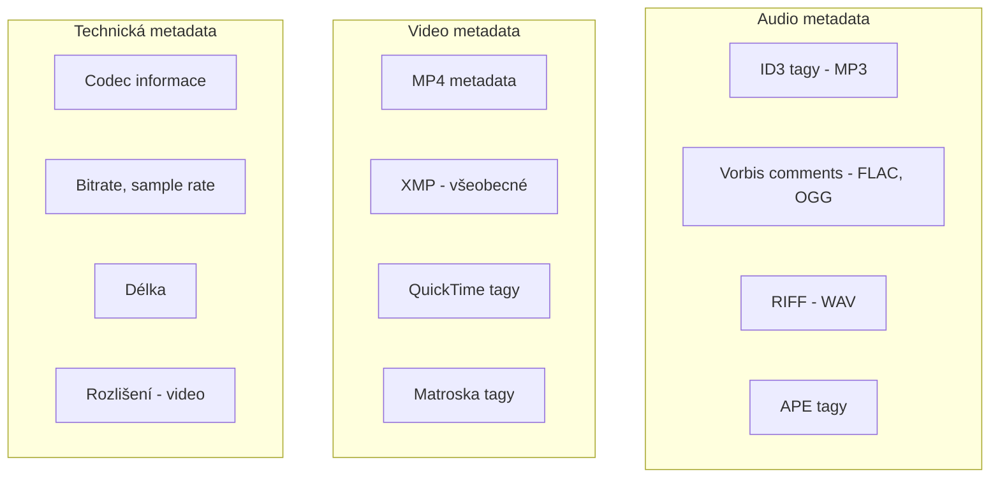

# 6.4 Audio a video

> **Cíle kapitoly:**
>
> - Porozumět metadatům v audio a video souborech
> - Umět extrahovat metadata z MP3, MP4, WAV
> - Znát ID3 tagy a jejich strukturu
> - Umět analyzovat audio/video metadata pro OSINT

---

## Teorie

### Typy audio/video metadat



### ID3 tagy (MP3)

ID3 je standard pro metadata v MP3 souborech:

| Tag | Popis | OSINT hodnota |
|---|---|---|
| **TIT2** | Název skladby | Identifikace obsahu |
| **TPE1** | Interpret | Autor |
| **TALB** | Album | Projekt/kolekce |
| **TCOM** | Skladatel | Další identita |
| **TYER** | Rok | Datace |
| **TCON** | Žánr | Kategorie |
| **COMM** | Komentář | Poznámky |
| **APIC** | Obrázek alba | Cover art |
| **USLT** | Text písně | Lyrics |

### Nástroje pro extrakci

```bash
# 1. exiftool - audio i video
exiftool song.mp3
exiftool video.mp4

# 2. ffprobe - technická data
ffprobe -v quiet -print_format json -show_format -show_streams video.mp4

# 3. mediainfo - podrobné informace
mediainfo video.mp4

# 4. id3v2 - specificky MP3
id3v2 -l song.mp3
```

---

## Postup krok za krokem: Audio/video analýza

### 1. Audio metadata

```bash
$ exiftool recording.mp3
Title                       : Interview s XYZ
Artist                      : Reporter Jan
Album                       : Podcast 2024
Year                        : 2024
Genre                       : Talk
Comment                     : nahráno 15.3.2024 v Praze
Duration                    : 0:45:30
Bitrate                     : 192 kbps
```

### 2. Video metadata

```bash
$ exiftool video.mp4
Title                       : Bezpečnostní školení
Create Date                 : 2024:01:20 14:00:00
Duration                    : 0:12:15
Video Frame Rate            : 30 fps
Video Size                  : 1920x1080
Video Codec                 : H.264
Audio Codec                 : AAC
GPS Position                : 50 deg 5' 15.12" N, 14 deg 25' 17.94" E
```

### 3. Technické informace (ffprobe)

```bash
$ ffprobe -v quiet -print_format json -show_format video.mp4 | python3 -m json.tool
{
    "format": {
        "filename": "video.mp4",
        "duration": "735.000000",
        "size": "52428800",
        "bit_rate": "570425",
        "tags": {
            "creation_time": "2024-01-20T14:00:00.000Z",
            "location": "+50.0875+014.4217/"
        }
    }
}
```

### 4. Extrakce embedded obrázků

```bash
# MP3 s obrázkem alba
exiftool -b -Picture song.mp3 > cover.jpg

# Video screenshoty
ffmpeg -i video.mp4 -ss 00:01:00 -vframes 1 screenshot.jpg
```

---

## Reálné příklady

### Příklad 1: Geolokace videa

**Soubor:** surveillance.mp4

```bash
$ exiftool surveillance.mp4 | grep GPS
GPS Latitude                : 50 deg 5' 15.12" N
GPS Longitude               : 14 deg 25' 17.94" E
```

**Analýza:** Video bylo natočeno na Václavském náměstí. Smartphone zaznamenal GPS souřadnice.

### Příklad 2: Identifikace nahrávacího zařízení

**Soubor:** interview.wav

```bash
$ exiftool interview.wav
Make                        : Zoom
Model                       : H6
Duration                    : 1:23:15
```

**Analýza:** Profesionální diktafon Zoom H6. Svědčí o seriózní produkci.

---

## Tipy a časté chyby

> [!TIP]
> ffprobe je nejlepší pro technická data (codec, rozlišení, bitrate). exiftool je lepší pro autorská metadata.

> [!WARNING]
> **Častá chyba:** MP4 soubory mohou obsahovat GPS data z telefonu, i když to není na první pohled patrné.

> [!WARNING]
> **Častá chyba:** Konverze formátu (MP3 → WAV) může odstranit ID3 tagy, ale technická metadata zůstávají.

---

## Praktické cvičení

**Úkol 1:** Audio analýza:
1. Najděte MP3 soubor (vlastní nebo ukázkový)
2. Pomocí exiftool zjistěte: interpret, album, rok, komentář
3. Pomocí ffprobe zjistěte: bitrate, sample rate, délka

**Úkol 2:** Video analýza:
1. Najděte MP4 video
2. Zjistěte: rozlišení, codec, délka, datum vytvoření
3. Pokud má GPS, zobrazte v mapě

**Úkol 3:** Detektivní práce:
1. Stáhněte ukázkové video z internetu
2. Zkontrolujte metadata
3. Co můžete zjistit o autorovi/nahrávacím zařízení?

**Pomůcky:** exiftool, ffprobe, mediainfo
**Očekávaný výstup:** Audio + video metadatová analýza

---

## Shrnutí

- Audio a video soubory obsahují bohatá metadata
- ID3 tagy v MP3: interpret, album, rok, komentář
- Video soubory (MP4) mohou mít GPS data
- ffprobe je nejlepší pro technická metadata
- Vždy kontrolujte embedded obrázky u MP3

---

## Kontrolní otázky

1. Jaké metadata obsahuje MP3 soubor?
2. Jaký nástroj použijete pro technická data videa?
3. Mohou MP4 soubory obsahovat GPS?
4. Jak extrahujete obrázek alba z MP3?
5. Jaký je rozdíl mezi exiftool a ffprobe?

---

## Zdroje a odkazy

- [exiftool](https://exiftool.org)
- [ffmpeg/ffprobe](https://ffmpeg.org)
- [MediaInfo](https://mediaarea.net/mediainfo)
- [ID3 Standard](https://id3.org)
