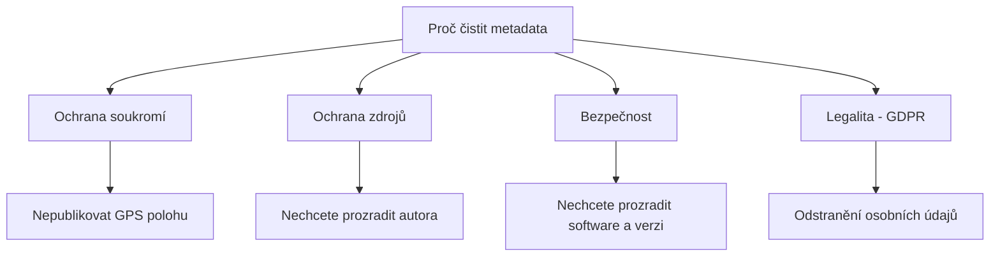

# 6.5 Jak metadata odstranit

> **Cíle kapitoly:**
>
> - Umět bezpečně odstranit metadata ze souborů
> - Znát nástroje pro čištění metadat
> - Umět vytvořit bezpečný pracovní postup
> - Znát limity odstraňování metadat

---

## Teorie

### Proč odstraňovat metadata



### Rizika nevyčištěných metadat

| Typ souboru | Riziko |
|---|---|
| **Fotografie** | GPS poloha domova/práce |
| **PDF** | Autor, software, historie |
| **Office** | Komentáře, revize, skryté listy |
| **Audio** | Nahrávací zařízení, datum |
| **Video** | GPS, datum, zařízení |

### Nástroje pro odstranění metadat

```bash
# 1. exiftool — odstranění všech metadat
exiftool -all= photo.jpg

# 2. exiftool — odstranění pouze GPS
exiftool -gps:all= photo.jpg

# 3. exiftool — ponechání základních metadat
exiftool -all= -tagsfromfile @ -exif:Orientation photo.jpg

# 4. MAT (Metadata Anonymisation Toolkit)
mat2 photo.jpg

# 5. ImageMagick — pro obrázky
convert input.jpg -strip output.jpg
```

### Specifické nástroje

| Nástroj | Platforma | Specializace |
|---|---|---|
| **exiftool** | Win/Mac/Linux | Univerzální |
| **MAT2** | Linux | Univerzální, GUI |
| **ImageOptim** | Mac | Obrázky |
| **Office Exif Remover** | Win | Office |
| **PDF Metadata Editor** | Win/Mac | PDF |
| **VLC** | Win/Mac/Linux | Video |

---

## Postup krok za krokem: Čištění metadat

### 1. Fotografie

```bash
# Odstranění všech metadat
exiftool -all= photo.jpg

# Jen GPS
exiftool -gps:all= photo.jpg
```

### 2. PDF

```bash
# exiftool
exiftool -all= document.pdf

# Ghostscript
gs -dNOPAUSE -dBATCH -sDEVICE=pdfwrite \
   -dCompatibilityLevel=1.4 \
   -dPDFSETTINGS=/screen \
   -sOutputFile=clean.pdf \
   input.pdf
```

### 3. Office dokumenty

```bash
# exiftool
exiftool -all= document.docx

# Rozbalení a úprava XML
unzip document.docx -d tmp
exiftool -all= tmp/docProps/core.xml
cd tmp && zip -r ../clean.docx .
```

### 4. Audio/video

```bash
# Audio
ffmpeg -i input.mp3 -map 0:a -c copy -metadata:s:a:0 "" output.mp3

# Video
ffmpeg -i input.mp4 -map_metadata -1 -c copy output.mp4
```

---

## Reálné příklady

### Příklad 1: Bezpečná publikace

**Scénář:** Chcete publikovat fotografii z protestu na Twitter.

```bash
# Před publikací
exiftool -all= protest.jpg
# Všechna metadata smazána
```

### Příklad 2: Hromadné čištění

```bash
# Dávkové čištění všech JPG ve složce
exiftool -all= -r *.jpg

# Záloha originálů (přidá _original)
exiftool -all= -r -overwrite_original *.jpg
```

---

## Tipy a časté chyby

> [!TIP]
> Vždy si udělejte zálohu originálu před čištěním! ExifTool automaticky vytvoří `_original` soubor.

> [!WARNING]
> **Častá chyba:** Jen přejmenování souboru neodstraní metadata. Potřebujete specializované nástroje.

> [!WARNING]
> **Častá chyba:** Nahrání na sociální síť nestačí. Sítě sice mažou EXIF, ale ne vždy 100% — a originál na disku stále obsahuje metadata.

---

## Praktické cvičení

**Úkol 1:** Vyčistěte fotografii:
1. Vyfoťte fotku mobilem (bude mít GPS)
2. Zkontrolujte EXIF: `exiftool photo.jpg`
3. Smažte všechna metadata: `exiftool -all= photo.jpg`
4. Zkontrolujte, že metadata jsou pryč

**Úkol 2:** Vyčistěte PDF a DOCX:
1. Vytvořte PDF a Office dokument
2. Zkontrolujte metadata
3. Vyčistěte je
4. Ověřte, že jsou čistá

**Úkol 3:** Hromadné čištění:
1. Vytvořte složku s 5 různými soubory
2. Pomocí exiftool vyčistěte všechny najednou
3. Ověřte výsledek

**Pomůcky:** exiftool, MAT2, ffmpeg
**Očekávaný výstup:** Vyčištěné soubory + ověření absence metadat

---

## Shrnutí

- Metadata mohou prozradit citlivé informace
- ExifTool je nejmocnější nástroj pro čištění
- Každý typ souboru vyžaduje jiný přístup
- Vždy zálohujte originál před čištěním
- Pravidelně čistěte soubory před publikací

---

## Kontrolní otázky

1. Jak odstraníte všechna metadata z fotografie?
2. Jaký nástroj použijete pro hromadné čištění?
3. Proč nestačí přejmenování souboru?
4. Jak vyčistíte metadata z MP4 videa?
5. Jak ověříte, že metadata byla úspěšně odstraněna?

---

## Zdroje a odkazy

- [exiftool](https://exiftool.org)
- [MAT2](https://0xacab.org/jvoisin/mat2)
- [FFmpeg](https://ffmpeg.org)
- [ImageOptim](https://imageoptim.com)
