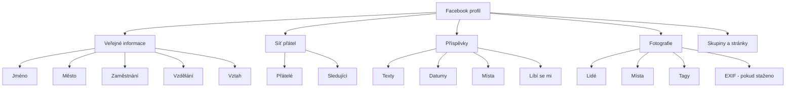

# 7.1 Facebook

> **Cíle kapitoly:**
>
> - Umět vyhledávat a analyzovat Facebook profily
> - Znát nástroje pro OSINT na Facebooku
> - Umět mapovat vztahy a sítě přátel
> - Znát limity a ochranu soukromí na Facebooku

---

## Teorie

### Facebook jako OSINT zdroj

Facebook je největší sociální síť s miliardami uživatelů. Pro OSINT je cenný díky množství veřejných dat.



### Veřejné vs soukromé informace

| Informace | Veřejná | Omezená |
|---|---|---|
| Profilová fotka | Často ano | Může být omezena |
| Titulní fotka | Často ano | Může být omezena |
| Jméno | Ano | — |
| Město | Volitelně | Uživatel volí |
| Seznam přátel | Volitelně | Uživatel volí |
| Příspěvky | Volitelně | Uživatel volí |
| Fotografie | Volitelně | Uživatel volí |
| Telefon | Pouze přátelé | Obvykle skryt |
| Email | Pouze přátelé | Obvykle skryt |

### Nástroje pro Facebook OSINT

| Nástroj | Účel |
|---|---|
| **Facebook Graph Search** | Vyhledávání v datech (omezený přístup) |
| **Facebook People Search** | Vyhledávání osob |
| **Facebook Pages** | Analýza stránek |
| **Facebook Groups** | Analýza skupin |
| **IntelX** | Prohledávání Facebook dat |
| **Social Links** | Profesionální nástroj |

---

## Postup krok za krokem: Analýza profilu

### 1. Vyhledání profilu

```bash
# Standardní vyhledávání
facebook.com/search/people/?q=Jméno+Příjmení

# Google dork
site:facebook.com "Jméno Příjmení" Praha
```

### 2. Analýza veřejných informací

- **Profilová fotka** — stáhnout, zkontrolovat EXIF
- **Titulní fotka** — další kontext
- **Info sekce** — zaměstnání, vzdělání, město
- **Přátelé** — síť vztahů (pokud je veřejná)

### 3. Fotografie

```bash
# Stažení fotek pro EXIF analýzu
# Facebook odstraňuje EXIF, ale pokud si uživatel stáhl originál...
# Někdy jsou fotky nahrány s EXIF přímo z telefonu
```

### 4. Sledování změn

```bash
# Wayback Machine — archivace profilu
web.archive.org/web/*/facebook.com/username

# Sledování změn profilové fotky
# změní se URL profilovky — ukládat historii
```

---

## Reálné příklady

### Příklad 1: Ověření identity

**Cíl:** Ověřit, zda osoba pracuje v uvedené firmě

**Postup:**
1. Najít Facebook profil
2. Zkontrolovat sekci "Work" — firma, pozice, období
3. Zkontrolovat fotky z pracovního prostředí
4. Zkontrolovat tagy kolegů

### Příklad 2: Mapování vztahů

**Cíl:** Zjistit vztahy mezi osobami

**Postup:**
1. Získat seznam přátel (pokud veřejný)
2. Analyzovat společné přátele
3. Zkontrolovat tagy na fotkách
4. Zkontrolovat komentáře na společných příspěvcích

---

## Tipy a časté chyby

> [!TIP]
> Facebook Graph Search byl omezen, ale stále fungují některé dotazy. Zkuste `graph.facebook.com` přes API.

> [!WARNING]
> **Častá chyba:** Profil může být falešný (fake). Vždy ověřujte informace z více zdrojů.

> [!WARNING]
> **Častá chyba:** Skenování profilů bez přihlášení je omezené. Pro větší analýzu se přihlaste (ale s výzkumnou identitou!).

---

## Praktické cvičení

**Úkol 1:** Analyzujte veřejný profil:
1. Najděte Facebook profil veřejné osoby (např. politika)
2. Zjistěte co nejvíce veřejných informací
3. Zkontrolujte fotografie
4. Zmapujte síť (stránky, skupiny)

**Úkol 2:** Ověřte informace:
1. Vyberte 3 informace z profilu
2. Ověřte je na LinkedIn, Google, firemním webu
3. Které informace byly konzistentní?

**Pomůcky:** Facebook, Google, LinkedIn
**Očekávaný výstup:** Profilová analýza + ověření informací

---

## Shrnutí

- Facebook nabízí bohatá veřejná data
- Profilová a titulní fotka jsou obvykle veřejné
- Síť přátel, tagy a fotografie mapují vztahy
- Facebook odstraňuje EXIF, ale ne vždy
- Falešné profily jsou běžné — vždy ověřovat

---

## Kontrolní otázky

1. Jaké informace jsou na Facebooku obvykle veřejné?
2. Jak najdete Facebook profil člověka?
3. Proč je důležité ověřovat Facebook informace z více zdrojů?
4. Maže Facebook EXIF data z fotografií?
5. Jak můžete mapovat vztahy na Facebooku?

---

## Zdroje a odkazy

- [Facebook Search](https://www.facebook.com/search/)
- [IntelX Facebook Search](https://intelx.io/tools?tab=facebook)
- [Social Links](https://sociallinks.io)
- [OSINT Facebook Tools](https://osintframework.com)
