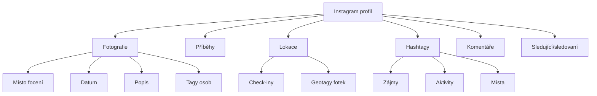

# 7.2 Instagram

> **Cíle kapitoly:**
>
> - Umět analyzovat Instagram profily a obsah
> - Znát techniky pro vyhledávání podle lokace
> - Umět extrahovat metadata z Instagram fotek
> - Znát nástroje pro Instagram OSINT

---

## Teorie

### Instagram jako OSINT zdroj

Instagram je vizuálně orientovaná síť s důrazem na fotografie, lokace a příběhy (stories).



### Veřejné vs soukromé profily

| Informace | Veřejný profil | Soukromý profil |
|---|---|---|
| Profilová fotka | Ano | Ano |
| Bio | Ano | Ano |
| Počet příspěvků | Ano | Ano |
| Fotografie | Ano | Ne |
| Lokace | Ano (pokud přidány) | Ne |
| Sledující/sledovaní | Ano | Počty, ne seznam |
| Příběhy | Ano | Ne |
| Komentáře | Ano | Ne |

### Nástroje pro Instagram OSINT

| Nástroj | Účel |
|---|---|
| **Bibliogram** | Prohlížení bez přihlášení (omezené) |
| **ImgInn** | Stažení Instagram fotek |
| **Instagram Analyzer** | Analýza profilu |
| **osintgram** | Python tool pro Instagram OSINT |
| **Instaloader** | Stahování obsahu |
| **Dumpor** | Online Instagram viewer |

---

## Postup krok za krokem: Analýza profilu

### 1. Základní informace

```bash
# Zobrazení profilu
instagram.com/username/

# Bio — popis, odkazy
# Počet příspěvků, sledujících, sledovaných
```

### 2. Analýza fotek

```bash
# Lokace — kde byly fotky pořízeny?
# Datum — kdy byly nahrány?
# Tagy — kdo je na fotce?
# Hashtagy — jaká témata?

# Stažení fotek pro EXIF (pokud dostupné)
instaloader profile username
```

### 3. Stories

```bash
# Instagram stories mizí po 24h, ale:
# - Wayback Machine může mít archiv
# - Story saver služby
# - Screenshot
```

### 4. Lokace

```bash
# Procházení fotek podle lokace
instagram.com/explore/locations/LOCATION_ID/

# Zjištění nejčastějších lokací
# Mapování pohybu
```

---

## Reálné příklady

### Příklad 1: Sledování pohybu

**Cíl:** Zjistit, kde cíl žije nebo pracuje

**Postup:**
1. Zkontrolovat všechny lokace na fotkách
2. Identifikovat nejčastější lokace v pracovní dny
3. Porovnat s víkendovými lokacemi
4. Najít pattern (domov, práce, tělocvična, ...)

### Příklad 2: Identifikace zájmů

**Cíl:** Zjistit zájmy a koníčky cíle

**Postup:**
1. Analyzovat hashtagy v popiscích
2. Zkontrolovat sledované účty
3. Prohlédnout komentáře
4. Identifikovat opakující se témata

---

## Tipy a časté chyby

> [!TIP]
> Instagram fotky často nemají EXIF (odstraněn při nahrání), ale geotagy jsou stále přítomny v datech Instagramu.

> [!WARNING]
> **Častá chyba:** Stories mizí po 24h, ale Instagram je může archivovat pro uživatele. Pokud má uživatel "Story Archive", může být obsah dostupný.

> [!WARNING]
> **Častá chyba:** Instagram API je omezené. Pro větší analýzu použijte nástroje jako Instaloader nebo osintgram.

---

## Praktické cvičení

**Úkol 1:** Analyzujte veřejný profil:
1. Vyberte veřejný Instagram profil (např. známá osoba)
2. Zjistěte: bio, počet fotek, lokace
3. Analyzujte 10 nejnovějších fotek:
   - Kde byly pořízeny?
   - Jaká témata?
   - Kdo je na nich tagován?

**Úkol 2:** Mapování lokací:
1. Zjistěte 3 nejčastější lokace cíle
2. Zkuste identifikovat: domov, práce, volný čas
3. Vyznačte na mapě

**Pomůcky:** Instagram, Instaloader, Google Maps
**Očekávaný výstup:** Profilová analýza + mapa lokací

---

## Shrnutí

- Instagram je vizuální síť s důrazem na lokace
- Geotagy prozrazují pohyb a zvyky
- Hashtagy odhalují zájmy
- Veřejné profily poskytují hodně dat
- Soukromé profily mají omezená data (jen bio + fotka)

---

## Kontrolní otázky

1. Jaké informace jsou vidět na soukromém Instagram profilu?
2. K čemu slouží geotagy na Instagramu?
3. Jak můžete stáhnout Instagram fotky pro analýzu?
4. Jak dlouho jsou dostupné Instagram stories?
5. Co prozrazují hashtagy o uživateli?

---

## Zdroje a odkazy

- [Instaloader](https://instaloader.github.io)
- [osintgram](https://github.com/Datalux/Osintgram)
- [Bibliogram](https://bibliogram.art)
- [ImgInn](https://imginn.com)
