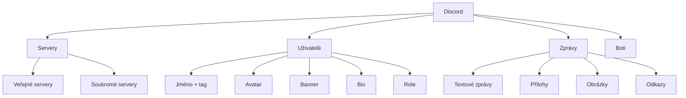

# 7.7 Discord

> **Cíle kapitoly:**
>
> - Porozumět struktuře Discordu a jeho OSINT potenciálu
> - Umět analyzovat Discord servery a uživatele
> - Znát techniky pro sběr dat z Discordu
> - Znát nástroje pro Discord OSINT

---

## Teorie

### Discord jako OSINT zdroj

Discord je komunikační platforma s komunitními servery. Každý server má vlastní kanály, uživatele a pravidla.



### Veřejné informace na Discordu

| Informace | Dostupnost |
|---|---|
| Uživatelské jméno + tag | Vždy |
| Avatar | Vždy |
| Banner | Vždy |
| Bio | Vždy (pokud vyplněno) |
| Role na serveru | Na daném serveru |
| Historie zpráv | V kanálech, kde má přístup |
| Členství v serverech | Skryté (nelze zjistit bez přístupu) |
| E-mail | Nikdy |
| Telefon | Nikdy |

### Nástroje pro Discord OSINT

| Nástroj | Účel |
|---|---|
| **Discord Web** | Základní prohlížení |
| **Discord API** | Programový přístup (s botem) |
| **Discord Lookup** | Zjištění informací o uživateli |
| **Discord ID** | Konverze Discord ID na datum |
| **Discord History Tracker** | Export historie zpráv |
| **Discord Servers** | Vyhledávání veřejných serverů |

---

## Postup krok za krokem: Discord analýza

### 1. Informace o uživateli

```bash
# Discord ID
# Každý uživatel má unikátní ID (snowflake)
# ID lze získat: Developer Mode → Copy ID

# Discord ID obsahuje timestamp
# První bity = datum vytvoření účtu
```

### 2. Discord ID konverze

```python
# Konverze Discord ID na datum
import datetime
discord_id = 123456789012345678
timestamp = ((discord_id >> 22) + 1420070400000) / 1000
date = datetime.datetime.fromtimestamp(timestamp)
print(f"Účet vytvořen: {date}")
```

### 3. Veřejné servery

```bash
# Vyhledávání veřejných serverů
# disboard.org - databáze veřejných serverů
# discord.me - katalog serverů

# Analýza serveru
# Počet členů
# Kanály
# Témata
```

### 4. Analýza zpráv

```bash
# Sběr zpráv z veřejného kanálu
# Discord History Tracker
# Manuální screenshoty
# API s botem (pokud má přístup)
```

---

## Reálné příklady

### Příklad 1: Datum vytvoření účtu

**Discord ID:** 123456789012345678

```python
>>> datetime.fromtimestamp(1420070400 + (123456789012345678 >> 22) / 1000)
2023-06-15 12:30:00
```

**Analýza:** Účet byl vytvořen 15. června 2023.

### Příklad 2: Analýza komunity

**Cíl:** Zjistit složení komunity

**Postup:**
1. Vstoupit na veřejný server (s výzkumnou identitou)
2. Prohlédnout seznam členů (role, bio)
3. Analyzovat aktivitu v kanálech
4. Identifikovat klíčové členy (moderátoři, administrátoři)

---

## Tipy a časté chyby

> [!TIP]
> Discord ID je snowflake — první bity jsou timestamp. Můžete zjistit, kdy byl účet vytvořen.

> [!WARNING]
> **Častá chyba:** Sběr dat z Discord serverů bez oprávnění může porušovat podmínky služby.

> [!WARNING]
> **Častá chyba:** Discord boti vidí jen to, k čemu mají oprávnění. Nemohou číst soukromé kanály nebo DM.

---

## Praktické cvičení

**Úkol 1:** Analyzujte Discord ID:
1. Získejte Discord ID (vlastní nebo z veřejného profilu)
2. Pomocí konverze zjistěte datum vytvoření
3. Ověřte na discordlookup.com

**Úkol 2:** Veřejný server:
1. Najděte veřejný Discord server (disboard.org)
2. Prohlédněte si strukturu serveru
3. Analyzujte kanály a aktivitu

**Pomůcky:** Discord, discordlookup.com, disboard.org
**Očekávaný výstup:** Discord ID analýza + struktura serveru

---

## Shrnutí

- Discord ID odhaluje datum vytvoření účtu
- Veřejné servery poskytují informace o komunitách
- Bio, avatar a role jsou veřejné informace
- Sběr dat bez oprávnění porušuje podmínky
- Boti vidí jen to, k čemu mají přístup

---

## Kontrolní otázky

1. Jak zjistíte datum vytvoření Discord účtu?
2. Jaké informace jsou na Discordu veřejné?
3. Jak najdete veřejné Discord servery?
4. Proč je důležité mít vlastní výzkumnou identitu na Discordu?
5. Co je Discord snowflake?

---

## Zdroje a odkazy

- [Discord Developer Portal](https://discord.com/developers)
- [Discord Lookup](https://discordlookup.com)
- [Disboard](https://disboard.org)
- [Discord History Tracker](https://github.com/DiscordHistoryTracker)
