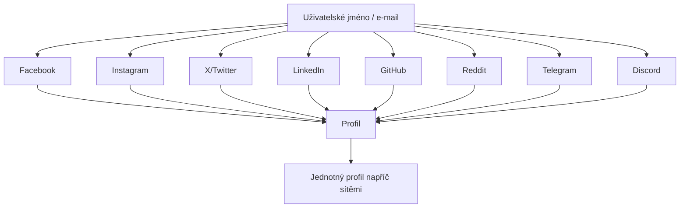

# 7.9 Praktické vyhledávání

> **Cíle kapitoly:**
>
> - Umět kombinovat techniky napříč sociálními sítěmi
> - Znát nástroje pro multi-platformní vyhledávání
> - Umět propojit identity napříč sítěmi
> - Znát techniky cross-referencingu

---

## Teorie

### Multi-platformní vyhledávání

Sociální sítě jsou propojené — uživatelé často používají stejné přezdívky, e-maily nebo fotky napříč platformami.



### Nástroje pro multi-platformní vyhledávání

| Nástroj | Účel |
|---|---|
| **Sherlock** | Vyhledávání uživatelského jména napříč sítěmi |
| **WhatsMyName** | Podobné jako Sherlock |
| **SocialScan** | OSINT nad sociálními sítěmi |
| **Maigret** | Rozšířený Sherlock |
| **Namechk** | Kontrola dostupnosti jmen |
| **IntelX** | Multi-zdrojové vyhledávání |
| **SpiderFoot** | Automatizovaný OSINT nástroj |

---

## Postup krok za krokem: Multi-platformní vyhledávání

### 1. Sherlock — Vyhledání uživatelského jména

```bash
# Instalace
pip install sherlock

# Základní vyhledání
sherlock username

# Vyhledání s výstupem do CSV
sherlock username --csv

# Vyhledání více jmen
sherlock username1 username2
```

### 2. Analýza výsledků

```bash
# Sherlock zjistí, na kterých platformách jméno existuje
# Výsledky: Facebook ✓, Twitter ✓, Instagram ✗, ...

# Křížová kontrola:
# - Stejný avatar? → stejná osoba
# - Stejný popis? → stejná osoba
# - Stejný e-mail? → stejná osoba
```

### 3. Cross-referencing podle e-mailu

```bash
# E-mail → uživatelské jméno → platformy
# E-mail → Gravatar (profilový obrázek)
# E-mail → Have I Been Pwned (úniky)

# Nástroje
# - Epieos (email OSINT)
# - Hunter.io (email pattern)
```

### 4. Cross-referencing podle fotky

```bash
# Reverzní vyhledávání obrázků
# Google Images, Yandex, TinEye
# Najde stejnou fotku na jiných platformách
```

---

## Reálné příklady

### Příklad 1: Cross-referencing

**Cíl:** Propojit anonymní účet s reálnou osobou

**Postup:**
1. Anonymní účet: @hacker123 na Twitteru
2. Sherlock: najde @hacker123 na GitHubu
3. GitHub commit: e-mail = john.doe@gmail.com
4. E-mail → LinkedIn: John Doe, Security Engineer
5. LinkedIn fotka → reverzní vyhledání → Facebook

**Výsledek:** Anonymní účet @hacker123 = John Doe

### Příklad 2: Falešný profil

**Cíl:** Ověřit, zda je profil legitimní

**Postup:**
1. Profil na Facebooku: "Anna Nováková"
2. Sherlock: "Anna Nováková" na 3 platformách, ale různé fotky
3. Reverzní vyhledání fotek → každá patří jiné osobě
4. Závěr: falešný profil

---

## Tipy a časté chyby

> [!TIP]
> Sherlock je nejlepší nástroj pro rychlou kontrolu uživatelského jména napříč stovkami platforem během sekund.

> [!WARNING]
> **Častá chyba:** Stejné uživatelské jméno ≠ stejná osoba. Může být náhoda. Vždy ověřovat dalšími informacemi.

> [!WARNING]
> **Častá chyba:** Sherlock neprohledává všechny platformy. Některé blokují scraping nebo vyžadují přihlášení.

---

## Praktické cvičení

**Úkol 1:** Sherlock:
1. Nainstalujte Sherlock
2. Vyhledejte své vlastní uživatelské jméno
3. Které platformy našel?
4. Vyhledejte "johnwick" — kolik platforem?

**Úkol 2:** Cross-referencing:
1. Vyberte si veřejně známou osobu
2. Najděte její profily na různých sítích
3. Ověřte, že patří stejné osobě (fotka, bio, jméno)
4. Zapište, které faktory potvrzují identitu

**Úkol 3:** Reverzní vyhledávání fotek:
1. Stáhněte profilovou fotku z LinkedIn
2. Vyhledejte ji na Google Images
3. Našli jste stejnou fotku jinde?
4. Jaká je kvalita výsledků?

**Pomůcky:** Sherlock, Google Images, TinEye
**Očekávaný výstup:** Multi-platformní profil + ověření identity

---

## Shrnutí

- Uživatelské jméno je klíč pro multi-platformní vyhledávání
- Sherlock najde profil na stovkách platforem
- Cross-referencing: fotka, bio, e-mail potvrzují identitu
- Stejné jméno ≠ stejná osoba — vždy ověřovat
- Reverzní vyhledávání fotek propojuje profily

---

## Kontrolní otázky

1. K čemu slouží Sherlock?
2. Jak ověříte, že dva profily patří stejné osobě?
3. Proč stejné uživatelské jméno nestačí k identifikaci?
4. Jak vám pomůže reverzní vyhledávání fotek?
5. Které nástroje použijete pro cross-referencing?

---

## Zdroje a odkazy

- [Sherlock](https://github.com/sherlock-project/sherlock)
- [WhatsMyName](https://whatsmyname.app)
- [Maigret](https://github.com/soxoj/maigret)
- [IntelX](https://intelx.io)
- [SpiderFoot](https://www.spiderfoot.net)
- [TinEye](https://tineye.com)
