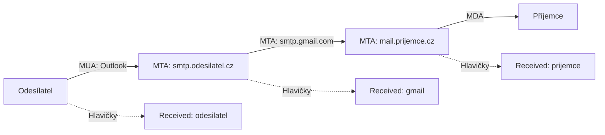

# 8.1 Hlavičky e-mailů

> **Cíle kapitoly:**
>
> - Porozumět struktuře e-mailových hlaviček
> - Umět analyzovat hlavičky a získat z nich informace
> - Znát cestu e-mailu od odesílatele k příjemci
> - Umět identifikovat podezřelé e-maily

---

## Teorie

### Struktura e-mailové hlavičky

Každý e-mail obsahuje hlavičky s informacemi o cestě od odesílatele k příjemci.



### Klíčové hlavičky

| Hlavička | Popis | OSINT hodnota |
|---|---|---|
| **From** | Odesílatel | Může být falešný |
| **To** | Příjemce | Cíl |
| **Subject** | Předmět | Téma |
| **Date** | Datum a čas odeslání | Přesný čas |
| **Message-ID** | Unikátní ID | Identifikace |
| **Received** | Každý server přidá svůj Received | Cesta e-mailu |
| **Return-Path** | Adresa pro nedoručitelné | Skutečný odesílatel |
| **Reply-To** | Adresa pro odpověď | Může být jiná |
| **DKIM-Signature** | DKIM podpis | Ověření |
| **SPF** | SPF výsledek | Ověření |
| **Authentication-Results** | Výsledky autentizace | Ověření |
| **X-Mailer** | E-mailový klient | Software |
| **X-Originating-IP** | IP odesílatele | (vzácné) |

### Získání hlaviček

```bash
# Gmail: Otevřít e-mail → Tři tečky → Zobrazit původní
# Outlook: Otevřít e-mail → Tři tečky → Zobrazit zdroj
# Thunderbird: Ctrl+U

# Výstup ve formátu text
Return-Path: <sender@example.com>
Received: from mail.example.com (203.0.113.1)
Received: from smtp.gmail.com (209.85.220.41)
From: "Jan Novák" <jan.novak@gmail.com>
Date: Mon, 15 Jan 2024 14:30:00 +0100
Message-ID: <CAG12345@mail.gmail.com>
```

---

## Postup krok za krokem: Analýza hlaviček

### 1. Extrahujte hlavičky

```bash
# Zkopírovat hlavičky z e-mailového klienta
# Uložit do souboru headers.txt
```

### 2. Analyzujte Received řetězec

```bash
# Received: od spodu nahoru (nejstarší → nejnovější)
# První Received = odesílatel
# Poslední Received = příjemce

Received: from mail-pj1-f44.google.com (209.85.216.44)
 by mx.example.com with ESMTPS
Received: from smtp.outlook.com (40.92.17.44)
 by mail-pj1-f44.google.com with ESMTPS
Received: from DESKTOP-ABC123 (203.0.113.5)
 by smtp.outlook.com with ESMTPS
```

### 3. Zkontrolujte autentizaci

```bash
Authentication-Results: mx.example.com;
 spf=pass (google.com: domain of sender@gmail.com designates 209.85.220.41 as permitted sender)
 dkim=pass header.i=@gmail.com
 dmarc=pass action=none
```

### 4. IP geolokace

```bash
# První Received = IP odesílatele nebo jeho MTA
# Geolokace IP
whois 203.0.113.5
curl ipinfo.io/203.0.113.5
```

---

## Reálné příklady

### Příklad 1: Identifikace odesílatele

```bash
Received: from [192.168.1.100] (89.23.45.67)
 by smtp.seznam.cz

# IP 89.23.45.67 → patří UPC Česká republika
# Možná lokace: Praha
```

### Příklad 2: Phishingový e-mail

```bash
From: "ČSOB Banka" <security@csob-banking.cz>
Return-Path: <phisher@malicious-server.ru>

Authentication-Results: mx.prijemce.cz;
 spf=fail (csob-banking.cz does not designate 185.130.5.20 as sender)
```

**Analýza:** SPF fail = e-mail nebyl odeslán z oficiálního serveru ČSOB. Phishing.

---

## Tipy a časté chyby

> [!TIP]
> Vždy analyzujte Received hlavičky od nejstaršího (dole) k nejnovějšímu (nahoře). První Received je skutečný zdroj.

> [!WARNING]
> **Častá chyba:** From hlavička může být falešná. Vždy kontrolujte SPF, DKIM, DMARC.

> [!WARNING]
> **Častá chyba:** X-Originating-IP je vzácný. Moderní e-maily ho obvykle neobsahují.

---

## Praktické cvičení

**Úkol 1:** Analyzujte hlavičky:
1. Pošlete e-mail z Gmailu na Seznam
2. Zobrazte hlavičky
3. Analyzujte Received řetězec
4. Které servery e-mail prošel?

**Úkol 2:** Phishing detection:
1. Najděte podezřelý e-mail (ve spam složce)
2. Zobrazte hlavičky
3. Zkontrolujte SPF, DKIM, DMARC
4. Je e-mail legitimní?

**Pomůcky:** Gmail, Seznam, hlavičky
**Očekávaný výstup:** Analýza hlaviček + detekce phishingu

---

## Shrnutí

- Hlavičky obsahují kompletní cestu e-mailu
- Received: od spodu nahoru — od odesílatele k příjemci
- SPF, DKIM, DMARC ověřují pravost
- From může být falešný — kontrolovat Return-Path a SPF
- First Received IP = nejbližší odesílateli

---

## Kontrolní otázky

1. Která hlavička ukazuje cestu e-mailu?
2. Jak zjistíte IP odesílatele?
3. Co znamená SPF fail?
4. Proč From hlavička není důvěryhodná?
5. Jak zobrazíte hlavičky v Gmailu?

---

## Zdroje a odkazy

- [Gmail - Zobrazení hlaviček](https://support.google.com/mail/answer/29436)
- [DKIM.org](https://www.dkim.org)
- [DMARC.org](https://dmarc.org)
- [MXToolbox Email Header Analyzer](https://mxtoolbox.com/EmailHeaders.aspx)
