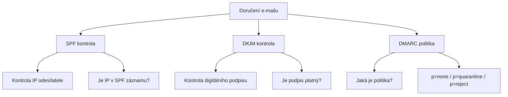

# 8.2 SPF, DKIM, DMARC

> **Cíle kapitoly:**
>
> - Porozumět protokolům SPF, DKIM a DMARC
> - Umět zkontrolovat SPF záznam domény
> - Umět ověřit DKIM podpis
> - Znát význam DMARC politiky

---

## Teorie

### Email autentizační protokoly

SPF, DKIM a DMARC jsou protokoly pro ověření pravosti e-mailů.



### SPF (Sender Policy Framework)

SPF definuje, které servery smí odesílat e-maily za doménu.

```bash
# SPF záznam v DNS
dig example.com TXT | grep "v=spf1"

# Příklad
"v=spf1 include:_spf.google.com ~all"

# Mechanizmy:
# include: - zahrnout SPF jiné domény
# ip4: - povolit IP rozsah
# a: - povolit A záznam domény
# mx: - povolit MX servery
# all - výchozí:
#   +all (povolit vše) - špatné
#   -all (zamítnout vše) - striktní
#   ~all (měkké zamítnutí) - doporučeno
#   ?all (neutrální) - žádná akce
```

### DKIM (DomainKeys Identified Mail)

DKIM přidává digitální podpis k e-mailům, který ověřuje doména odesílatele.

```bash
# DKIM záznam v DNS (typicky)
dig default._domainkey.example.com TXT

# Příklad
"v=DKIM1; k=rsa; p=MIGfMA0GCSqGSIb3DQEBAQUAA4GNADCBiQKBgQC..."

# DKIM hlavička v e-mailu:
DKIM-Signature: v=1; a=rsa-sha256; c=relaxed/relaxed;
 d=gmail.com; s=20230601;
 h=from:to:subject:date:message-id;
 bh=47DEQpj8HBSa+/TImW+5JCeuQeRkm5NMpJWZG3hSuFU=;
 b=...
```

### DMARC (Domain-based Message Authentication, Reporting & Conformance)

DMARC definuje politiku, co dělat s e-maily, které neprošly SPF/DKIM.

```bash
# DMARC záznam v DNS
dig _dmarc.example.com TXT

# Příklad
"v=DMARC1; p=reject; sp=reject; rua=mailto:dmarc@example.com"

# Politiky:
# p=none - pouze monitorovat
# p=quarantine - označit jako spam
# p=reject - odmítnout

# Další tagy:
# sp: - politika pro subdomény
# rua: - reportovací e-mail
# ruf: - forensic reporty
# pct: - procento e-mailů ke kontrole
# fo: - reporting options
```

---

## Postup krok za krokem: Kontrola SPF/DKIM/DMARC

### 1. SPF kontrola

```bash
# Zjištění SPF záznamu
dig seznam.cz TXT | grep spf

# Online nástroj
# mxtoolbox.com/spf/
```

### 2. DKIM kontrola

```bash
# Zjištění DKIM klíče (selectors se liší)
dig google._domainkey.seznam.cz TXT
dig default._domainkey.gmail.com TXT
```

### 3. DMARC kontrola

```bash
# Zjištění DMARC záznamu
dig _dmarc.seznam.cz TXT

# Online
# dmarcian.com/dmarc-inspector/
```

### 4. Interpretace

```bash
# SPF: ~all = měkké selhání (softfail)
#      -all = tvrdé selhání (hardfail)
# DKIM: platný klíč = podpis je ověřitelný
# DMARC: p=reject = striktní ochrana
```

---

## Reálné příklady

### Příklad 1: Seznam.cz

```bash
$ dig seznam.cz TXT | grep spf
"v=spf1 include:spf.seznam.cz ~all"

$ dig _dmarc.seznam.cz TXT
"v=DMARC1; p=reject; sp=reject; rua=mailto:dmarc@seznam.cz"
```

**Analýza:** SPF s ~all (softfail), DMARC p=reject — striktní ochrana.

### Příklad 2: Doména bez ochrany

```bash
$ dig unprotected-site.cz TXT | grep spf
# (žádný SPF záznam)

$ dig _dmarc.unprotected-site.cz TXT
# (žádný DMARC záznam)
```

**Analýza:** Žádná ochrana proti phishingu a spoofingu.

---

## Tipy a časté chyby

> [!TIP]
> DMARC p=reject je nejlepší ochrana proti phishingu. Pokud doména používá p=none, je zranitelná.

> [!WARNING]
> **Častá chyba:** SPF s +all (povolit vše) je stejně špatné jako žádný SPF. Vždy používejte -all nebo ~all.

> [!WARNING]
> **Častá chyba:** DMARC bez rua (report) neposkytuje zpětnou vazbu. Bez reportů nevíte, kdo zneužívá vaši doménu.

---

## Praktické cvičení

**Úkol 1:** Zkontrolujte SPF/DKIM/DMARC:
1. seznam.cz — SPF, DKIM, DMARC
2. google.com — SPF, DKIM, DMARC
3. vlastní doména (pokud máte)
4. doména bez známé ochrany

**Úkol 2:** Porovnání:
1. Která doména má nejlepší ochranu?
2. Která nemá žádnou ochranu?
3. Jaký je DMARC policy u každé?

**Pomůcky:** dig, mxtoolbox.com, dmarcian.com
**Očekávaný výstup:** SPF/DKIM/DMARC analýza 3+ domén

---

## Shrnutí

- SPF definuje povolené odesílací servery
- DKIM přidává digitální podpis k e-mailům
- DMARC definuje politiku pro neplatné e-maily
- SPRÁVNÉ nastavení: SPF -all, DKIM platný klíč, DMARC p=reject
- Domény bez ochrany jsou zranitelné phishingem

---

## Kontrolní otázky

1. K čemu slouží SPF?
2. Jak DKIM ověřuje pravost e-mailu?
3. Jaké jsou DMARC politiky?
4. Proč je -all lepší než ~all?
5. Co zjistíte z DMARC reportů?

---

## Zdroje a odkazy

- [MXToolbox SPF](https://mxtoolbox.com/spf/)
- [DMARC Inspector](https://dmarcian.com/dmarc-inspector/)
- [DKIM Core](https://www.dkim.org)
- [DMARC.org](https://dmarc.org)
