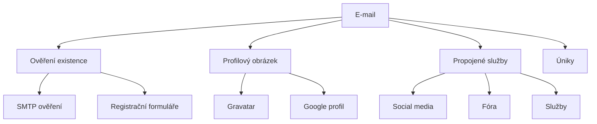

# 8.4 Analýza účtů

> **Cíle kapitoly:**
>
> - Umět ověřit existenci e-mailového účtu
> - Znát techniky pro vyhledávání propojených služeb
> - Umět analyzovat metadata účtů

---

## Teorie

### Co lze zjistit z e-mailového účtu

E-mailová adresa je klíč pro propojení identit napříč službami.



### Nástroje pro analýzu účtu

| Nástroj | Účel |
|---|---|
| **Epieos** | Email OSINT, profilový obrázek, propojené služby |
| **Hunter.io** | Email pattern, ověření |
| **VerifyEmail** | Ověření existence |
| **Gravatar** | Profilový obrázek podle e-mailu |
| **Google Profile** | Google profil podle e-mailu |
| **PEP** | Profilový obrázek a sociální sítě |

---

## Postup krok za krokem: Analýza e-mailu

### 1. Ověření existence

```bash
# SMTP ověření (bez odeslání e-mailu)
# Online nástroje
# - verify-email.org
# - hunter.io/email-verifier

# Epieos
# epieos.com - email lookup
```

### 2. Profilový obrázek

```bash
# Gravatar
# https://www.gravatar.com/avatar/HASH?d=404
# Hash = MD5(email.trim().lower())

# Epieos
# Zobrazí Gravatar + Google profil
```

### 3. Propojené služby

```bash
# Epieos
# - Sociální sítě (Facebook, Twitter, Instagram)
# - Fóra
# - Další služby

# Google profil
# https://profiles.google.com/EMAIL
```

---

## Reálné příklady

### Příklad 1: Gravatar

```bash
$ EMAIL="jan.novak@gmail.com"
$ HASH=$(echo -n "$EMAIL" | md5)
$ curl -I "https://www.gravatar.com/avatar/$HASH?d=404"
# 200 = existuje, 404 = neexistuje
```

### Příklad 2: Epieos

```bash
# Epieos zobrazí:
# - Gravatar profilový obrázek
# - Google profil
# - Facebook profil (pokud je propojen)
# - Twitter profil (pokud je propojen)
# - Další služby
```

---

## Tipy a časté chyby

> [!TIP]
> Gravatar je skvělý nástroj — pokud má uživatel Gravatar, získáte profilový obrázek, který může být unikátní.

> [!WARNING]
> **Častá chyba:** SMTP ověření není 100% spolehlivé. Některé servery vrací falešně pozitivní/negativní.

> [!WARNING]
> **Častá chyba:** E-mail nemusí být unikátní identifikátor. Jeden člověk může mít více e-mailů.

---

## Praktické cvičení

**Úkol 1:** Analyzujte e-mail:
1. Zkontrolujte svůj e-mail na Epieos
2. Jaké informace našel?
3. Zkontrolujte Gravatar
4. Jaké propojené služby jsou vidět?

**Úkol 2:** Ověření:
1. Zkuste SMTP ověření na známý platný e-mail
2. Zkuste na neplatný e-mail
3. Porovnejte výsledky

**Pomůcky:** Epieos, Gravatar, hunter.io
**Očekávaný výstup:** Emailová analýza + profilový obrázek

---

## Shrnutí

- E-mail je klíčový identifikátor napříč službami
- Gravatar poskytuje profilový obrázek
- Epieos odhaluje propojené služby
- SMTP ověření zjistí existenci
- E-mail není 100% unikátní — jeden člověk, více e-mailů

---

## Kontrolní otázky

1. Jak zjistíte Profilový obrázek z e-mailu?
2. K čemu slouží Epieos?
3. Jak funguje SMTP ověření e-mailu?
4. Proč není SMTP ověření 100% spolehlivé?
5. Jaké informace můžete získat z e-mailové adresy?

---

## Zdroje a odkazy

- [Epieos](https://epieos.com)
- [Gravatar](https://en.gravatar.com)
- [Hunter.io](https://hunter.io)
- [Verify Email](https://verify-email.org)
