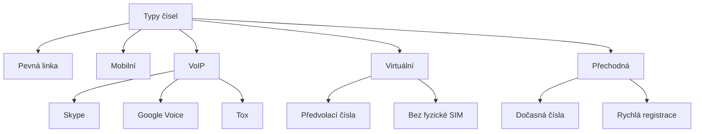

# 9.3 Identifikace VoIP

> **Cíle kapitoly:**
>
> - Umět identifikovat VoIP čísla
> - Znát virtuální a přechodná čísla
> - Umět analyzovat operátora čísla

---

## Teorie

### Co je VoIP

VoIP (Voice over IP) je telefonování přes internet. VoIP čísla mohou vypadat jako běžná čísla, ale nejsou vázána na fyzickou SIM.



### Indikátory VoIP

| Indikátor | Popis |
|---|---|
| **Operátor** | VoIP operátoři: Skype, Google, Twilio |
| **Délka čísla** | Často neobvyklá délka |
| **Předvolba** | Některé předvolby patří VoIP providerům |
| **Lokace** | VoIP číslo z jiné země než uživatel |
| **Služby** | Číslo nalezené u přechodných služeb |

### Běžní VoIP provideri

| Provider | Formát | Detekce |
|---|---|---|
| **Skype** | Skype username | Nelze telefonní lookup |
| **Google Voice** | USA čísla | Typicky Google IP |
| **Twilio** | Různé | API detekce |
| **Zoom Phone** | Firemní VoIP | DNS/ASN |
| **RingCentral** | Firemní VoIP | DNS/ASN |
| **Přechodná čísla** | Na minuty/hodiny | SMS activation services |

### Nástroje pro identifikaci VoIP

| Nástroj | Popis |
|---|---|
| **Numverify** | Operátor a typ linky |
| **PhoneInfoga** | Detekce VoIP |
| **Twilio Lookup** | API pro VoIP detekci |
| **IP geolokace** | Pokud je známa IP |

---

## Postup krok za krokem: Identifikace VoIP

### 1. Numverify

```bash
$ curl "https://api.numverify.com/validate?number=+12015551234"
{
  "line_type": "voip",
  "carrier": "Google Voice",
  "country": "United States"
}
```

### 2. Analýza operátora

```bash
# VoIP operátoři typicky nejsou standardní mobilní operátoři
# Google, Skype, Twilio, ...
```

### 3. Přechodná čísla

```bash
# Služby pro přechodná čísla:
# - smspool.net
# - textverified.com
# - sms-activate.org
# - 5sim.net

# Indikátory:
# Číslo používané jen krátce
# Ověřovací SMS k službám
# Spojeno s vícero účty
```

---

## Reálné příklady

### Příklad 1: VoIP detekce

```bash
$ numverify +12015551234
line_type: voip
carrier: Google Voice
```

**Analýza:** VoIP číslo — Google Voice. Číslo z USA, uživatel může být odkudkoli.

### Příklad 2: Přechodné číslo

```bash
# Číslo +420601123456 je:
# - Aktivní jen 24h
# - Použito pro registraci na 5 službách
# - Blokováno službami jako "virtual number"
```

---

## Tipy a časté chyby

> [!TIP]
> VoIP čísla jsou často používána pro anonymitu. Jejich identifikace je cenná pro OSINT.

> [!WARNING]
> **Častá chyba:** Ne každé číslo s podezřelým operátorem je VoIP. Někteří operátoři mají VoIP i mobilní divize.

> [!WARNING]
> **Častá chyba:** VoIP číslo může být použito legitimně (např. firemní ústředna). Není to automaticky důkaz nelegální činnosti.

---

## Praktické cvičení

**Úkol 1:** Identifikace VoIP:
1. Zkuste Numverify na známé VoIP číslo (např. Skype číslo)
2. Jaký je line_type?
3. Kdo je operátor?

**Úkol 2:** Analýza:
1. Najděte příklad přechodného čísla
2. Které služby ho používají?
3. Jaké jsou indikátory?

**Pomůcky:** Numverify, PhoneInfoga
**Očekávaný výstup:** Identifikace VoIP čísla + analýza

---

## Shrnutí

- VoIP čísla nejsou vázána na fyzickou SIM
- Numverify detekuje VoIP a operátora
- Přechodná čísla jsou dočasná pro ověřování
- VoIP nemusí být nelegitimní, ale je to indikátor
- Google Voice, Skype, Twilio jsou běžní VoIP providerii

---

## Kontrolní otázky

1. Co je VoIP číslo?
2. Jak detekujete VoIP číslo?
3. K čemu slouží přechodná čísla?
4. Kdo jsou běžní VoIP provideri?
5. Proč je identifikace VoIP důležitá pro OSINT?

---

## Zdroje a odkazy

- [Numverify](https://numverify.com)
- [Twilio Lookup](https://www.twilio.com/lookup)
- [PhoneInfoga](https://github.com/sundowndev/phoneinfoga)
- [5sim](https://5sim.net)
