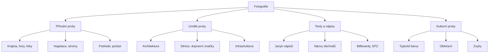

# 10.1 Určení místa podle fotografie

> **Cíle kapitoly:**
>
> - Umět analyzovat fotografii pro určení místa
> - Znát vizuální indikátory polohy
> - Umět používat reverzní vyhledávání obrázků

---

## Teorie

### Vizuální geolokace

Geolokace fotografie bez GPS vyžaduje analýzu vizuálních prvků.



### Reverzní vyhledávání obrázků

| Nástroj | URL | Specifika |
|---|---|---|
| **Google Images** | images.google.com | Největší databáze |
| **Yandex Images** | yandex.com/images | Dobré na východní Evropu |
| **TinEye** | tineye.com | Vyhledávání podle hashe |
| **Bing Images** | bing.com/images | Alternativa |
| **Baidu Images** | image.baidu.com | Čínská databáze |
| **SauceNAO** | saucenao.com | Anime/art |

### Co hledat na fotografii

| Prvek | Co prozrazuje |
|---|---|
| **Dopravní značky** | Země, region |
| **SPZ** | Země, region |
| **Jazyk nápisů** | Země, jazyková oblast |
| **Architektura** | Styl → region, éra |
| **Elektrické zásuvky** | Země |
| **Stromy a vegetace** | Klimatická zóna |
| **Barva popelnic** | Město (někdy) |
| **Městská hromadná doprava** | Město |
| **Billboardy** | Místní firmy |

---

## Postup krok za krokem: Geolokace fotografie

### 1. Reverzní vyhledávání

```bash
# Google Images
# 1. Otevřít images.google.com
# 2. Kliknout na kameru
# 3. Nahrát fotku nebo vložit URL

# Yandex (často lepší výsledky)
# 1. Otevřít yandex.com/images
# 2. Nahrát fotku
```

### 2. Analýza vizuálních prvků

```bash
# 1. Jazyk nápisů → země
# 2. Dopravní značky → region
# 3. Architektura → typické pro oblast
# 4. SPZ → země, rok
# 5. Počasí/obloha → obecný region
```

### 3. Mapové nástroje

```bash
# Google Maps / Mapy.cz
# Hledání podobných míst
# Street View pro ověření

# Overpass Turbo
# Hledání podle prvků (restaurace, banky, ...)
```

---

## Reálné příklady

### Příklad 1: Geolokace podle billboardu

**Fotografie:** Budova s billboardem "Kaufland"

**Postup:**
1. Kaufland je řetězec v ČR, Německu, Rakousku, ...
2. Jazyk na billboardu: čeština → ČR
3. Google: "Kaufland" + další prvky (nádraží? kostel?)
4. Street View: ověření místa

### Příklad 2: Geolokace podle architektury

**Fotografie:** Panelákové sídliště

**Postup:**
1. Paneláky → východní Evropa
2. Typ paneláku → specifický pro ČR/Slovensko
3. Barevné schéma → konkrétní sídliště
4. Další prvky → město

---

## Tipy a časté chyby

> [!TIP]
> Yandex je často lepší než Google pro geolokaci fotek z východní Evropy a Asie.

> [!WARNING]
> **Častá chyba:** Spoléhání na jeden prvek. Vždy kombinujte více indikátorů — jeden může být zavádějící.

> [!WARNING]
> **Častá chyba:** Fotografie může být stará — prvky se mohly změnit. Ověřujte aktuálnost.

---

## Praktické cvičení

**Úkol 1:** Geolokace:
1. Najděte fotografii s rozpoznatelným místem (např. z dovolené)
2. Smažte EXIF (abyste neviděli GPS)
3. Pomocí reverzního vyhledávání a vizuální analýzy určete místo
4. Ověřte na Google Maps

**Úkol 2:** Výzva:
1. Stáhněte fotku z internetu bez známého místa
2. Určete co nejvíce informací:
   - Země
   - Město (pokud možné)
   - Konkrétní místo
3. Jaké prvky vám pomohly?

**Pomůcky:** Google Images, Yandex, Google Maps, Street View
**Očekávaný výstup:** Geolokace fotografie + použité indikátory

---

## Shrnutí

- Vizuální geolokace kombinuje reverzní vyhledávání a analýzu prvků
- Jazyk, architektura, SPZ, značky jsou klíčové indikátory
- Yandex je lepší pro východní Evropu
- Vždy kombinovat více indikátorů
- Ověřovat na Google Maps / Street View

---

## Kontrolní otázky

1. Jaké vizuální prvky pomáhají určit místo?
2. K čemu slouží reverzní vyhledávání obrázků?
3. Proč je Yandex užitečný pro geolokaci?
4. Jak ověříte správnost geolokace?
5. Proč nestačí jeden indikátor?

---

## Zdroje a odkazy

- [Google Images](https://images.google.com)
- [Yandex Images](https://yandex.com/images)
- [TinEye](https://tineye.com)
- [GeoGuessr](https://www.geoguessr.com)
- [Overpass Turbo](https://overpass-turbo.eu)
