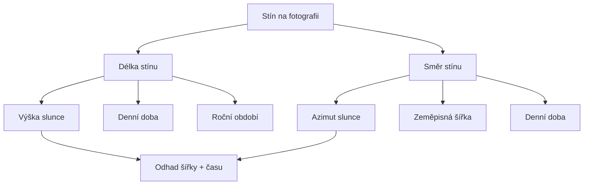

# 10.2 Slunce a stíny

> **Cíle kapitoly:**
>
> - Umět využít slunce a stíny pro geolokaci
> - Znát nástroje pro analýzu slunce (SunCalc)
> - Umět určit čas podle stínů

---

## Teorie

### Principy analýzy stínů

Délka a směr stínu závisí na poloze slunce, která se liší podle zeměpisné šířky, denní doby a ročního období.



### SunCalc

SunCalc (suncalc.org) je nástroj pro výpočet polohy slunce v daném místě a čase.

```bash
# Web
https://www.suncalc.org

# Parametry:
# - Datum a čas
# - Poloha (souřadnice)
# Výstup: výška slunce, azimut, východ/západ
```

### Výpočet z fotografie

```bash
# Pokud známe:
# - délku stínu (poměr k objektu)
# - směr stínu
# - datum (z EXIF nebo odhad)

# Můžeme vypočítat:
# - přibližnou zeměpisnou šířku
# - denní dobu
```

---

## Postup krok za krokem: Analýza stínů

### 1. Změřte stín

```bash
# Pomocí referenčního objektu na fotografii
# Změřte poměr výška objektu / délka stínu
```

### 2. SunCalc

```bash
# Otevřít suncalc.org
# Nastavit datum (z EXIF nebo odhad)
# Posouvat časem a sledovat výšku slunce
# Porovnat s naměřeným poměrem stínu
```

### 3. Kombinace s dalšími prvky

```bash
# Směr stínu + přibližná denní doba = zeměpisná šířka
# Kombinovat s jazykem, architekturou
```

---

## Reálné příklady

### Příklad 1: Odhad času

**Fotografie:** Stín objektu je 2x delší než jeho výška

```bash
# SunCalc pro Prahu (50° s.š.)
# V létě v poledne: stín je krátký
# V zimě v poledne: výška slunce ~20°, stín ~2.7x

# Odhad: zima, kolem poledne
```

### Příklad 2: Odhad šířky

**Fotografie:** Stín ukazuje severozápadně, délka = 1x výška

```bash
# Pokud víme, že je poledne (z kontextu)
# Výška slunce 45° → 45° severní šířky
# Nebo: 45° jižní šířky v prosinci
```

---

## Tipy a časté chyby

> [!TIP]
> SunCalc je neocenitelný nástroj pro analýzu stínů. Umožňuje zpětně dopočítat polohu nebo čas.

> [!WARNING]
> **Častá chyba:** Stín může být zkreslen perspektivou nebo nerovným terénem. Vždy korigujte perspektivu.

> [!WARNING]
> **Častá chyba:** Zaměňování severozápadního stínu (ráno) s jihozápadním (odpoledne) při absenci kompasu.

---

## Praktické cvičení

**Úkol 1:** Analýza stínu:
1. Najděte fotografii s výrazným stínem
2. Změřte poměr výška/délka stínu
3. Pomocí SunCalc odhadněte denní dobu nebo šířku

**Úkol 2:** Ověření:
1. Vyfoťte objekt venku (zapište datum, čas, místo)
2. Smažte EXIF
3. Dejte fotku někomu jinému k analýze
4. Porovnejte výsledky

**Pomůcky:** SunCalc, fotografie, pravítko (poměr)
**Očekávaný výstup:** Analýza stínu + odhad času/polohy

---

## Shrnutí

- Délka a směr stínu odhaluje polohu a čas
- SunCalc umožňuje zpětný výpočet
- Poměr výška/délka stínu = výška slunce
- Směr stínu = azimut slunce
- Kombinovat s dalšími indikátory pro přesnost

---

## Kontrolní otázky

1. Jak délka stínu souvisí s výškou slunce?
2. K čemu slouží SunCalc?
3. Jaké faktory ovlivňují stín?
4. Proč může být perspektiva problematická?
5. Jak kombinujete analýzu stínů s dalšími technikami?

---

## Zdroje a odkazy

- [SunCalc](https://www.suncalc.org)
- [Shadow Calculator](https://www.shadowcalculator.org)
- [SunEarthTools](https://www.sunearthtools.com)
