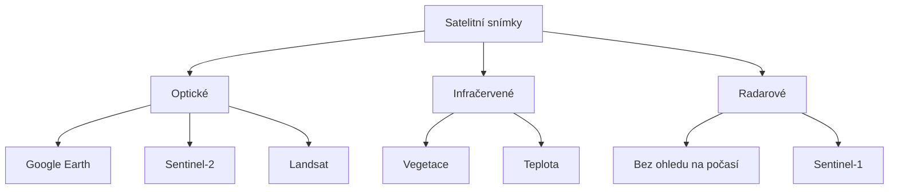

# 10.3 Mapy a satelitní snímky

> **Cíle kapitoly:**
>
> - Umět používat mapové platformy pro OSINT
> - Znát techniky práce se satelitními snímky
> - Umět porovnávat historické snímky
> - Znát nástroje pro analýzu map

---

## Teorie

### Mapové platformy

| Platforma | URL | Specifika |
|---|---|---|
| **Google Maps** | maps.google.com | Street View, 3D, historie |
| **Google Earth** | earth.google.com | Historie snímků, 3D |
| **Mapy.cz** | mapy.cz | ČR, turistické mapy |
| **OpenStreetMap** | osm.org | Otevřená data |
| **Sentinel Hub** | sentinel-hub.com | Satelitní snímky ESA |
| **USGS Earth Explorer** | earthexplorer.usgs.gov | NASA/USGS satelity |
| **Zoom Earth** | zoom.earth | Rychlé satelitní snímky |

### Satelitní snímky



### Historické snímky

| Platforma | Historický dosah |
|---|---|
| **Google Earth** | Až 40 let |
| **Sentinel Hub** | Od 2015 |
| **Landsat** | Od 1972 |
| **USGS Earth Explorer** | Od 1970s |
| **Mapy.cz historie** | Až 10 let (ČR) |

---

## Postup krok za krokem: Práce s mapami

### 1. Google Earth

```bash
# Instalace
# earth.google.com

# Hledání místa
# Historie snímků (ikonka hodin)
# Porovnání časových vrstev
```

### 2. Sentinel Hub

```bash
# Web
# apps.sentinel-hub.com

# Výběr satelitu (Sentinel-2)
# Výběr data
# Filtry: NDVI (vegetace), infra
```

### 3. Overpass Turbo

```bash
# Web
# overpass-turbo.eu

# Dotaz: hledání prvků v OSM
# "[amenity=restaurant]" v okruhu 1km
# Export dat
```

---

## Reálné příklady

### Příklad 1: Sledování změn

**Cíl:** Zjistit, kdy byla postavena nová budova

```bash
# Google Earth → Historie snímků
# 2018: pole
# 2020: stavební jáma
# 2022: hotová budova
```

### Příklad 2: Overpass dotaz

```bash
# Najít všechny banky v okruhu 2km od místa
# Výsledek: seznam bank + jejich adresy
# Lze použít pro OSINT profilaci
```

---

## Tipy a časté chyby

> [!TIP]
> Google Earth má nejdelší historii satelitních snímků. Pro ČR je skvělá i Mapy.cz s historickými ortofoty.

> [!WARNING]
> **Častá chyba:** Satelitní snímky nejsou v reálném čase. Nejnovější mohou být týdny až měsíce staré.

> [!WARNING]
> **Častá chyba:** Rozlišení se liší podle místa. Města mají vysoké rozlišení, venkov nižší.

---

## Praktické cvičení

**Úkol 1:** Historické snímky:
1. Otevřete Google Earth
2. Najděte své město
3. Zapněte historii snímků
4. Sledujte změny za posledních 10 let

**Úkol 2:** Sentinel Hub:
1. Otevřete Sentinel Hub
2. Najděte konkrétní místo
3. Porovnejte snímky z různých dat
4. Všimněte si rozdílů (vegetace, budovy)

**Úkol 3:** Overpass Turbo:
1. Otevřete overpass-turbo.eu
2. Najděte všechny restaurace v okruhu 500m od známého místa
3. Exportujte seznam

**Pomůcky:** Google Earth, Sentinel Hub, Overpass Turbo
**Očekávaný výstup:** Historická změna + Overpass data

---

## Shrnutí

- Google Earth má nejdelší historii satelitních snímků
- Sentinel Hub poskytuje aktuální družicová data
- Overpass Turbo umožňuje dotazy do OSM databáze
- Historické snímky odhalují změny v čase
- Různé platformy mají různá rozlišení a pokrytí

---

## Kontrolní otázky

1. Která platforma má nejdelší historii snímků?
2. Jaké satelity poskytují aktuální snímky zdarma?
3. K čemu slouží Overpass Turbo?
4. Jaké je omezení satelitních snímků?
5. Jak porovnáte historické snímky?

---

## Zdroje a odkazy

- [Google Earth](https://earth.google.com)
- [Sentinel Hub](https://www.sentinel-hub.com)
- [Overpass Turbo](https://overpass-turbo.eu)
- [USGS Earth Explorer](https://earthexplorer.usgs.gov)
- [Zoom Earth](https://zoom.earth)
