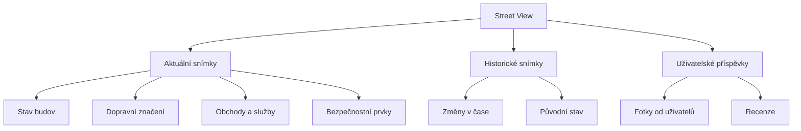

# 10.4 Street View

> **Cíle kapitoly:**
>
> - Umět používat Street View pro OSINT
> - Znát techniky pro virtuální prohlídku místa
> - Umět využívat historické Street View snímky
> - Znát alternativy Google Street View

---

## Teorie

### Street View jako OSINT nástroj

Street View umožňuje virtuální prohlídku místa z úrovně ulice.



### Platformy

| Platforma | URL | Specifika |
|---|---|---|
| **Google Street View** | maps.google.com | Největší pokrytí |
| **Mapy.cz Panorama** | mapy.cz | Výborné pokrytí ČR |
| **Bing Streetside** | bing.com/maps | USA, UK |
| **Yandex Panorama** | yandex.com/maps | Rusko, východní Evropa |
| **Mapillary** | mapillary.com | Uživatelské snímky |

### Co hledat ve Street View

| Prvek | OSINT hodnota |
|---|---|
| **Bezpečnostní kamery** | Bezpečnostní postavení |
| **Přístupové body** | Fyzická bezpečnost |
| **Sousedé** | Sousední budovy |
| **Dopravní značení** | Přístup |
| **Obchody a služby** | Charakter lokality |
| **Stav budovy** | Údržba, stáří |
| **Lidé v okolí** | Demografie (omezeně) |

---

## Postup krok za krokem: Street View analýza

### 1. Základní prohlídka

```bash
# Google Maps
# 1. Najít místo
# 2. Přetáhnout panáčka na mapu
# 3. Pohybovat se po ulici
```

### 2. Historické snímky

```bash
# Google Street View
# 1. Otevřít Street View
# 2. Kliknout na "See more dates" (hodiny)
# 3. Procházet historické snímky
```

### 3. Mapy.cz

```bash
# Mapy.cz Panorama
# 1. Otevřít mapy.cz
# 2. Zapnout "Panorama" vrstvu
# 3. Prohlížet česká města a obce
```

### 4. Mapillary

```bash
# Web
# mapillary.com/app

# Uživatelské snímky z celého světa
# Často novější než Google
```

---

## Reálné příklady

### Příklad 1: Fyzická bezpečnost

**Cíl:** Zjistit zabezpečení budovy

**Street View:**
- Kamery u vchodu? Ano — 2 ks
- Oplocení? 2m plot s ostnatým drátem
- Vstup? Jediný vchod, recepce
- Parkování? Vyhrazené, kontrolované

### Příklad 2: Změny v čase

**Cíl:** Sledovat výstavbu

```bash
# Historické snímky Google Street View
# 2019: prázdný pozemek
# 2021: staveniště
# 2023: hotová budova
```

---

## Tipy a časté chyby

> [!TIP]
> Pro ČR je Mapy.cz Panorama často lepší než Google Street View — má novější a podrobnější snímky.

> [!WARNING]
> **Častá chyba:** Street View nemusí být aktuální. Snímky mohou být roky staré.

> [!WARNING]
> **Častá chyba:** Ne všechna místa mají Street View. Venkovské oblasti jsou často nepokryté.

---

## Praktické cvičení

**Úkol 1:** Street View analýza:
1. Vyberte konkrétní adresu
2. Prohlédněte si ji ve Street View
3. Zjistěte: stav budovy, zabezpečení, okolí
4. Zkontrolujte historické snímky

**Úkol 2:** Porovnání platforem:
1. Najděte stejné místo na Google Street View a Mapy.cz Panorama
2. Porovnejte kvalitu a aktuálnost
3. Která je lepší?

**Pomůcky:** Google Maps, Mapy.cz, Mapillary
**Očekávaný výstup:** Street View analýza + porovnání platforem

---

## Shrnutí

- Street View umožňuje virtuální prohlídku místa
- Historické snímky odhalují změny v čase
- Mapy.cz Panorama je skvělá pro ČR
- Mapillary poskytuje uživatelské snímky
- Vždy kontrolovat aktuálnost snímků

---

## Kontrolní otázky

1. Jak zobrazíte historické Street View snímky?
2. Proč je Mapy.cz Panorama užitečné pro ČR?
3. Co je Mapillary?
4. Jaké informace lze získat ze Street View?
5. Jaké je omezení Street View?

---

## Zdroje a odkazy

- [Google Street View](https://maps.google.com)
- [Mapy.cz Panorama](https://mapy.cz)
- [Mapillary](https://www.mapillary.com)
- [Bing Streetside](https://www.bing.com/maps)
