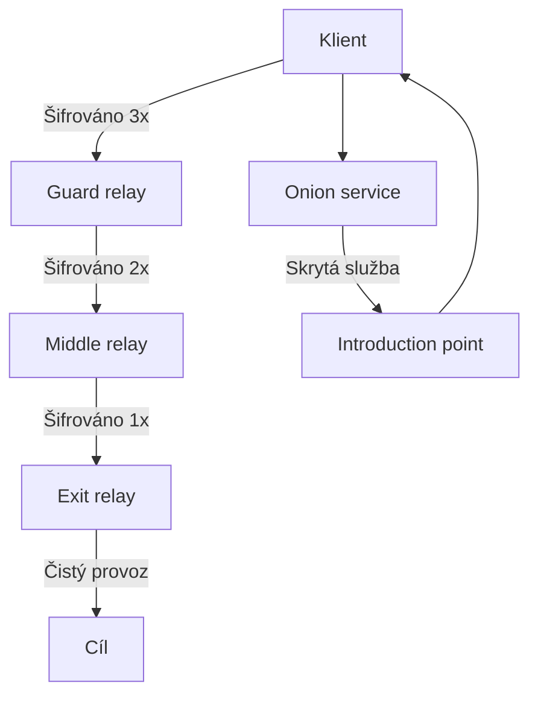

# 11.1 Jak funguje Tor

> **Cíle kapitoly:**
>
> - Porozumět architektuře Tor
> - Znát princip onion routingu
> - Umět bezpečně používat Tor

---

## Teorie

### Architektura Tor

Tor (The Onion Router) je síť pro anonymní komunikaci.



### Vrstvy šifrování

```bash
# Onion routing = 3 vrstvy šifrování
# Každý relay "odloupne" jednu vrstvu

# Vrstva 1: Guard relay → zná klienta, ne cíl
# Vrstva 2: Middle relay → zná guard a exit, ne klienta ani cíl
# Vrstva 3: Exit relay → zná cíl, ne klienta
```

### Tor vs běžný prohlížeč

| Aspekt | Běžný prohlížeč | Tor Browser |
|---|---|---|
| IP adresa | Vaše vlastní | IP exit relay |
| Historie | Uložena | Smazána při zavření |
| Cookies | Persistentní | Smazány |
| Fingerprint | Unikátní | Standardizován |
| JavaScript | Povolen | Blokován (Safest) |
| HTTPS | Volitelné | Důležité |

---

## Postup krok za krokem: Instalace a použití Tor

### 1. Stažení a instalace

```bash
# Stáhnout z torproject.org
# Nainstalovat
# Spustit Tor Browser
```

### 2. Bezpečnostní nastavení

```bash
# Otevřít Tor Browser
# Kliknout na shield → "Safest"
# Zkontrolovat: check.torproject.org
```

### 3. Ověření

```bash
# check.torproject.org by měl hlásit
# "Congratulations. This browser is configured to use Tor."
```

---

## Reálné příklady

### Příklad 1: Kontrola IP

```bash
# Bez Tor: ifconfig.me → 89.23.45.67 (vaše IP)
# S Tor: ifconfig.me → 185.220.101.1 (exit relay)

# Změnila se IP? Ano.
# Změnila se země? Pravděpodobně.
```

### Příklad 2: Fingerprint

```bash
# amiunique.org
# Bez Tor: unikátní fingerprint
# S Tor (Safest): méně unikátní
```

---

## Tipy a časté chyby

> [!TIP]
> Tor Browser není běžný prohlížeč. Používejte ho jen pro anonymní procházení, ne pro běžné denní použití.

> [!WARNING]
> **Častá chyba:** Maximalizace okna Tor Browseru. Usnadňuje fingerprinting. Používejte výchozí velikost.

> [!WARNING]
> **Častá chyba:** Instalace addonů do Tor Browseru. Každý addon mění fingerprint a usnadňuje identifikaci.

---

## Praktické cvičení

**Úkol:** Nainstalujte a otestujte Tor:
1. Stáhněte Tor Browser z torproject.org
2. Nainstalujte
3. Ověřte na check.torproject.org
4. Porovnejte fingerprint s běžným prohlížečem

**Pomůcky:** Tor Browser, check.torproject.org, amiunique.org
**Očekávaný výstup:** Funkční Tor Browser + srovnání anonymity

---

## Shrnutí

- Tor používá 3-vrstvé šifrování (onion routing)
- Guard relay zná klienta, exit relay cíl
- Tor Browser standardizuje fingerprint
- Nepřidávejte addony, nemaximalizujte okno
- Tor není pro běžné denní použití

---

## Kontrolní otázky

1. Jak funguje onion routing?
2. Kolik vrstev šifrování Tor používá?
3. Jaký relay zná cíl, ale ne klienta?
4. Proč byste neměli přidávat addony do Tor Browseru?
5. Jak ověříte, že Tor funguje?

---

## Zdroje a odkazy

- [Tor Project](https://www.torproject.org)
- [Tor Stack Exchange](https://tor.stackexchange.com)
- [check.torproject.org](https://check.torproject.org)
