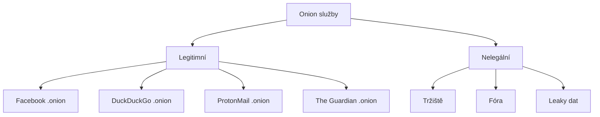

# 11.2 Onion služby

> **Cíle kapitoly:**
>
> - Porozumět .onion službám
> - Znát typy onion služeb
> - Umět vyhledávat na dark webu

---

## Teorie

### Co jsou onion služby

.onion je speciální doména přístupná jen přes Tor síť.



### Legitimní onion služby

| Služba | .onion adresa | Popis |
|---|---|---|
| **Facebook** | facebookonion.com | Přístup přes Tor |
| **DuckDuckGo** | duckduckgogg42xjoc72x3sjasowoarfbgcmvfimaftt6twagswzczad.onion | Anonymní vyhledávání |
| **ProtonMail** | protonmailrmez3lotccipshtkleegetolb73fuirgj7r4o4vfu7ozyd.onion | Šifrovaný e-mail |
| **The Guardian** | guardian. onion | Zpravodajství |
| **BBC News** | bbcnewsd73hkzno2ini43t4gblxvycyac5aw4gnv7t2rcc47hwkdyd.onion | Zpravodajství |
| **SecureDrop** | varies | Whistleblowing platforma |

### Vyhledávače dark webu

| Vyhledávač | Popis |
|---|---|
| **Ahmia** | ahmia.fi — indexuje onion stránky |
| **Torch** | torch — klasický vyhledávač |
| **Not Evil** | notevil — alternativa |
| **Phobos** | phobos — onion vyhledávač |

---

## Postup krok za krokem: Přístup k onion službám

### 1. Tor Browser

```bash
# Otevřít Tor Browser
# Vložit .onion adresu
```

### 2. Ahmia vyhledávání

```bash
# Otevřít ahmia.fi
# Vyhledat téma
# Výsledky: .onion odkazy
```

### 3. Ověření adresy

```bash
# Vždy ověřovat .onion adresu z více zdrojů
# Phishing na dark webu je běžný
```

---

## Reálné příklady

### Příklad 1: Facebook přes Tor

```bash
# Facebook onion: facebookwkhpilnemxj7asaniu7vnjjbiltxjqhye3mhbshg7kx5tfyd.onion
# Přes Tor: anonymní, bez sledování
# Stejný obsah jako běžný Facebook
```

### Příklad 2: SecureDrop

```bash
# SecureDrop umožňuje whistleblowerům anonymně posílat dokumenty
# Každá organizace má vlastní .onion
# The Guardian, NY Times, Washington Post
```

---

## Tipy a časté chyby

> [!TIP]
> Ahmia indexuje jen část dark webu. Mnoho onion stránek není indexováno.

> [!WARNING]
> **Častá chyba:** Klikání na neznámé .onion odkazy. Phishing a malware jsou na dark webu běžné.

> [!WARNING]
> **Častá chyba:** Domněnka, že .onion = nelegální. Facebook, DuckDuckGo a další legitimní služby mají .onion verze.

---

## Praktické cvičení

**Úkol:** Prozkoumejte legitimní onion služby:
1. Otevřete Tor Browser
2. Navštivte DuckDuckGo onion verzi
3. Navštivte Facebook onion (pokud máte účet)
4. Použijte Ahmia pro vyhledání tématu

**Pomůcky:** Tor Browser, Ahmia
**Očekávaný výstup:** Seznam legitimních onion služeb

---

## Shrnutí

- .onion jsou domény přístupné jen přes Tor
- Existují legitimní i nelegální onion služby
- Facebook, DuckDuckGo, ProtonMail mají onion verze
- Ahmia indexuje onion stránky
- Phishing je na dark webu běžný

---

## Kontrolní otázky

1. Co je .onion doména?
2. Vyjmenujte 3 legitimní onion služby
3. K čemu slouží Ahmia?
4. Proč je na dark webu běžný phishing?
5. Jak ověříte pravost .onion adresy?

---

## Zdroje a odkazy

- [Ahmia](https://ahmia.fi)
- [Tor Project - Onion Services](https://community.torproject.org/onion-services/)
- [SecureDrop](https://securedrop.org)
