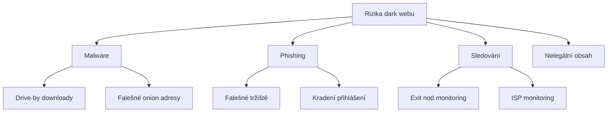

# 11.3 Bezpečný přístup

> **Cíle kapitoly:**
>
> - Umět bezpečně přistupovat k dark webu
> - Znát Tails a další bezpečnostní nástroje
> - Umět nastavit OPSEC pro dark web

---

## Teorie

### Rizika přístupu k dark webu



### Bezpečnostní doporučení

| Opatření | Popis |
|---|---|
| **Tails OS** | Live OS, žádné stopy |
| **Veřejná WiFi** | Nepoužívat domácí IP |
| **Žádný JavaScript** | Vypnout v Tor Browser |
| **Žádné stahování** | Neotvírat neznámé soubory |
| **Žádné přihlašování** | Nepoužívat osobní účty |
| **Žádné platby** | Neprovádět finanční transakce |

### Tails OS

Tails (The Amnesic Incognito Live System) je live OS navržený pro anonymitu.

```bash
# Vlastnosti:
# - Veškerý provoz přes Tor
# - Po vypnutí žádné stopy
# - Šifrované úložiště
# - Předinstalované nástroje
```

---

## Postup krok za krokem: Bezpečný přístup

### 1. Tails

```bash
# 1. Stáhnout Tails z tails.net
# 2. Ověřit podpis (GPG)
# 3. Vypálit na USB (Etcher)
# 4. Bootovat z USB
# 5. Nastavit šifrované úložiště
```

### 2. Veřejná WiFi

```bash
# Použít WiFi v:
# - Kavárně
# - Knihovně
# - MHD (pokud je dostupná)
# NE doma, NE v práci
```

### 3. Tor Browser

```bash
# Bezpečnostní úroveň: Safest
# JavaScript: vypnutý
# Žádné addony
# Výchozí velikost okna
```

---

## Tipy a časté chyby

> [!TIP]
> Tails je nejbezpečnější způsob přístupu k dark webu. Boot z USB, žádné stopy, vše přes Tor.

> [!WARNING]
> **Častá chyba:** Přístup k dark webu z domova bez VPN. ISP vidí, že používáte Tor.

> [!WARNING]
> **Častá chyba:** Přihlášení k osobním účtům z Tor. Propojí vaši identitu s anonymním provozem.

---

## Praktické cvičení

**Úkol:** Nastavte bezpečný přístup:
1. Stáhněte Tails (tails.net)
2. Vytvořte bootovací USB
3. Pokud nemůžete, alespoň Tor Browser s maximálním zabezpečením
4. Dokumentujte postup

**Pomůcky:** Tails ISO, Etcher, USB flash disk
**Očekávaný výstup:** Funkční Tails USB nebo Tor Browser s maximálním zabezpečením

---

## Shrnutí

- Dark web vyžaduje maximální OPSEC
- Tails je nejbezpečnější volba
- Veřejná WiFi + Tor = vyšší anonymita
- Žádný JavaScript, stahování, přihlašování
- Nikdy nepoužívat osobní účty

---

## Kontrolní otázky

1. Proč je Tails bezpečnější než běžný Tor Browser?
2. Proč nepoužívat domácí WiFi pro dark web?
3. Jaké jsou základní bezpečnostní pravidla pro dark web?
4. Proč vypínat JavaScript na dark webu?
5. Co je šifrované úložiště v Tails?

---

## Zdroje a odkazy

- [Tails OS](https://tails.net)
- [Tor Project](https://www.torproject.org)
- [EFF - Surveillance Self-Defense](https://ssd.eff.org)
