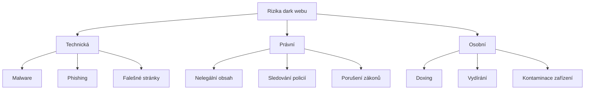

# 11.5 Rizika

> **Cíle kapitoly:**
>
> - Znát rizika spojená s dark webem
> - Umět se chránit před malwarem a phishingem
> - Znát právní rizika

---

## Teorie

### Kategorie rizik



### Malware na dark webu

| Typ | Popis |
|---|---|
| **Drive-by download** | Stažení bez vědomí |
| **Fake onion stránky** | Kradení přihlašovacích údajů |
| **Java exploit** | Zneužití zranitelností |
| **Ransomware** | Šifrování dat |
| **Trojan** | Vzdálený přístup |

### Právní rizika

```bash
# Sledování:
# - Exit nody Tor mohou být monitorovány
# - Policie provozuje falešné onion služby
# - ISP vidí, že používáte Tor

# Nelegální obsah:
# - Náhodný přístup k nelegálnímu obsahu
# - Držení i náhodného obsahu může být trestné
```

---

## Postup: Ochrana před riziky

### 1. Technická ochrana

```bash
# Tails OS
# Tor Browser (Safest)
# Žádný JavaScript
# Žádné stahování
# Žádné addony
```

### 2. Právní ochrana

```bash
# Vědět, co je ve vaší zemi nelegální
# Neprovádět nelegální aktivity
# Dokumentovat výzkum (proč jste na stránce byl)
```

### 3. Osobní ochrana

```bash
# Žádné osobní účty
# Žádné platební metody
# Žádné prozrazení identity
# VPN + Tor (Tor over VPN)
```

---

## Reálné příklady

### Příklad 1: Policejní operace

```bash
# 2022: Policie provozovala falešné tržiště "ChipMixer"
# Sledovala uživatele, kteří na tržiště přistupovali
# Zatčeno 10 osob
```

### Příklad 2: Malware

```bash
# Uživatel stáhl "bezpečnostní nástroj" z onion stránky
# Ve skutečnosti to byl trojan
# Útočník získal přístup k webkameře a souborům
```

---

## Tipy a časté chyby

> [!TIP]
> Pokud narazíte na nelegální obsah, okamžitě opusťte stránku a dokumentujte (datum, čas, URL) pro případ právních otázek.

> [!WARNING]
> **Častá chyba:** Domněnka, že Tor = nepostižitelnost. Policie provozuje falešné služby a monitoruje exit nody.

> [!WARNING]
> **Častá chyba:** Stahování souborů z dark webu. I "nevinný" soubor může obsahovat malware nebo nelegální obsah.

---

## Praktické cvičení

**Úkol:** Identifikujte rizika:
1. Vytvořte seznam 5 rizik dark webu
2. Pro každé riziko navrhněte ochranné opatření
3. Diskutujte: jaké jsou právní důsledky v ČR?

**Pomůcky:** Tato kapitola, internet
**Očekávaný výstup:** Seznam rizik + ochranná opatření

---

## Shrnutí

- Dark web je plný rizik: malware, phishing, právní
- Malware může infikovat zařízení i bez kliknutí
- Policie monitoruje dark web
- Nelegální obsah může být trestný i při náhodném přístupu
- OPSEC je klíčový pro bezpečnost

---

## Kontrolní otázky

1. Jaká jsou hlavní rizika dark webu?
2. Jak se chránit před malwarem na dark webu?
3. Proč policie monitoruje dark web?
4. Jaké jsou právní důsledky přístupu k nelegálnímu obsahu?
5. Co dělat, když narazíte na nelegální obsah?

---

## Zdroje a odkazy

- [Tor Project - Safety](https://support.torproject.org/about/)
- [EFF - Surveillance Self-Defense](https://ssd.eff.org)
- [Cybercrime.cz](https://cybercrime.cz)
