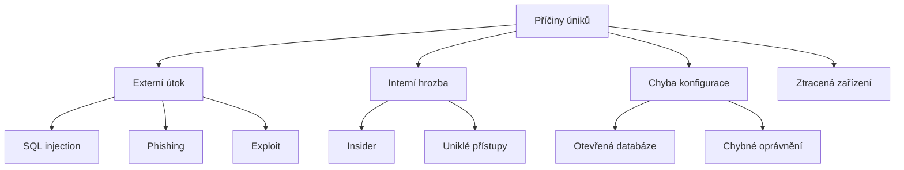

# 12.1 Co jsou databázové úniky

> **Cíle kapitoly:**
>
> - Porozumět mechanismům databázových úniků
> - Znát typy uniklých dat
> - Znát historii významných úniků

---

## Teorie

### Jak k únikům dochází



### Typy uniklých dat

| Typ dat | Příklad | Riziko |
|---|---|---|
| **Přihlašovací údaje** | E-mail + heslo | Účet kompromitován |
| **Osobní data** | Jméno, adresa, rodné číslo | Krádež identity |
| **Finanční data** | Kreditní karty, bankovní účty | Finanční ztráta |
| **Zdravotní data** | Lékařské záznamy | Diskriminace |
| **Firemní data** | Know-how, smlouvy | Konkurenční výhoda |

### Největší úniky historie

| Rok | Událost | Dopad |
|---|---|---|
| 2013 | Adobe | 153M účtů |
| 2016 | LinkedIn | 700M účtů |
| 2017 | Equifax | 147M osob |
| 2018 | Marriott | 500M hostů |
| 2019 | Collection #1 | 773M účtů |
| 2021 | Facebook | 533M účtů |
| 2023 | Twitter/X | 235M účtů |
| 2024 | Ticketmaster | 560M účtů |

---

## Postup krok za krokem: Ověření úniku

### 1. Have I Been Pwned

```bash
# Web
haveibeenpwned.com

# Zadání e-mailu
# Výsledek: seznam úniků
```

### 2. Křížová kontrola

```bash
# Různé zdroje:
# - HIBP
# - Firefox Monitor
# - DeHashed
```

---

## Shrnutí

- Úniky dat jsou běžné a masivní
- Stovky miliónů účtů unikají každý rok
- Každý by měl pravidelně kontrolovat své účty
- Uniklá data vedou k phishingu a krádežím identity

---

## Kontrolní otázky

1. Jak dochází k únikům dat?
2. Jaké typy dat unikají?
3. Vyjmenujte 3 největší úniky
4. Jak zkontrolujete, zda váš e-mail unikl?
5. Jaká jsou rizika uniklých dat?

---

## Zdroje a odkazy

- [Have I Been Pwned](https://haveibeenpwned.com)
- [Firefox Monitor](https://monitor.firefox.com)
- [Ransomware Blog - The Record](https://therecord.media)
