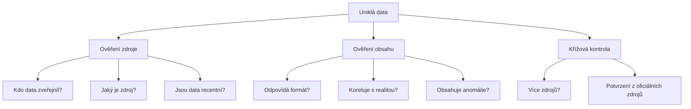

# 12.2 Jak ověřovat informace

> **Cíle kapitoly:**
>
> - Umět ověřit pravost uniklých dat
> - Znát techniky křížové kontroly
> - Umět posoudit důvěryhodnost zdroje

---

## Teorie

### Proces ověřování



### Indikátory pravosti

| Indikátor | Pravděpodobné | Pochybné |
|---|---|---|
| **Formát dat** | Konzistentní | Nekonzistentní |
| **Hash hesla** | bcrypt, scrypt | MD5, plaintext |
| **Časové údaje** | Logické | Nelogické |
| **Velikost dat** | Odpovídá | Příliš malá/velká |
| **Zveřejnění** | Známý zdroj | Neznámý zdroj |

---

## Postup krok za krokem: Ověření

### 1. Ověřte zdroj

```bash
# Kdo zveřejnil?
# - Známý whistleblower?
# - Neznámý účet?
# - Dark web fórum?
```

### 2. Ověřte obsah

```bash
# Obsahuje data ukázková data?
# Jsou e-maily ve správném formátu?
# Jsou hesla hashovaná?
# Je datum úniku logické?
```

### 3. Křížová kontrola

```bash
# Potvrzuje únik HIBP?
# Potvrzuje firma únik?
# Píší o tom média?
```

---

## Praktické cvičení

**Úkol:** Ověřte únik:
1. Zkontrolujte svůj e-mail na HIBP
2. Je únik potvrzen více zdroji?
3. Jaká data unikla?

---

## Shrnutí

- Ne všechny "úniky" jsou pravé
- Vždy ověřovat zdroj a obsah
- Křížová kontrola z více zdrojů
- Známé úniky jsou obvykle potvrzeny médii

---

## Kontrolní otázky

1. Jak ověříte pravost uniklých dat?
2. Jaké jsou indikátory falešného úniku?
3. Proč je křížová kontrola důležitá?
4. Kdo bývá nejspolehlivější zdroj?
