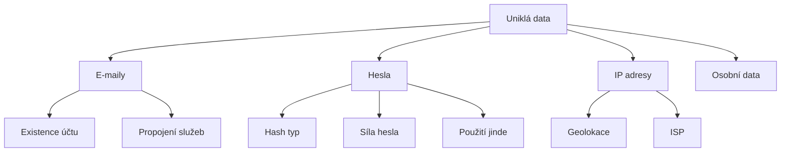

# 12.3 Analýza uniklých dat

> **Cíle kapitoly:**
>
> - Umět analyzovat uniklá data
> - Znát nástroje pro analýzu
> - Umět extrahovat relevantní informace

---

## Teorie

### Co analyzovat



### Nástroje pro analýzu

| Nástroj | Popis |
|---|---|
| **jq** | JSON processing |
| **hash-identifier** | Identifikace hash typu |
| **hashcat** | Lámání hashů |
| **Python/pandas** | Data processing |

---

## Postup krok za krokem: Analýza

### 1. Extrahujte data

```bash
# JSON → CSV
cat data.json | jq -r '.[] | [.email, .password] | @csv' > data.csv
```

### 2. Analyzujte

```bash
# Počet unikátních e-mailů
cut -d',' -f1 data.csv | sort -u | wc -l

# Nejčastější domény
cut -d',' -f1 data.csv | cut -d'@' -f2 | sort | uniq -c | sort -rn | head -10
```

### 3. Identifikujte hash

```bash
# hash-identifier
hash-identifier -t hash_string
```

---

## Shrnutí

- Uniklá data obsahují cenné informace
- JSON → CSV pro analýzu
- Identifikace hash typu je důležitá
- Hledat propojení mezi daty

---

## Kontrolní otázky

1. Jak analyzujete uniklý JSON soubor?
2. K čemu slouží hash-identifier?
3. Jaké informace lze získat z uniklých dat?
4. Jak zjistíte nejčastější e-mailové domény?
5. Proč je důležité znát hash typ?
