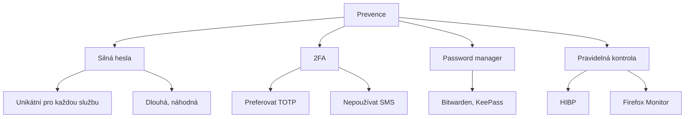

# 12.4 Bezpečnostní doporučení

> **Cíle kapitoly:**
>
> - Znát jak se chránit před úniky
> - Umět reagovat na únik dat
> - Znát bezpečnostní návyky

---

## Teorie

### Prevence úniků



### Reakce na únik

| Krok | Akce |
|---|---|
| 1 | Zjistit, která data unikla |
| 2 | Změnit heslo na uniklé službě |
| 3 | Změnit heslo na všech službách se stejným heslem |
| 4 | Aktivovat 2FA (pokud nebyla) |
| 5 | Sledovat podezřelou aktivitu |
| 6 | Informovat postižené (pokud relevantní) |

---

## Postup krok za krokem: Reakce na únik

### 1. Zjistěte rozsah

```bash
# haveibeenpwned.com
# Která služba unikla?
# Která data?
```

### 2. Změňte hesla

```bash
# Uniklá služba → nové heslo
# Vše se stejným heslem → nová hesla
```

### 3. Sledujte aktivitu

```bash
# Neobvyklé přihlášení?
# Neobvyklé e-maily?
# Phishing?
```

---

## Shrnutí

- Unikátní hesla na každou službu
- 2FA (TOTP, ne SMS)
- Password manager
- Pravidelná kontrola HIBP
- Rychlá reakce na únik

---

## Kontrolní otázky

1. Jaké jsou nejlepší prevence proti únikům?
2. Co dělat ihned po zjištění úniku?
3. Proč nepoužívat SMS 2FA?
4. Jak často kontrolovat úniky?
5. Jak poznáte phishing po úniku?

---

## Zdroje a odkazy

- [Have I Been Pwned](https://haveibeenpwned.com)
- [Bitwarden](https://bitwarden.com)
- [EFF - SSD](https://ssd.eff.org)
