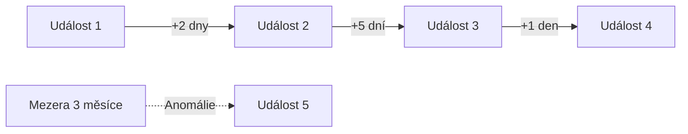
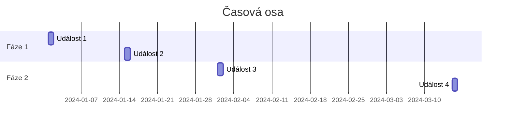

# 13.1 Tvorba časové osy

> **Cíle kapitoly:**
>
> - Umět vytvořit časovou osu událostí
> - Znát nástroje pro timeline analýzu
> - Umět vizualizovat časovou osu

---

## Teorie

### Proč časová osa

Časová osa pomáhá pochopit sled událostí a odhalit vzorce.



### Co zaznamenávat

| Událost | Co zaznamenat |
|---|---|
| **E-maily** | Datum, čas, odesílatel, předmět |
| **Sociální sítě** | Datum příspěvku, obsah |
| **DNS změny** | Datum změny, nový záznam |
| **Doménové změny** | WHOIS změny, expirace |
| **SSL certifikáty** | Vydání, expirace |
| **IP změny** | Nová IP, ASN |

### Nástroje

| Nástroj | Popis |
|---|---|
| **Timeline JS** | Interaktivní časová osa |
| **GanttProject** | Gantt diagramy |
| **Excel/CSV** | Jednoduchá tabulka |
| **Mermaid** | Markdown diagramy |
| **Maltego** | Vizualizace + čas |

---

## Postup krok za krokem: Tvorba časové osy

### 1. Sběr dat

```bash
# Shromáždit všechny události s daty
# E-maily, příspěvky, DNS změny, ...
```

### 2. Seřadit chronologicky

```bash
# Od nejstarší po nejnovější
# Identifikovat mezery
```

### 3. Vizualizace



### 4. Analýza

```bash
# Jaké jsou vzorce?
# Kde jsou anomálie?
# Co se stalo v klíčových bodech?
```

---

## Praktické cvičení

**Úkol:** Vytvořte časovou osu:
1. Vyberte si téma (např. vývoj webu, kariéra osoby)
2. Shromážděte události s daty
3. Vytvořte časovou osu (Mermaid nebo nástroj)
4. Identifikujte vzorce a anomálie

**Pomůcky:** Mermaid, Timeline JS, Excel
**Očekávaný výstup:** Časová osa s analýzou

---

## Shrnutí

- Časová osa odhaluje vztahy a vzorce
- Sled událostí je klíčový pro pochopení
- Vizualizace pomáhá identifikovat anomálie
- Pravidelná aktualizace časové osy

---

## Kontrolní otázky

1. Proč je časová osa důležitá?
2. Jaké události zaznamenáváte?
3. Jaké nástroje použijete?
4. Jak identifikujete anomálie?
5. Jak často aktualizovat časovou osu?
