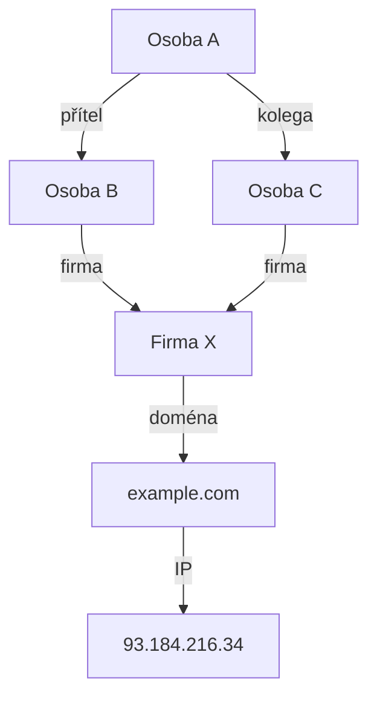

# 13.2 Link analysis

> **Cíle kapitoly:**
>
> - Porozumět konceptu link analysis
> - Umět vytvořit graf vztahů
> - Znát nástroje pro link analysis

---

## Teorie

### Co je link analysis

Link analysis je technika vizualizace a analýzy vztahů mezi entitami.



### Entity a vztahy

| Entita | Typ vztahu |
|---|---|
| **Osoba** | Příbuzný, kolega, přítel |
| **Firma** | Zaměstnavatel, vlastník, dodavatel |
| **Doména** | Vlastník, hosting, IP |
| **IP** | ASN, geolokace, domény |
| **E-mail** | Osoba, služba, únik |
| **Telefon** | Osoba, operátor, messenger |

### Nástroje

| Nástroj | Popis |
|---|---|
| **Maltego** | Profesionální OSINT nástroj |
| **Gephi** | Open-source vizualizace grafů |
| **Cytoscape** | Biologické a sociální sítě |
| **NodeXL** | Excel plugin |
| **Mermaid** | Markdown diagramy |

---

## Postup krok za krokem: Link analysis

### 1. Identifikujte entity

```bash
# Osoby, firmy, domény, IP, e-maily, telefony
# Každá entita je uzel v grafu
```

### 2. Mapujte vztahy

```bash
# Každý vztah je hrana mezi uzly
# Typ: osoba→firma, doména→IP, e-mail→osoba
```

### 3. Vizualizujte

```mermaid
graph TD
    A[Jednatel] -->|firma| B[ABC s.r.o.]
    B -->|doména| C[abc.cz]
    C -->|IP| D[93.184.216.0/24]
    D -->|ASN| E[AS24971]
    A -->|e-mail| F[email@abc.cz]
    F -->|únik| G[LinkedIn 2021]
```

### 4. Analyzujte

```bash
# Kdo je centrální uzel?
# Jaké jsou nečekané vztahy?
# Chybí nějaká data?
```

---

## Reálné příklady

### Příklad 1: Maltego

```bash
# Transformace:
# Doména → IP → ASN → další domény v AS
# E-mail → sociální sítě → osoby
# Telefon → operátor → messenger
```

### Příklad 2: Gephi

```bash
# Import CSV vztahů
# Aplikace algoritmů (Force Atlas)
# Identifikace komunit a clusterů
```

---

## Praktické cvičení

**Úkol:** Vytvořte graf vztahů:
1. Vyberte si osobu nebo firmu
2. Identifikujte entity (domény, IP, e-maily, ...)
3. Mapujte vztahy
4. Vizualizujte v Mermaid nebo Gephi

**Pomůcky:** Mermaid, Gephi, Maltego (pokud máte)
**Očekávaný výstup:** Graf vztahů

---

## Shrnutí

- Link analysis odhaluje skryté vztahy
- Entity = uzly, vztahy = hrany
- Maltego je profesionální nástroj
- Gephi je open-source alternativa
- Centrální uzly jsou klíčové

---

## Kontrolní otázky

1. Co je link analysis?
2. Jaké entity mapujete?
3. K čemu slouží Maltego?
4. Jaký je rozdíl mezi Gephi a Maltego?
5. Co je centrální uzel?
