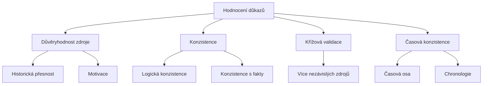

# 13.3 Vyhodnocení důkazů

> **Cíle kapitoly:**
>
> - Umět vyhodnotit důkazy
> - Znát kritéria hodnocení
> - Umět triangulovat informace

---

## Teorie

### Kritéria hodnocení



### Admiralty Code

| Kód zdroje | Kód informace | Význam |
|---|---|---|
| A | 1 | Spolehlivý zdroj, potvrzená informace |
| B | 2 | Běžně spolehlivý, pravděpodobně pravdivá |
| C | 3 | Poměrně spolehlivý, možná pravdivá |
| D | 4 | Nespolehlivý, pochybná |
| E | 5 | Neznámý, nepravděpodobná |
| | 6 | Nehodnotitelná |

---

## Postup krok za krokem: Hodnocení

### 1. Posuďte zdroj

```bash
# Kdo informaci poskytl?
# Jaká je jeho motivace?
# Jaká je historická přesnost?
```

### 2. Ověřte konzistenci

```bash
# Je informace logická?
# Neodporuje si s jinými fakty?
# Zapadá do časové osy?
```

### 3. Křížová validace

```bash
# Potvrzuje informaci jiný zdroj?
# Je zdroj nezávislý?
# Jaká je míra shody?
```

---

## Shrnutí

- Důkazy hodnotit podle zdroje, konzistence a validace
- Admiralty Code poskytuje standardní rámec
- Křížová validace je klíčová
- Jeden zdroj nestačí

---

## Kontrolní otázky

1. Jaká jsou kritéria hodnocení důkazů?
2. Co je Admiralty Code?
3. Proč je křížová validace důležitá?
4. Jak hodnotíte důvěryhodnost zdroje?
5. Co znamená "konzistentní s fakty"?
